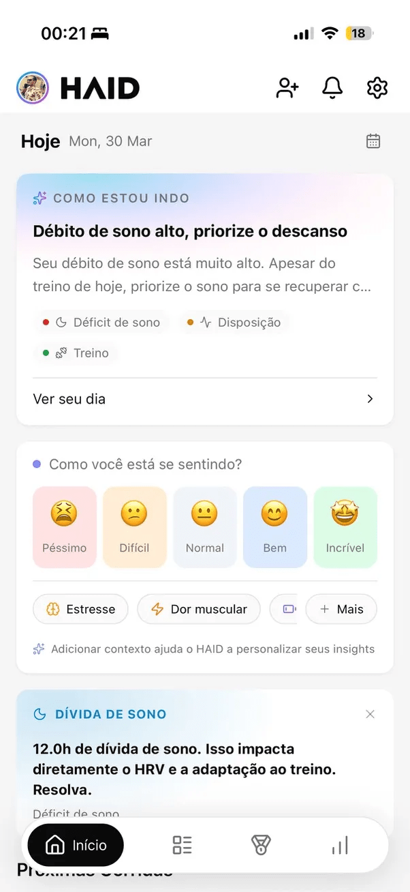
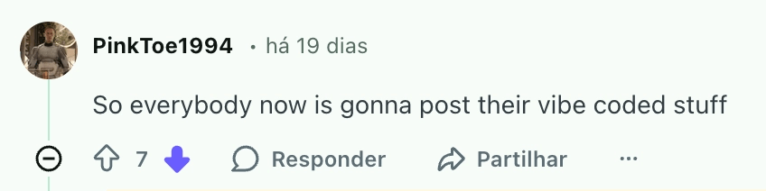
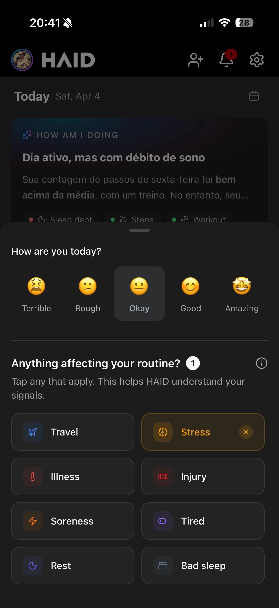

## The Hook

Everyone's doing build in public. Twitter (Sorry, X) threads about tech stacks, architecture decisions, deployment pipelines. I love reading those, but that's not what this is.

I'm a software engineer with over 15 years of experience. I've shipped products used by thousands of users well before AI was part of anyone's vocabulary. Building is my comfort zone. I know how to do that. Yes, I know build in public is also about early feedback, not literally asking people to write your code. But bear with me.

Growth? Marketing? Getting strangers on the internet to care about something I made? I have no idea how to do that. And that's exactly what this series is about: documenting the honest, messy process of a developer figuring out growth from scratch.

This is also a return to writing for me. One of my first side projects was [marquesfernandes.com](http://marquesfernandes.com/), which nowadays is more of a portfolio than a blog. But back then, writing was good for me. It forced me to think more deeply, learn things properly, and gave me a mindfulness moment doing something I'm not particularly good at. After a couple of years without writing, it felt like time to get back to it.

So here's the story so far: how [HAID](https://haid.app/) went from a frustrated athlete's side project to something with a real direction, and why the hard part is only starting now.

## Why HAID Exists

I'm a runner and triathlete, and for years I've been frustrated by the same thing: there's no single place I can call home for my fitness data.

Strava is great for the social side. Garmin Connect throws a wall of data at you, with a UI that's still rough despite recent redesign attempts. Apple Health is clean and gets a few things right, but misses the social and motivational layer that I think matters. Each app is great at one thing, none at everything, and none of them really talk to each other in a useful way.

I'd already scratched a similar itch before: I built [apuama.com](https://apuama.com/) because finding running and triathlon events in Brazil was unnecessarily hard. So I'm the kind of person who, when frustrated by a missing tool, just starts building it.

And since I love a side project: let's do this.

## The First Instinct: Just Build

I started HAID using technology I knew. First POC, structuring the repo, getting data ingestion working from Apple Health and Garmin, it came together fast. That phase is pure dopamine for a developer. Ideas flowing, pieces clicking into place, the feeling that everything is possible.

I needed a focus point, so I picked one: **challenges**. Me and a bunch of friends were using Gymrats for group fitness challenges, and I thought I could build something better. It gave me direction and momentum, a concrete feature to rally around instead of drowning in a sea of "wouldn't it be cool if…"

Good instinct. Wrong timing.

## The Wrong Early Bet

Challenges are a social feature. And social features need people.

For them to be useful, you need users. But users won't come if no other users are there. Classic chicken-and-egg. Even if I convinced every single person in my network who exercises, that's maybe a few dozen people, and it's not enough for meaningful interaction or useful data.

The challenges idea wasn't wrong forever. But it was wrong as the first lever, because it depended on solving distribution before the product had earned distribution. I didn't see that at the time.

I just needed to get some people in there. How hard could it be?

## Trying Everything I Could Think Of

### My Own Network

Everyone tells you to start with your own network. So I did. I reached out to friends, colleagues, and training partners. Some joined and were genuinely helpful, testing features, reporting bugs, and giving honest feedback. I'm grateful for them.

But the majority? Read the message, ignored it. Or replied, "yeah for sure, I'll check it out!" and never did.

And that's okay. People are busy. My side project is not their priority. But I'd be lying if I said it didn't sting a little. It did.

I had a couple of close friends, people I've helped in the past with their own stuff, who sent me, "Yeah dude, I'll download it for sure." Never did. That one stings differently than a stranger ignoring you.

### Influencer Outreach

Next: founder-led outreach. I followed a bunch of smaller influencers in the running and endurance space. I sent personalized messages and offered Pro tier for life. Almost no replies and zero downloads.

And I get it, social platforms nowadays make it hard for random people to reach creators, which is a feature, not a bug. If I were them, I wouldn't want strangers spamming me either. But it leaves you with a question: if not my network and not influencers, then how?

### Reddit

No budget for ads. No marketing knowledge. Where do people discover new products for free?

Everyone talks about going viral on Reddit. I'd never really used it, but I figured it was worth a shot. I researched subreddits related to fitness tracking, running, and wearables. The goal was simple: share what I was building and ask for help testing.

The few posts that weren't immediately banned got… interesting reactions.

A lot of hate comments. People being harsh for no apparent reason, even when you come with the best intentions. But I get it, this was the internet I always knew existed… I'd just never been on the receiving end before. I'm a private person. I don't like overexposure. So this was new territory.

I got that a lot. And damn, it got under my skin. I've been building software professionally for over 15 years. I've shipped products used by thousands of people at real companies, long before GPT existed. And now, because it's 2026, everything a solo developer puts out gets dismissed as AI-generated garbage?

Don't get me wrong, I use AI. I'm shit scared of it and what it's going to do to my job (*but this is a topic for another post*), but there's 15 years of caring, learning, understanding tradeoffs, scalability, and security research behind this. How dare user PinkToe1994 say otherwise? hahaha

I think I handled it reasonably well in the end. I took a step back, understood the dynamics, realized people on the internet are often projecting their own frustrations, and moved on. A few users did actually download the app. It was fun seeing random strangers show up in my database. But the conversion rate versus the emotional cost? Not worth the attempt.

## The Painful Part Is That People Were Kind of Right

Here's the thing though.

Buried under all the noise, there was one useful signal. I got two pieces of feedback from Reddit and one from a close friend. All three said essentially the same thing:

**"Why would I download this? What's different here?"**

And honestly? At that point, there was no good answer.

My first iteration of HAID was basically Apple Health + Strava + Garmin mashed together. My only pitch was "everything in one place," and even I wasn't fully convinced that was enough.

I had great plans for the app. I could see the future version in my head. And in my ego, I was thinking: *people need to just understand the vision! I just need users to test the data pipeline!*

But why would they? Nobody owes me anything.

It hit me because I probably wouldn't download it either. I scroll past app ads every day. Why should other people be different?

I was not just missing users. I was missing a reason for users to care.

That's the lesson.

I had confused functionality with value.

## What HAID Actually Became

So I sat down and forced myself to answer the question: what is HAID *for*? Not what it could be someday, but what it is for right now that nothing else does.

HAID stands for *How Am I Doing*. And I realized the answer to that question shouldn't come from just wearable data. It should come from **context**.

Here's what I mean: I love to travel. When I'm traveling, my training falls off. My training load drops. My step count changes. But I'm not a professional athlete. When I travel, I eat, drink, stay out late, enjoy life. No app knows that. And no app uses that information to actually help me. Something as simple as: "You're traveling, enjoy it, but how about one easy run this week?"

Same thing with injuries, stress, life changes. These things directly impact training and recovery, but no fitness app accounts for them. Your Garmin doesn't know you pulled a muscle, had a terrible week at work, or just got back from vacation.

Think about injuries. Apps track training load, TSS, all that, but do they actually warn you to slow down before it's too late? Imagine if the app could see the pattern: three stressful weeks, poor sleep, and a climbing training load. That's a recipe for injury. And with enough users sharing that context, injury prevention gets smarter over time.

The point of HAID is not just to aggregate data, but to help answer a better question: *how am I doing, really?*

Once I landed on that, things started clicking into place.

## Now the Hard Part Starts

I thought I was mostly trying to validate the ingestion pipeline, the UX, and the challenge features. But the real thing I needed to validate was much simpler: did HAID already give people a reason to care?

At that stage, the answer was no.

That was hard to hear, but also useful. Because from that point on, HAID stopped being "a bit of Strava, a bit of Garmin, a bit of Apple Health" and started becoming a product with a more specific idea: helping people understand their fitness through life context, not just raw data.

Building it was the part I already knew how to do.

Growth is the part I'm learning now.

* * *

*If you want to check out what I'm building: [haid.app](https://haid.app/)*

*Next post: how I turned a mess of feature ideas into an actual product roadmap and what I learned about product thinking as an engineer who'd never done it before.*
