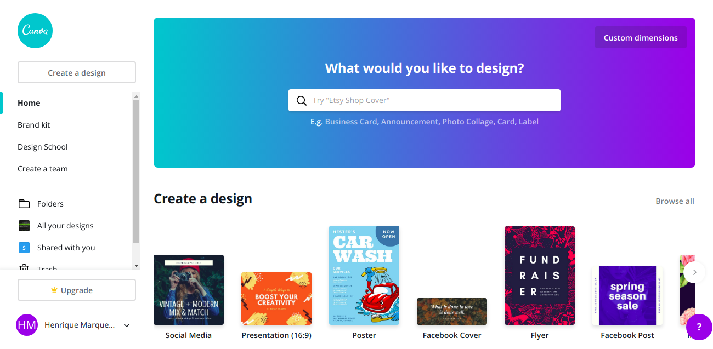
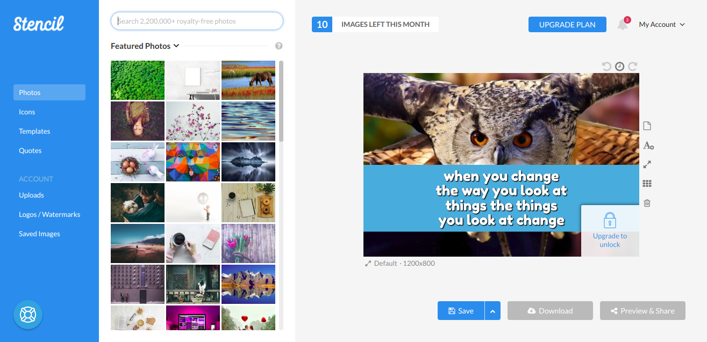

No me considero una persona con mal gusto, pero cuando se trata de crear artes termino tardando mucho tiempo en alcanzar un resultado aceptable. A medida que más y más vida se apresura, y las ideas para los mensajes aumentan, decidí buscar herramientas que me ayudaran en este proceso. Fue entonces cuando me encontré con 3 grandes herramientas, amable y lo mejor de todo: **GRATIS**!

## [Snappa](https://snappa.com/app)

[https://snappa.com/app](https://snappa.com/app)

Snappa es mi herramienta "ir a", tiene una interfaz de creación muy fácil de usar, docenas de formatos y plantillas de arte, todo para ayudarle a dar ese impulso inicial en su creatividad! Su cuenta gratuita le permite:  

-   **1** Usuario
-   **Más de 600.000** FOTOS y gráficos HD
-   **Más de 5.000** plantillas
-   **5** Descargas al mes
-   **2** Redes sociales

*Para ser claro: No me pagaron para anunciar la herramienta, realmente me gusta ...*

## [Canva, Año Nuevo](https://www.canva.com/)

[https://www.canva.com/](https://www.canva.com/)

Canva es una excelente alternativa a cuando se supera el límite de 5 descargas snappa... La gran mayoría de las características principales son gratuitas, pero para usos más avanzados tendrá que comprar la cuenta premium.

## [Plantilla, plantilla](https://getstencil.com/app)

[https://getstencil.com/app](https://getstencil.com/app)

Por último, Stencil, a pesar de que es una herramienta más simple que los otros, sigue siendo la cuenta del mensaje! En su versión gratuita permite:

-   **10** imágenes al mes
-   **10** imágenes favoritas
-   Fotos **limitadas**
-   Iconos **limitados**
