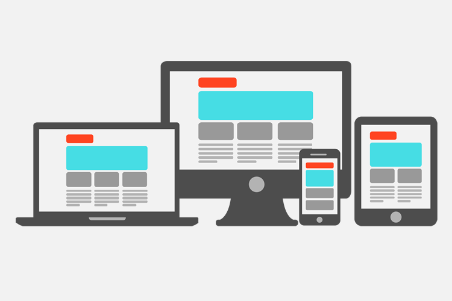

Do you have a website but feel it offers no benefits in running your business? We selected **4 factors** that can be **affecting** the performance of your pages. Identifying and correcting them can yield short-term results.

## 1\. There is no consistent use of keywords

 We currently use Google to search for any type of information. When we perform a search, the tool **correlate** the searched words with important parts of the structure of a website and displays a ranking in order of relevance in order to present satisfactory results for the user. For companies, assume the **top positions** research means gaining a wider audience and a competitive advantage. There are many aspects of the site that give Google tips about the content of a page such as keywords, titles and addresses. For **increase** the possibility of getting a **good position** In ranking for words related to your business, performing a search to identify what and how people are looking for a particular topic is essential to reap good results. For this, it is necessary to analyze the **number of searches** and the **competition** for each **key words** . It is noteworthy that words with a high volume of searches tend to have greater dispute for the top positions and it will hardly be possible to compete with sites that are already being well evaluated by Google.

## two. Your website is not mobile-friendly

 Every company needs to conduct its business based on **Tendencies** and in the constant **evolution** of the internet instead of continuing to bet on old formats. With the aggressive growth in the use of smartphones, today, having a website adapted for mobile devices is no longer an option, but a **obligation** for those who don't want to be left behind. According to a study, **48%** of users say that if a business website is not working well on mobile, they take that as an indication that the company simply **don't care** with the consumer. In addition to offering a better experience for the user, having a website adapted to any type of screen became a criterion for **great weight** for placement in search engines as determined by Google on April 21, 2015.

## 3\. Your website is slow on all devices

 THE **loading time** is another important point that makes a website more **accessible** and **useful** for users. According to statistics, **40%** of people **will abandon** a web page if she **to take time** more than **three seconds to load** . Server configuration, HTML structure of a page and its use of external resources such as images, JavaScript and CSS are some aspects that affect the speed of pages. Correctly format images to save bytes of data, reduce server response time, set an expiration date or maximum age in HTTP headers to take advantage of browser caching are some of Google's recommendations for **improve speed** .

## 4\. Layout is obsolete and polluted

 In addition to affecting loading time, **old layouts** tend to express **lack of credibility** and can cause users to simply leave their site without interacting with any information. In a study of the factors that made users **trust** or **suspect** from a website, **94 out of 100 responses** they said it was due to **design** . Visually beautiful, intuitive, cleaner and lighter interfaces can contribute to:

-   Increase the length of stay on the website;
    
-   Decrease the bounce rate;
    
-   Increase website traffic;
    
-   Increase conversions and sales, in the case of e-commerce.
    

It is important to hire a **specialized company** to fix these elements. The internet is constantly improving. Keep an eye out for technology and design trends and keep your website up to date. If this article helped you, please **share it** with your friends. Also take the opportunity to subscribe to our email list and be the first to receive new articles like this.
