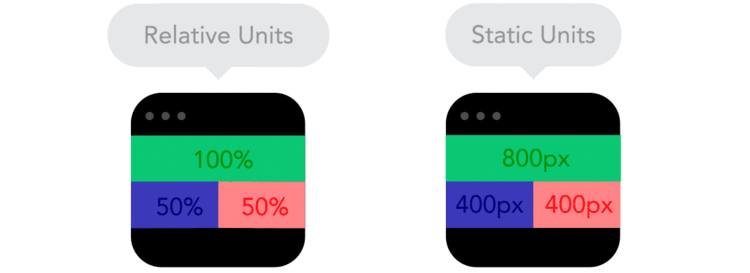
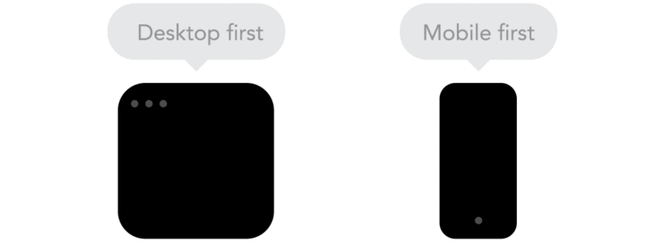

El concepto de diseño responsivo no es una novedad: su concepto comenzó en 2004 y se popularizó en 2012 como una evolución en la lógica del diseño web. Ha llamado bastante la atención en los últimos tiempos con el crecimiento del mercado de dispositivos móviles. Con esta técnica el sitio se adapta al tamaño de la pantalla del usuario, ajustando su diseño y contenido con el objetivo de brindar la mejor experiencia al usuario. 

## Imagina la siguiente situación...

Un ejemplo simple: si entras al sitio de una agencia de turismo desde tu computadora de escritorio, vas a buscar las referencias, fotos, servicios adicionales que ofrecen, etc. Pero si buscas la agencia en tu celular, parado en el tránsito dentro de tu auto, todo lo que necesitas es encontrar el número de contacto y la dirección lo más rápido posible, ¿verdad? Esa es la premisa del mobile-first, una experiencia optimizada para cada dispositivo. ¿Qué hace falta informar en una pantalla de 4 pulgadas de forma simple y fácil? Siempre son funciones diferentes que el sitio asume según el contexto de uso. 

## ¡Todavía no estoy convencido!

Reuní algunos motivos para convencerte de que el Diseño Responsivo es el mejor camino.

1.  Mucho más allá de la belleza, los sitios responsivos garantizan una experiencia optimizada para todos los dispositivos, incluso aquellos que aún no han sido lanzados.
2.  Se consideran la mejor solución Mobile-Friendly y, como lo determinó Google, esto se convierte en un criterio de gran peso para la posición del sitio en los buscadores.
3.  Tener un sitio para escritorio y otro para móvil requiere el doble de planificación de SEO y marketing; tener un único sitio lo hace más fácil de administrar.

## Curiosidades

• Existen más de 230 tamaños de pantalla en diferentes tipos de dispositivos • El 67% de los usuarios afirma que está más convencido de comprar en sitios responsivos • El 30% de los consumidores accede a sus correos electrónicos exclusivamente desde dispositivos móviles

### Quiero empezar a desarrollar un sitio responsivo, ¿por dónde empiezo?

Reuní 3 frameworks con los que ya he trabajado; son bastante famosos y, en mi opinión, los mejores para empezar. Una búsqueda rápida y encontrarás diversos tutoriales. [https://metroui.org.ua/](https://metroui.org.ua/) [http://getbootstrap.com/](http://getbootstrap.com/) [http://foundation.zurb.com/](http://foundation.zurb.com/)
