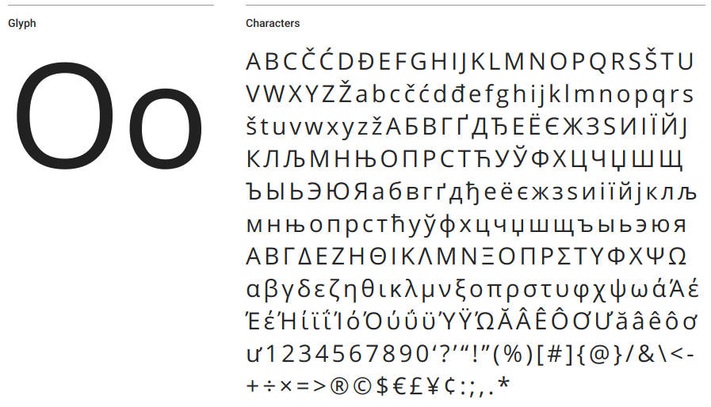
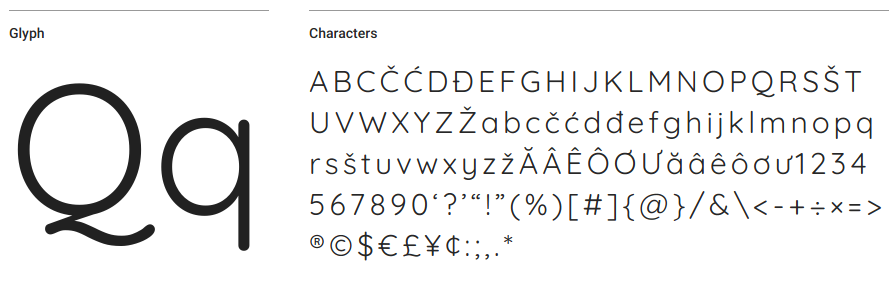
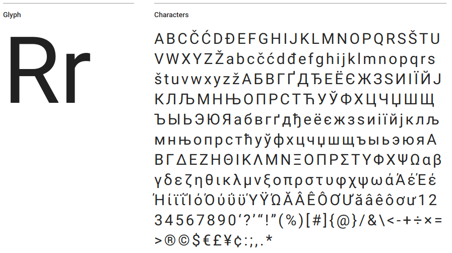
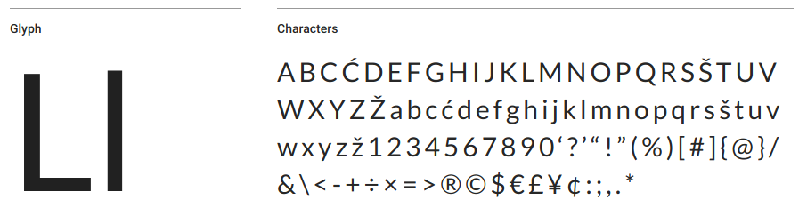
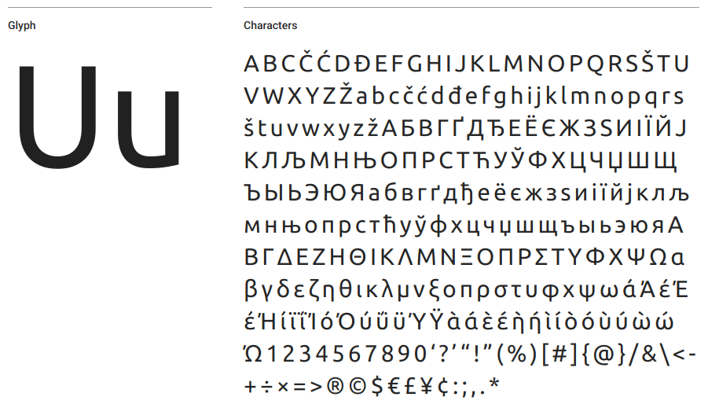
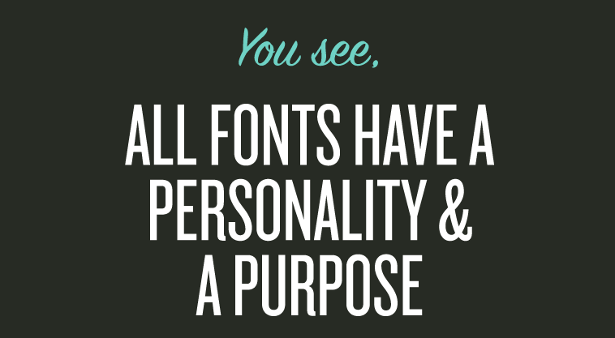

¿Busca fuentes gratuitas y optimizadas para lectura? He seleccionado 5 fuentes principales de Google Fonts para que usted pueda utilizar!

## [Open Sans](https://fonts.google.com/specimen/Open+Sans)

Comenzando con el amor de Internet, con casi 30 mil millones de uso semanal, esta fuente se consagró en Internet gracias a su amplia apertura y gran altura en letras minúsculas, proporcionando una agradable experiencia de lectura.

[https://fonts.google.com/specimen/Open+Sans](https://fonts.google.com/specimen/Open+Sans)

## [Arenas movedizas](https://fonts.google.com/specimen/Quicksand)

Inspirado en formas geométricas, está diseñado para pantallas grandes pero lo suficientemente legible en dispositivos más pequeños, excelente para títulos.

[https://fonts.google.com/specimen/Quicksand](https://fonts.google.com/specimen/Quicksand)

## [Roboto](https://fonts.google.com/specimen/Roboto)

Esta fuente fue desarrollada por [Google](http://google.com) para su sistema operativo móvil, fue lanzado en Android 4.0 "Ice Cream Sandwich". Según su diseñador la fuente es "moderna pero accesible".  
  

[https://fonts.google.com/specimen/Roboto](https://fonts.google.com/specimen/Roboto)

## [Lato](https://fonts.google.com/specimen/Lato)

Su nombre proviene de origen polaco, que significa "verano". ¡Su diseño de borde semi-redondeado promueve una sensación de lectura ligera!

[https://fonts.google.com/specimen/Lato](https://fonts.google.com/specimen/Lato)

## [Ubuntu](https://fonts.google.com/specimen/Ubuntu)

Su nombre proviene de origen sudafricano, que significa "humanidad". Una fuente para aquellos que buscan un aspecto moderno y con un toque humano, un hecho curioso es que los sitios brasileños están entre los mejores usuarios de la fuente!

[https://fonts.google.com/specimen/Ubuntu](https://fonts.google.com/specimen/Ubuntu)

## [Fuente adicional: Comic Sans MS](http://www.comicsanscriminal.com/)

Antes de que comience la lapidación... ¡Haga clic en el enlace!

[http://www.comicsanscriminal.com/](http://www.comicsanscriminal.com/)
