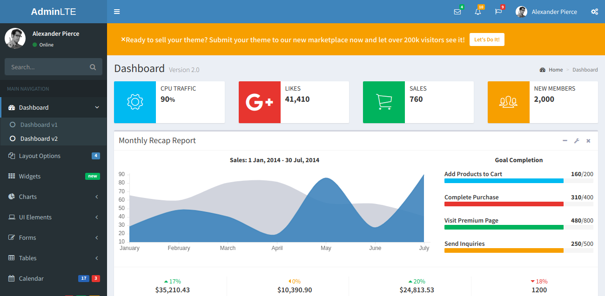
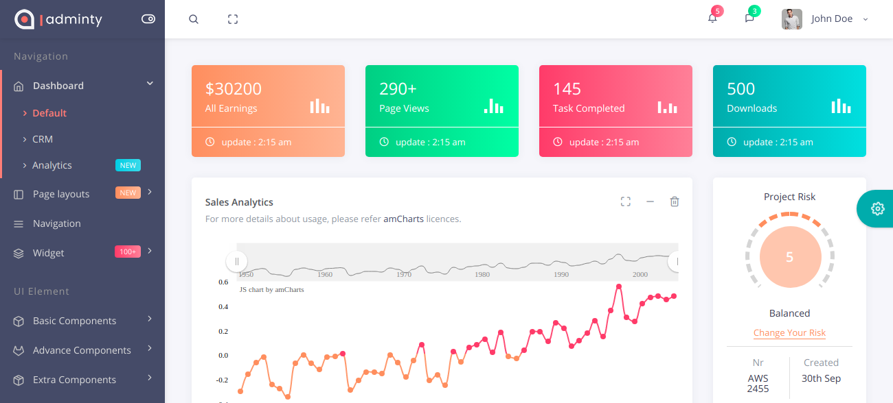
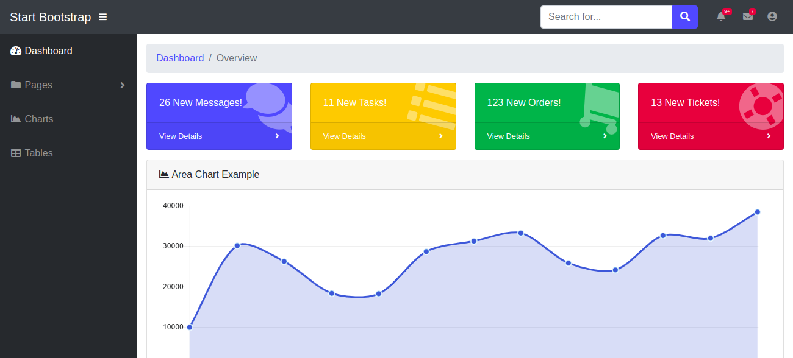
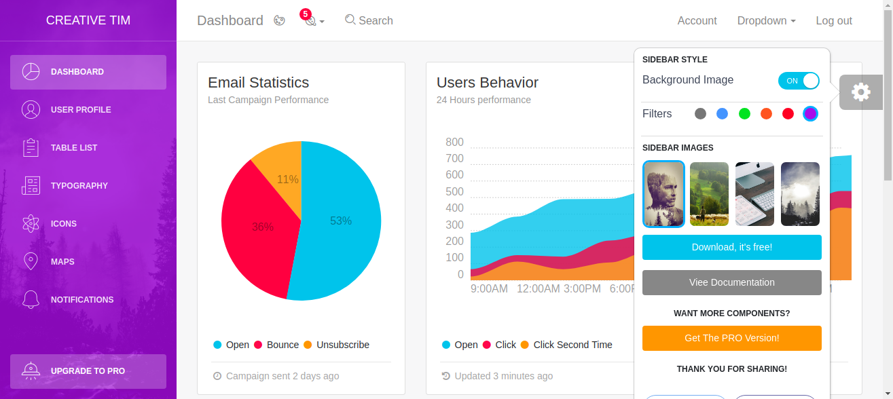
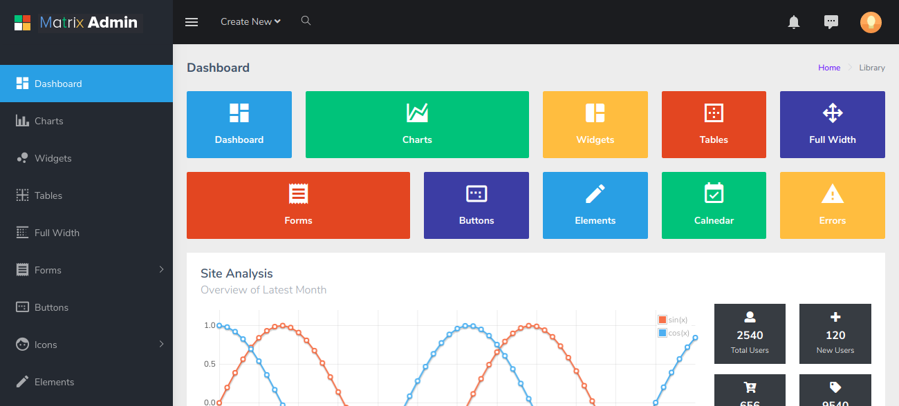
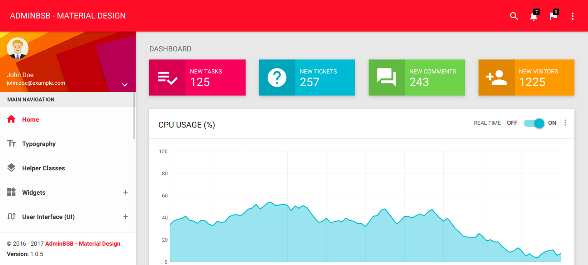

¿Está construyendo un panel de control o un sistema administrativo? Separé 8 plantillas gratuitas, responsivas y completas para que sea más fácil de usar.

## [AdminLTE](https://adminlte.io/themes/AdminLTE/index2.html)

[https://adminlte.io/themes/AdminLTE/index2.html](https://adminlte.io/themes/AdminLTE/index2.html)

**AdminLTE** es uno de los más completos en la categoría gratuita, particularmente ya utilizado para algunos proyectos y me gustó mucho. Totalmente responsivo, desarrollado en la parte superior de [**Bootstrap 3**](https://getbootstrap.com/docs/3.4/) tiene varios componentes y páginas de muestra, su uso y personalización es muy fácil.

## [Administración, Año Nuevo](https://colorlib.com//polygon/adminty/default/index.html)

[https://colorlib.com//polygon/adminty/default/index.html](https://colorlib.com//polygon/adminty/default/index.html)  

**Adminty** fue desarrollado por la compañía [colorlib](https://colorlib.com) en la parte superior de [Bootstrap 4](http://getbootstrap.com/), tiene varios componentes y es extremadamente expansivo, usarlo no es tan fácil, pero seguro que vale la pena, tiene un diseño muy agradable y moderno.

## [SB Admin](https://blackrockdigital.github.io/startbootstrap-sb-admin/)

[https://blackrockdigital.github.io/startbootstrap-sb-admin/](https://blackrockdigital.github.io/startbootstrap-sb-admin/)

**SB Admin** es para aquellos que buscan un panel más simple, tanto visualmente como en su uso.

## [Light Bootstrap](https://demos.creative-tim.com/light-bootstrap-dashboard/)

[https://demos.creative-tim.com/light-bootstrap-dashboard/](https://demos.creative-tim.com/light-bootstrap-dashboard/)  

**Light Bootstrap** es también una plantilla muy simple, fue desarrollado en la parte superior de [Bootstrap 4](http://getbootstrap.com).

## [Matrix Admin](https://wrappixel.com/templates/matrix-admin/)

[https://wrappixel.com/templates/matrix-admin/](https://wrappixel.com/templates/matrix-admin/)

**Matrix Admin** es una plantilla moderna y sencilla, su diseño se asemeja un poco con ventanas, fue desarrollado en la parte superior de [Bootstrap 4](http://getbootstrap.com).

## [AdminBSB](https://gurayyarar.github.io/AdminBSBMaterialDesign/)

[https://gurayyarar.github.io/AdminBSBMaterialDesign/](https://gurayyarar.github.io/AdminBSBMaterialDesign/)

**AdminBSB** fue desarrollado con Bootstrap 3 y Material Design, totalmente responsivo es un tema muy fresco para aquellos que buscan desarrollar una aplicación similar a la de [Google](https://material.io/design/).
