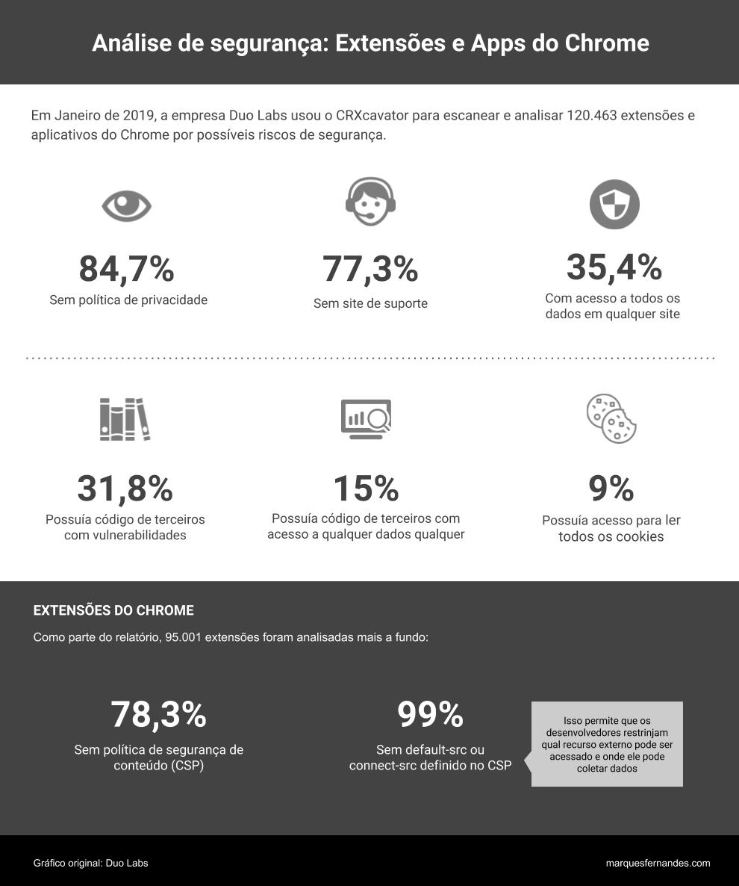

Recientemente me encontré con un artículo de [Lifehacker](https://lifehacker.com/check-to-see-if-your-next-chrome-extension-is-safe-with-1832818910) hablando sobre la seguridad de las extensiones de cromo. Un estudio fue realizado por la compañía de seguridad Duo Labs con la herramienta [CRXcavator](https://lifehacker.com/check-to-see-if-your-next-chrome-extension-is-safe-with-1832818910), una aplicación web que analiza extensiones y proporciona un informe de seguridad basado en revisiones en curso de [Chrome Web Store](https://chrome.google.com/webstore/category/extensions).

Este artículo me llamó la atención, utilizo muchas extensiones en mi día a día ([Wappalyzer](https://www.wappalyzer.com/), [Nimbus Screenshot](https://chrome.google.com/webstore/detail/nimbus-screenshot-screen/bpconcjcammlapcogcnnelfmaeghhagj?hl=en), [Trello](https://chrome.google.com/webstore/detail/trello/dmdidbedhnbabookbkpkgomahnocimke?hl=en)), si te pareces a mí y sales a instalar extensiones sin preocuparte por nada, vale la pena leerlo:

"Según su [blog](https://duo.com/blog/crxcavator), los informes proporcionados por Duo Labs no se basan solo en los datos de enero. La compañía ha automatizado sus análisis, escaneando Chrome Web Store y actualizando la información cada 3 horas.

Para tener esta información, simplemente introduzca en la búsqueda el nombre de la extensión que desea comprobar con crxcavator. El informe muestra todos los datos en detalle y ordena la extensión con una nota por nivel de seguridad. Si no te gusta el resultado de tu búsqueda, la herramienta proporciona una lista de enlaces a extensiones relacionadas con tus informes para que puedas encontrar fácilmente alternativas a esa extensión."
