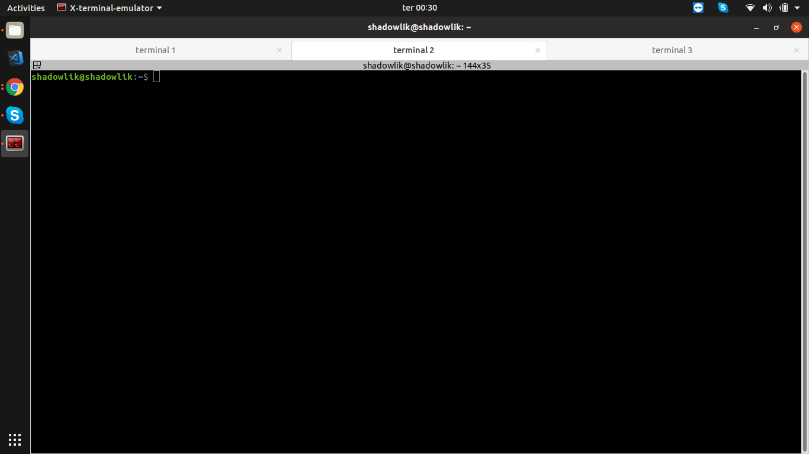
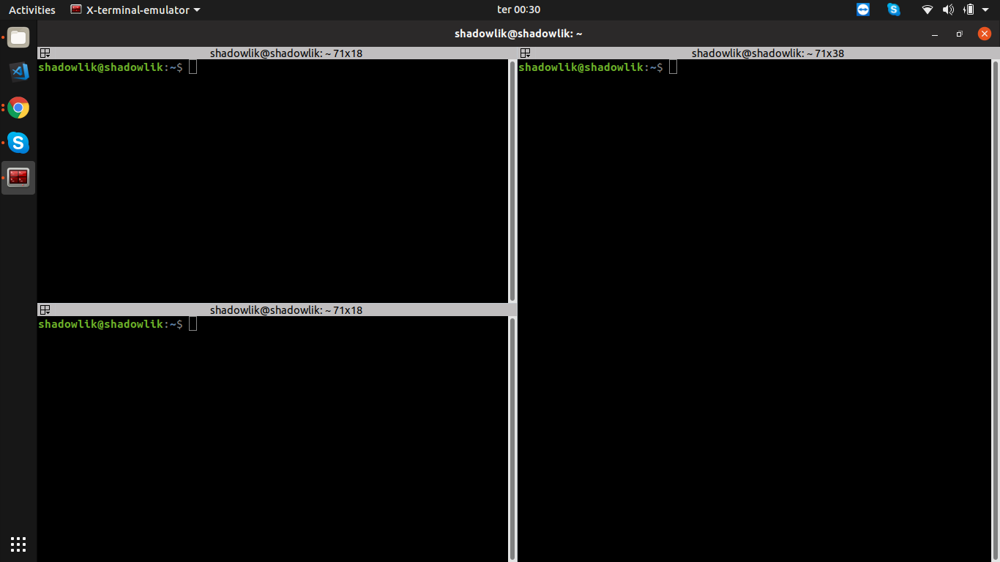
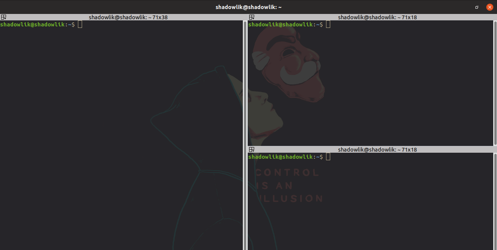
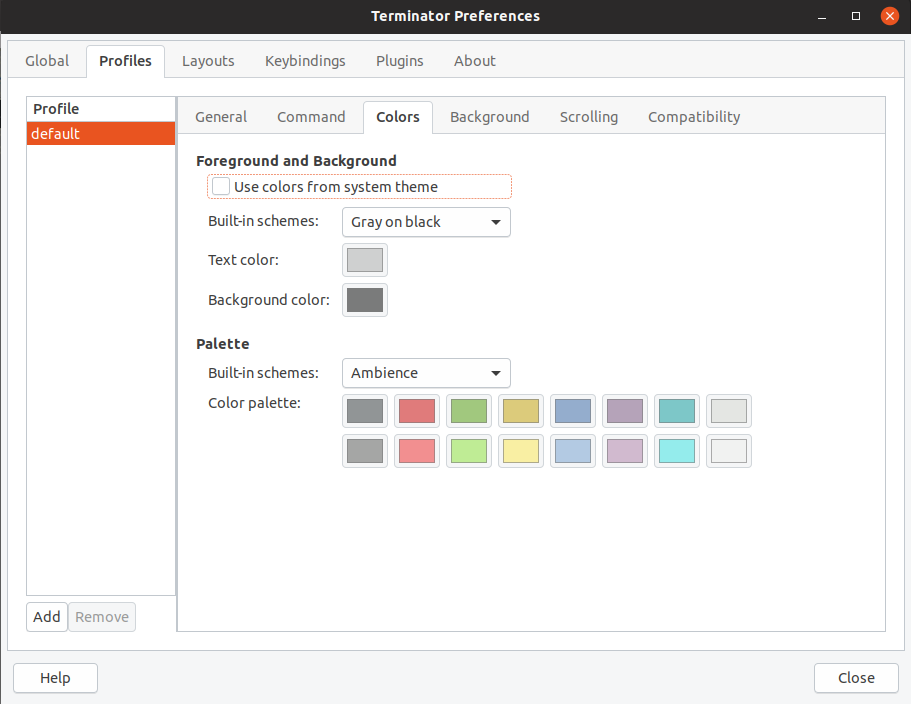

Se você está cansado do seu terminal ralé no linux; Cansado de ficar dando alt + tab entre terminais no mesmo projeto; Cansado de se perder ao tentar colar um comando; Conheça o **[Terminator](https://terminator-gtk3.readthedocs.io/en/latest/),** um [emulador de terminal](https://en.wikipedia.org/wiki/Terminal_emulator) mais robusto, organizado e customizável:

-   **Tabs Múltiplas:** Múltiplas abas de terminais na mesma janela.
-   **Grade de Terminais:** Divida uma aba em múltiplos terminais, horizontais e verticais.
-   **Logs Automático:** Salve logs de sessão automaticamente por usuários.
-   **Drag & Drop:** Arraste e solte textos, urls e comandos direto no terminal.
-   **Procurar:** Procure e destaque textos utilizando expressões Regex.
-   **Temas:** Vários temas e combinações disponíveis pela comunidade.
-   **E muito mais...**

-   
    
-   
    
-   
    
-   
    
-   
    

## Instalando o Terminator

Terminator pode ser facilmente instalado utilizando o gerenciador de pacotes na maioria das distribuições linux.

### Debian/Ubuntu

$ sudo add-apt-repository ppa:gnome-terminator
$ sudo apt-get update
$ sudo apt-get install terminator

### Fedora

$ sudo dnf install terminator

### CentOS/RHEL

$ sudo yum install terminator

## Instalando temas

Você pode instalar ou criar o seu próprio tema no Terminator. Acesse o [link](https://github.com/mbadolato/iTerm2-Color-Schemes) e escolha o tema que você mais gostar, abra o arquivo ".config" do tema desejado e copie seu conteúdo. Depois disso clique com o botão direito do mouse no Terminator, navegue até preferências e crie um novo perfil para gerar um novo arquivo de tema, vá até ~/.config/terminator/ e edite o arquivo referente ao novo perfil criado e cole o conteúdo do tema no final.

## Atalhos de teclado

Uma lista dos atalhos padrões e mais utilizados no Terminator:

-   `**F11**` : Alterna em tela cheia.
-   `**Ctrl+Shift+O**` : Divide a aba em terminais horizontais.
-   `**Ctrl+Shift+E**` : Divide a aba em terminais verticais.
-   `**Ctrl+Shift+W**` : Fecha o terminal ativo.
-   `**Ctrl+Shift+T**` : Abre uma nova aba.
-   `**Shift+Ctrl+s**` : Exibe/Esconde a barra de scroll.
-   `**Ctrl+Shift+f**` : Procura por um texto no terminal ativo.
-   `**Ctrl+Shift+R**` : Limpa o terminal ativo.
-   `**Super+g**` : Agrupa todos os terminais em uma aba.
-   `**Ctrl+Shift+q**` : Sai do terminator, fechando todas as abas.
