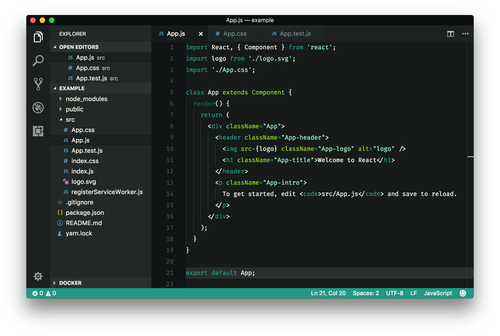
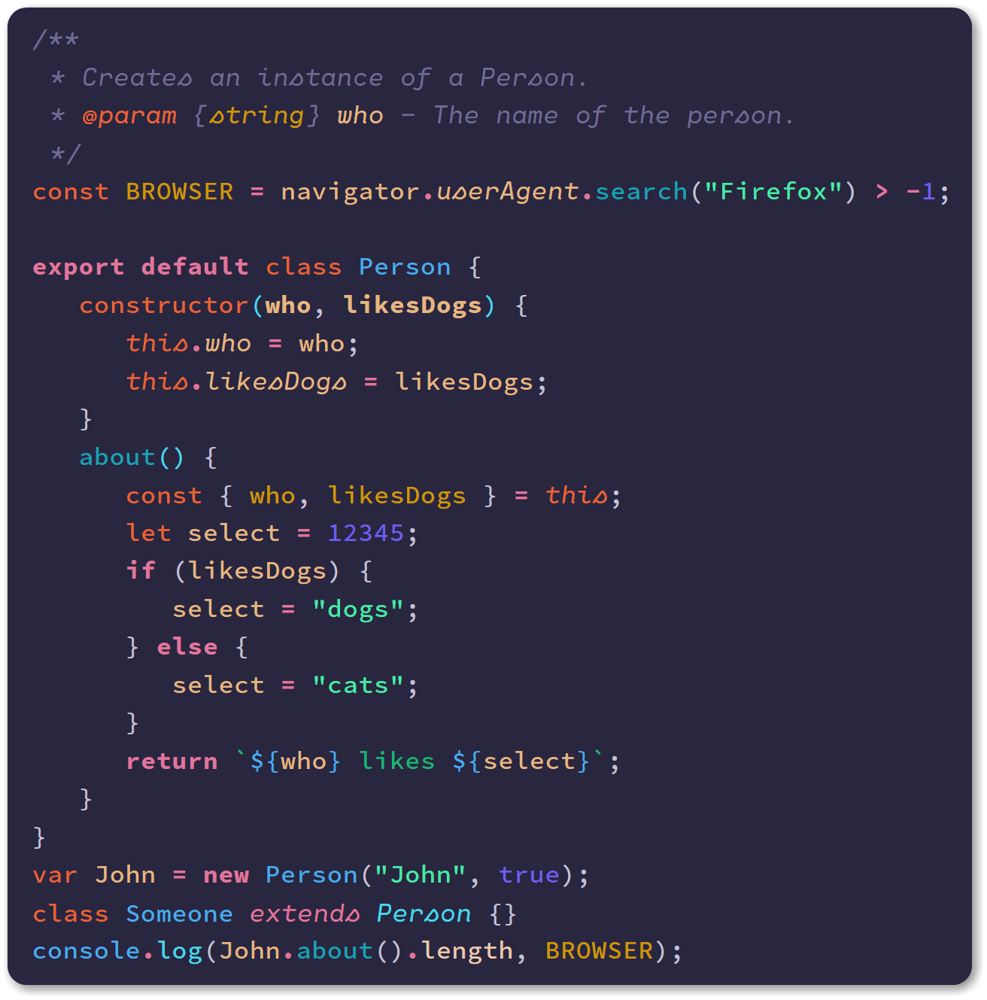

[VS Code](https://code.visualstudio.com/) es mi querido editor de la época: Código abierto, multiplataforma, ligero, altamente personalizable y con una comunidad increíble. Si aún no lo has probado, ¡pruébalo!

***También echa un vistazo:*** [*Paquetes de iconos para VS Code*](http://marquesfernandes.com/2019/10/07/pacotes-de-icones-para-vs-code-2019)

Separé una lista de 6 temas que he usado y aprobado:

## [0\. Búho Nocturno](https://marketplace.visualstudio.com/items?itemName=sdras.night-owl)

Uno de los queridos de la comunidad, el tema Nigh Owl fue desarrollado por [Sarah Drasner](https://github.com/sdras) y tiene colores optimizados para aquellos que les gusta trabajar en la oscuridad.

## [1\. Drácula, Año Nuevo](https://marketplace.visualstudio.com/items?itemName=dracula-theme.theme-dracula)

Otro querido de la comunidad y actualmente mi tema de elección. Un tema oscuro con combinaciones y contrastes fuertes pero agradables. Tiene paquetes para casi todos los IDE de mercado y también está disponible para terminales, aplicaciones de mensajería y más.

## [2\. One Dark Pro](https://marketplace.visualstudio.com/items?itemName=zhuangtongfa.Material-theme)

Para aquellos que están migrando desde [Atom,](https://ide.atom.io/) One Dark Pro te hará sentir como en casa.

## [3\. Rainglow, Año Nuevo](https://marketplace.visualstudio.com/items?itemName=daylerees.rainglow)

Si estás buscando variedad, **Rainglow** es tu elección: Una colección con más de 320 temas de combinación de colores.

-   
    
-   
    
-   
    
-   
    

## [4\. Noctis](https://marketplace.visualstudio.com/items?itemName=liviuschera.noctis)

Con combinaciones suaves este es un tema para aquellos que buscan descansar sus ojos. Tiene variaciones claras y oscuras.

-   
    
-   
    

## [5\. Un tema Monokai](https://marketplace.visualstudio.com/items?itemName=azemoh.one-monokai)

[Joshua Azemoh](https://github.com/azemoh) decidió hacer una referencia cruzada de su tema One Dark Pro con el tema [Monokai](https://www.monokai.pro/), dando vida a One Monokai Theme.

## [6\. Monokai Pro](https://marketplace.visualstudio.com/items?itemName=monokai.theme-monokai-pro-vscode)

[Monokai Pro](https://marketplace.visualstudio.com/items?itemName=monokai.theme-monokai-pro-vscode) es un esquema de color, interfaz personalizada y también una colección muy completa de iconos para Visual Studio Code.

## [7\. Sombras de púrpura](https://marketplace.visualstudio.com/items?itemName=ahmadawais.shades-of-purple)

Un tema profesional con diversos y vibrantes tonos de púrpura seleccionados a mano para su editor de código vs y terminal.

