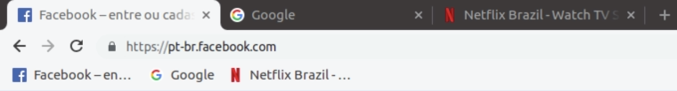
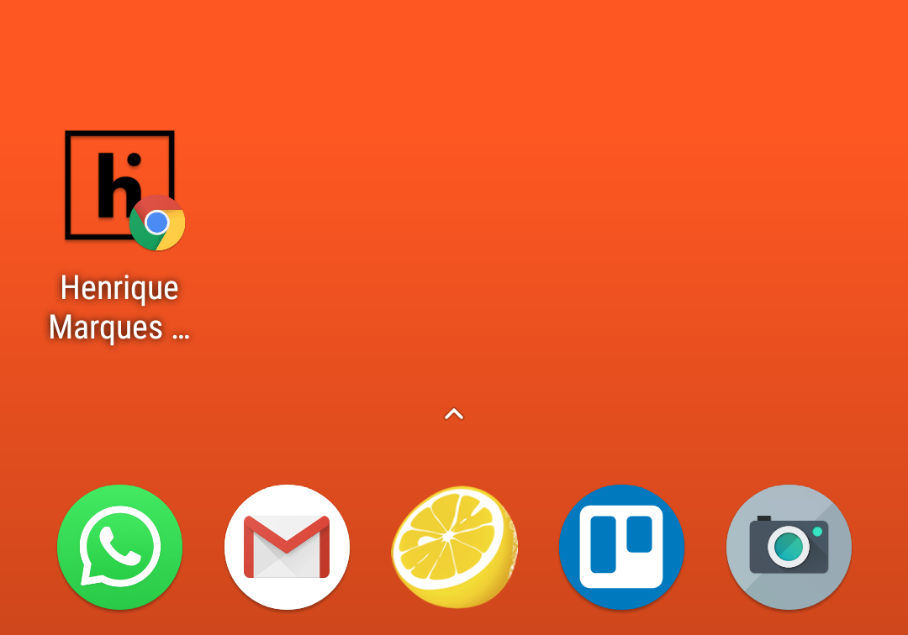

Favicon, "Favourite Icon" (Favorite Icon) , is an image used by browsers to graphically represent a page on the Internet. Previously, the only accepted format was ".ico" and 16x16 pixels in size, but nowadays we can use other formats such as ".png", ".jpg" and ".svg" and sizes. Currently, favicon is commonly used to:

-   navigation bar
-   favorite bar
-   desktop icons
-   mobile home screen icon

Most browsers will by default look for a file in the root of your site called "favicon.ico" but we can provide another location and sizes for the icon via the html <link /> tag.

## HTML Link Tag

If we don't want to use the standard browser method to display the icon and also to provide size variations we use the html tag <link />.

<link rel="" type="" sizes="" href="">

### Rel

The property "rel" means "relationship" and is used to indicate the relationship of the link in question to the page. In very old browsers the value "shortcut icon" was used, however we will focus on the modern and most used ones, so we will use the value "icon".

<link rel="icon" type="" sizes="" href="">

### Type

The "type" property indicates the [MIME format type](https://developer.mozilla.org/en-US/docs/Web/HTTP/Basics_of_HTTP/MIME_types) of the file being referenced. For example: For a file in ".ico" format we use "image/x-icon", whereas in ".png" format it would be "image/png". Although not a mandatory property, it is recommended to support older browsers (IE9 and IE10).

<link rel="icon" type="image/png" sizes="" href="">

### Sizes

The "sizes" property is used to indicate the size of the icon being referenced. As we can provide optimized versions for different uses, here we tell the browser what size and so it knows which icon is best to use in each case.

<link rel="icon" type="image/png" sizes="228x228" href="">

### href

The property "href" indicates the location on the server of the referenced file.

<link rel="icon" type="image/png" sizes="228x228" href="/icons/favicon.ico">

### Coline

| browser | Tag Link: "rel" / "type" | Accepted Formats |
| --- | --- | --- |
| IE 8 or earlier | rel="shortcut icon" | .ico |
| IE 9, IE 10 | rel="icon" type="image/x-icon" | .ico |
| IE 11 | rel="icon" type="image/ x-icon or png or gif " | .ico, .png, .gif |
| Chrome | rel="icon" type="image/ x-icon or png or gif " | .ico, .png, .gif |
| Firefox | rel="icon" type="image/ x-icon or png or gif " | .ico, .png, .gif, [.svg\*](http://caniuse.com/#feat=link-icon-svg) |
| Safari | rel="icon" type="image/ x-icon or png or gif " | .ico, .png, .gif |
| Opera | rel="icon" type="image/ x-icon or png or gif " | .ico, .png, .gif |

## Mobile Devices

Some mobile browsers allow the creation of shortcuts on the home screen and for this we can provide images with optimized quality and sizes:

| Device / Browser | Tag Link "rel" | Sizes (size) |
| --- | --- | --- |
| Apple / Safari | rel="apple-touch-icon" or  
rel="apple-touch-icon-precomposed" | 76x76 - iPad 2 and iPad mini  
120x120 - iPhone 4s, 5, 6  
152x152 - iPad (retina)  
180x180 - iPhone 6 Plus |
| Apple / Opera Coast | rel="icon"  
 | 228x228 |
| Android / Chrome | rel="icon"  
 | 192x192 |

## Most used sizes

Finally, I have separated a list with most sizes used and by whom:

| **Size** | **Name** | **Use** |
| --- | --- | --- |
| 32×32 | favicon-32.png | Default for most browsers |
| 57×57 | favicon-57.png | Standard for iOS and iPhone home screen up to 3rd generation |
| 76×76 | favicon-76.png | iPad Home Screen |
| 96×96 | favicon-96.png | GoogleTV |
| 120×120 | favicon-120.png | retina iPhone |
| 128×128 | favicon-128.png | Chrome Web Store icon and Windows 8 Start Screen |
| 144×144 | favicon-144.png | IE10 metro icon \* |
| 152×152 | favicon-152.png | iPad |
| 167×167 | favicon-167.png | Retina iPad |
| 180×180 | favicon-180.png | iPhone 6 plus |
| 192×192 | favicon-192.png | Google Developer Web App Recommendation |
| 195×195 | favicon-195.png | Opera Speed Dial (Version 15 and earlier) |
| 196×196 | favicon-196.png | Chrome home screen shortcut on Android |
| 228×228 | favicon-228.png | Opera Coast icon |

## Favicons generator sites

To make our lives easier there are sites that generate all major sizes automatically:

-   [https://www.favicon-generator.org/](https://www.favicon-generator.org/)
-   [https://realfavicongenerator.net/](https://realfavicongenerator.net/)
-   [https://favicon.io/](https://favicon.io/)
-   [http://www.genfavicon.com/](http://www.genfavicon.com/pt/)
-   [https://www.favicon.cc/](https://www.favicon.cc/)
