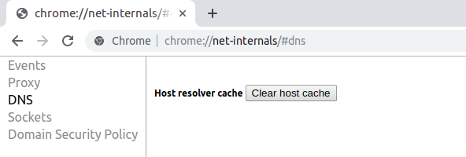

## What is DNS?

DNS, from the English Domain Name System, acts as a translator of IP addresses (192.168.0.1) to domains ( [marquesfernandes.com](http://marquesfernandes.com) ), as a kind of post office that manages to transform a zip code (IP) into a street (domain).

## What is DNS caching?

As your browsing history, images and other files are saved by your browser to improve browsing speed, your computer also stores the locations (IP addresses) of the websites you have visited so it avoids having to look up every time which IP it should accessing when you enter a site saved response and loading time. This is the famous DNS cache, so if the IP reference in a domain is changed on the DNS server, you may still be trying to access outdated information.

## How to clean?

Before I show you some ways to clear your computer's DNS cache, it is worth remembering that depending on where you are connected there may be other layers of cache on the network, very common in companies that use a proxy system and which you probably do not have access to. . In this situation you will unfortunately have to wait for the DNS cache to renew itself ☹.

### Windows

-   Press Win + X to open the Menu
-   Right-click Command Prompt and select Run as Administrator.
-   Type the following command and press enter:

ipconfig /flushdns

If the command is successful, you will see the following message:  
*Windows IP configuration successfully flushed the DNS Resolver Cache (Windows IP configuration successfully flushed the DNS Resolver Cache).*

### **MacOS**

1.  Click on Applications
2.  Click on Services
3.  Double click on the Terminal app
4.  Enter the following command:

sudo killall -HUP mDNSResponder

### Ubuntu and Debian Distributions

1.  Open the terminal (usually the shortcut is Ctrl+Alt+T)
2.  Run the following command:

sudo /etc/init.d/networking restart

Enter the root password and wait for the following response:*\[ ok \] Restarting networking (via systemctl): networking.service*

### Google Chrome

Open Google Chrome browser, type **chrome://net-internals/#dns** in the navigation bar and press the button **clear host cache** :

