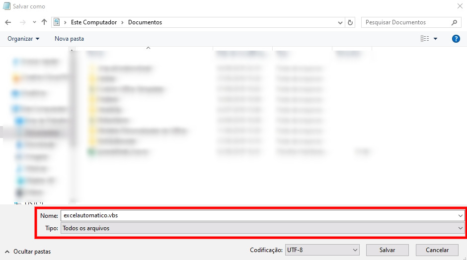

¿Alguna vez ha tenido que ejecutar una hoja de cálculo de Excel a diario? Recientemente me encontré con este escenario, y como un programador perezoso pensé: No se puede no para no automatizar esto! Encontré una solución relativamente simple y decidí documentar.

> **Siempre elijo a una persona perezos  
> a para hacer un trabajo duro... Porque encontrará una manera fácil de hacerlo.**
> 
> Bill Gates

Explicaré cómo puede hacer esto usando el **Programador de tareas** **(Programador de tareas de Windows - ya instalado)** para: Abrir; Ejecutar macros VBA; Guardar; Cierre Excel. Esta solución permite una amplia variedad de ajustes de programación!

**PARA QUE EL PROGRAMADOR FUNCIONE, EL EQUIPO DEBE ESTAR ENCENDIDO**

## Requisitos previos

Todos los requisitos previos ya vienen instalados de forma predeterminada en Windows:

-   Programador de tareas (Programador de tareas de Windows)
-   Bloc de notas (o algún editor de texto neutro)
-   CScript **(C:\\Windows\\System32\\cscript.exe)**

## Creación del archivo VBS

El archivo que hará que toda la magia suceda será un script de Visual Basic Script (VBS). Si está familiarizado con VBA, no tendrá ninguna dificultad para entender los comandos de script.

Abra el *Bloc de notas* y copie el contenido siguiente:

'Ruta completa a la hoja de cálculo de Excel 
CaminhoArquivoExcel = "C:\\Users\\henrique\\Documents\\nome\_da\_planilha.xlsm" 
 
'Alcance y nombre completo de la macro para ejecutar 
CaminhoMacro = "Module1.NomeDaMacro" 

'Creamos una instancia de Excel 
Set ExcelApp = CreateObject("Excel.Application") 

'¿Desea que esta instancia sea visible? 
ExcelApp.Visible = True  'o "False" 

'Impide que Excel muestre alertas
ExcelApp.DisplayAlerts = False 

'Abrimos el archivo excel 
Set wb = ExcelApp.Workbooks.Open(CaminhoArquivoExcel) 

'Ejecutamos la macro 
ExcelApp.Run CaminhoMacro

'Guardamos el archivo de Excel después de ejecutar la macro 
wb.Save 

'Volvemos con el parámetro de alertas para evitar problemas con otras hojas de cálculo 
ExcelApp.DisplayAlerts = True 
 
'Cerramos el archivo de Excel 
wb.Close 

'Cerramos la instancia de Excel 
ExcelApp.Quit 
  
'Alerta para avisar cuando la hoja de cálculo se ejecute correctamente 
MsgBox "Su hoja de cálculo se ejecutó automáticamente con éxito a las:" & TimeValue(Now), vbInformation 

Ahora necesitamos reemplazar alguna información:

1.  Intercambie el valor de la variable **File PathExcel** por la ubicación exacta del archivo de Excel que desea abrir. Importante poner el nombre correcto y la extensión.
2.  Cambie el valor de la variable **PathMacro** por el valor exacto de la macro que desea rotar.
3.  En **ExcelApp.Visible** puede decidir si desea que la aplicación abra una instancia visible **(verdadera)** o que la ejecute en segundo plano **(false).** **Algunos** **complementos no funcionan en segundo plano.**
4.  **MsgBox**: Alerta con mensaje visible al usuario si la macro se ha ejecutado correctamente, si no desea simplemente quitar esta línea.

Vamos a guardar este archivo con la extensión **.vbs**: en el Bloc de notas en el momento de guardar en el tipo de campo de nombre de archivo algo así como: **excelautomatico.vbs** y en el tipo de archivo seleccione: **Todos los archivos**. Un bien si todas las rutas son correctas y guardar este archivo en un lugar seguro donde nadie puede eliminar accidentalmente. ¡Anote la ruta del archivo guardado porque lo necesitaremos para más adelante!

## Creación de la programación con el Programador de tareas

Para encontrar el programa sólo tiene que escribir en el menú de búsqueda iniciar **El Programador de tareas**. 

Para crear una nueva tarea simplemente haga clic en el botón en el lado derecho: **Crear tarea...**

### Crear tarea - Ficha General 

En **la pestaña General** rellenará el nombre de la programación y su descripción.

*Consejo: La descripción es opcional, pero una buena práctica para que en el futuro usted o alguien más pueda entender lo que hace este horario. ¡Experimenta el tuyo, crea una descripción objetiva!*

En esta pestaña también podemos establecer si queremos que la programación se ejecute cuando el usuario no ha iniciado sesión en el equipo, **recordando de nuevo que para trabajar el equipo siempre debe estar encendido**. Asumo que siempre desea ejecutar incluso con el equipo bloqueado: seleccione **Ejecutar si el usuario ha iniciado sesión o no**, e introduzca su usuario y contraseña para validar esta opción. 

### Crear tarea - pestaña Desencadenadores 

En **la pestaña Desencadenadores** configuramos programaciones de tareas, haga clic en el botón **Nuevo** para crear y configurar una nueva programación. En el ejemplo siguiente estamos creando una regla para ejecutar nuestra programación todos los días a las 16:43 hs:

Puede crear más de una regla para cada programación.

### Crear tarea - pestaña Acciones 

En **la pestaña Acciones** vamos a trazar los acciones que se deben realizar. Para ejecutar el script creado al principio del tutorial necesitamos usar un programa nativo de Windows llamado **CScript** que nos permita ejecutar nuestro archivo **.vbs**: 

En el campo "Programa/script" agregue: **"C:\\Windows\\System32\\cscript.exe"** 

Ahora vamos a mover como argumento a **CScript** qué archivo queremos que se ejecute. Pegue la ruta completa del archivo **.vbs** que creamos al principio: 

En el campo "Agregar argumentos (opcional)" cambiar los valores y añadir algo como: **"C:\\****Users****\\****henrique****\\****excelautomatico****.vbs"** 

**Ambos valores deben estar entre comillas.** 

### Crear tarea - Otras pestañas 

Algunos ajustes adicionales se pueden encontrar en las otras pestañas, por lo que le recomiendo una comprobación y ver si se requerirá cualquier otra configuración para su caso.
