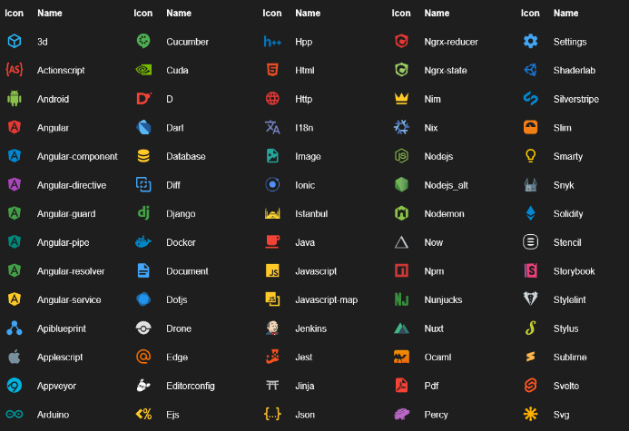
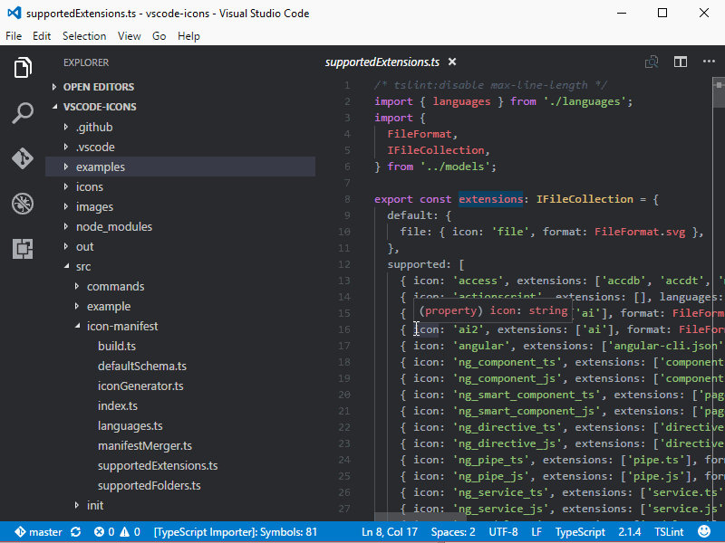

Tired of that tedious and ugly icon pack from your VS Code? Check out a list of the best packages to customize file and folder icons in your VS Code!

***Also check:** [Top 6 themes to use in VS Code](http://marquesfernandes.com/2019/03/19/top-6-temas-para-usar-no-vs-code-em-2019)*

## [Material Icon Theme](https://marketplace.visualstudio.com/items?itemName=PKief.material-icon-theme)

**Installations:** +2.5 million  
**Stars:** 4.9

[Material Icon Theme](https://marketplace.visualstudio.com/items?itemName=PKief.material-icon-theme) is the icon pack that I like and use the most, it has a wide selection of proprietary icons in addition to identifying and customizing several default folders, such as the "src/" folder.

## [vscode-icons](https://marketplace.visualstudio.com/items?itemName=vscode-icons-team.vscode-icons)

**Installations:** +3.7 million  
**Stars:** 4.8

vscode-icons is the most downloaded package, with over 3.7 million downloads and 341 stars, it has a wide variety of icons.

## [VSCode Great Icons](https://marketplace.visualstudio.com/items?itemName=emmanuelbeziat.vscode-great-icons)

**Installations:** +560 thousand  
**Stars:** 4.9

VSCode Great Icons has more than 100 different icons, in the top 3 most downloaded packs it is a good alternative for your icons!

## [Nome Dark Icon Theme](https://marketplace.visualstudio.com/items?itemName=be5invis.vscode-icontheme-nomo-dark)

**Installations:** +117 thousand  
**Stars:** 4.8

[Nome Dark Icon Theme](https://marketplace.visualstudio.com/items?itemName=be5invis.vscode-icontheme-nomo-dark) it is not as famous as the others, but its icon style is very pleasing.

## [Keen neutral icon theme](https://marketplace.visualstudio.com/items?itemName=keenethics.keen-neutral-icon-theme)

**Installations:** +7.4 thousand  
**Stars:** 5

[Keen neutral icon theme](https://marketplace.visualstudio.com/items?itemName=keenethics.keen-neutral-icon-theme) is a minimalist icon theme, ideal for anyone who likes clean and objective lines.
