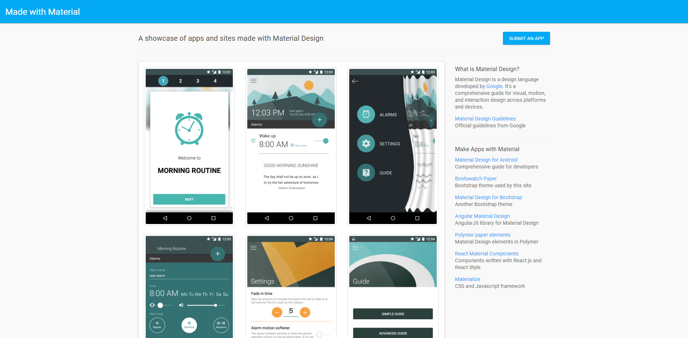
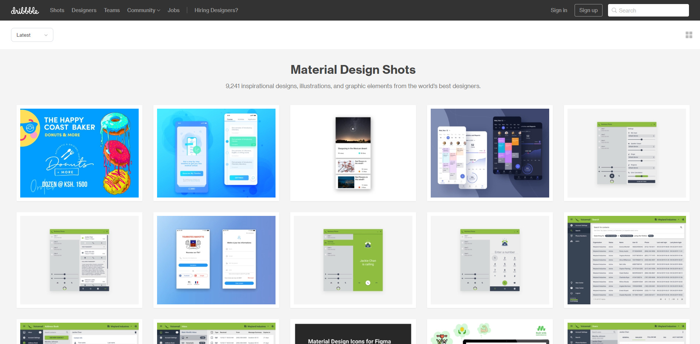
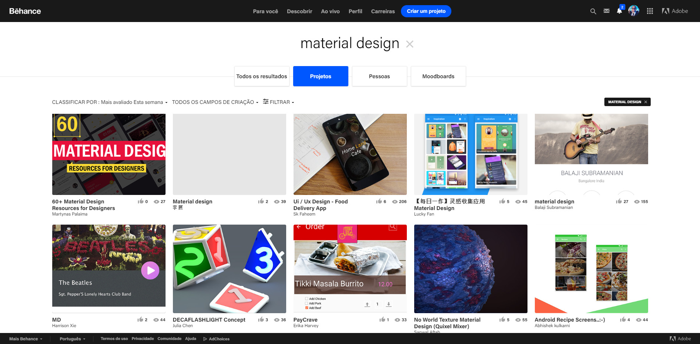
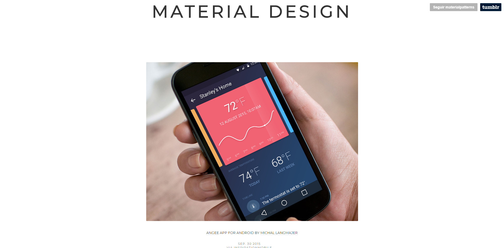
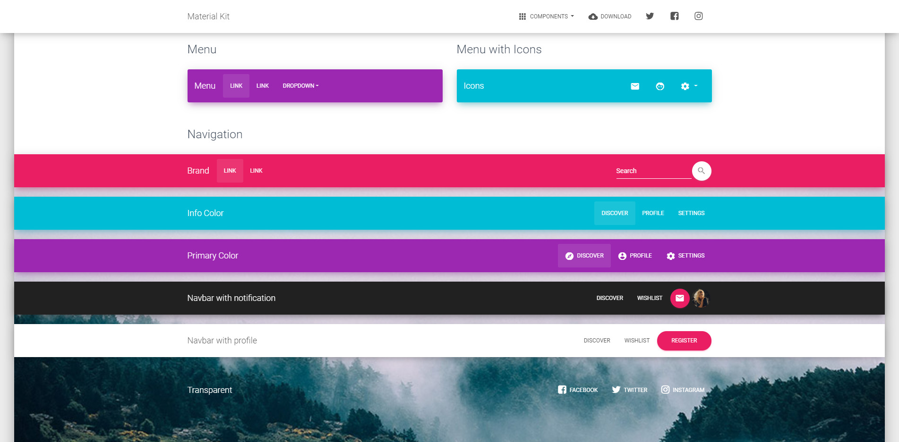
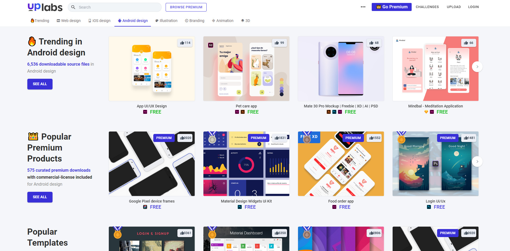
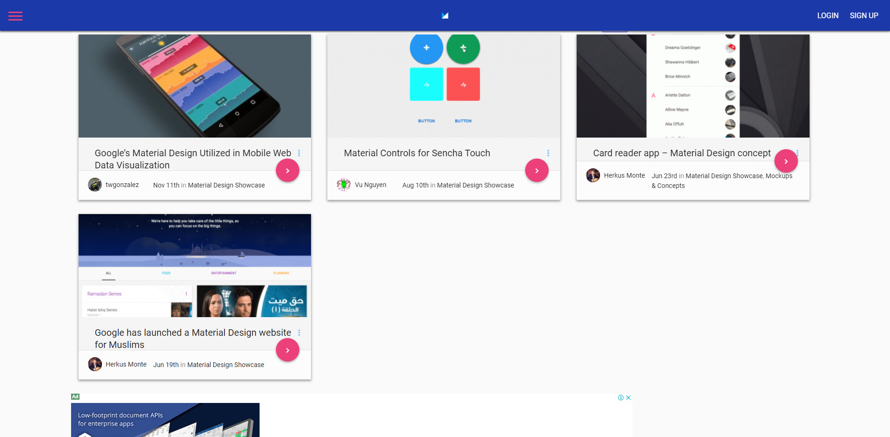
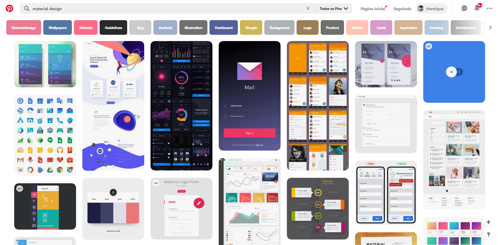
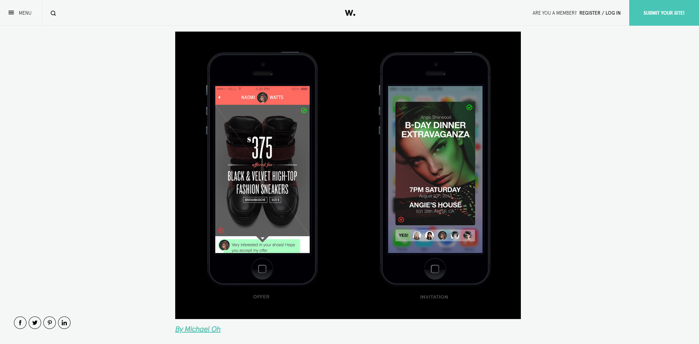
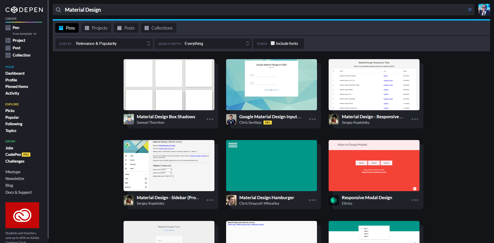

Recentemente comecei um projeto usando o [Vuetify](http://vuetifyjs.com), framework [Vue](https://vuejs.org) de componentes Material, e por mais completo e bem estruturado que os componentes sejam tive uma certa dificuldade para compor e combinar a interface. Se você, como eu, não possui tato para design veja essa lista de sites e projetos para ajudar nas inspirações:

## [Made with Material](https://madewithmaterial.tumblr.com)

[Made with Material](https://madewithmaterial.tumblr.com/) é um [tumblr](https://www.tumblr.com/) que reúne um belo portfolio de apps criados com Material.

## [Dribbble: Material Design](https://dribbble.com/tags/material_design)

[Dribbble](https://dribbble.com/) é uma comunidade online para a exposição de conteúdo artístico.  Você consegue filtrar por tags de interesse, por exemplo: [tags/material\_design](https://dribbble.com/tags/material_design).

## [Behance: Material Design Projects](https://www.behance.net/search?content=projects&search=material%20design&sort=appreciations&time=week&user_tags=89571585)

[Behance](https://www.behance.net/) (Bēhance) é uma rede social da [Adobe](https://www.adobe.com/br/) que tem como objetivo "mostrar e descobrir o trabalho criativo". Nele você encontra uma série de inspirações incluindo amostras feitas com [Material Design](https://www.behance.net/search?content=projects&search=material%20design&sort=appreciations&time=week&user_tags=89571585).

## [Material Patterns](https://materialpatterns.tumblr.com)

[Material Patterns](https://materialpatterns.tumblr.com/) é um [tumblr](https://www.tumblr.com/) que reúne alguns exemplos de apps criados com Material.

## [Material Kit by Creative Tim](https://demos.creative-tim.com/material-kit/index.html)

[Material Kit](https://demos.creative-tim.com/material-kit/index.html) é um kit de UI gratuito feito em cima do Bootstrap 4 com design inspirado no Material do Google.

## [Uplabs Android](https://www.uplabs.com/android)

"A [UpLabs](https://www.uplabs.com/android) é o local para encontrar recursos de design de alta qualidade para designers, agências criativas e desenvolvedores".

## [Material Design Blog](http://materialdesignblog.com/material-design-showcase/)

"Um portfolio dos melhores sites de design de materiais, temas, maquetes e exemplos de conceitos para sua inspiração. Projetos criativos construídos com Material Design."

## [Pinterest: Material Design](https://br.pinterest.com/search/pins/?rs=ac&len=2&q=material%20design&eq=material%20design&etslf=6060&term_meta[]=material%7Cautocomplete%7C2&term_meta[]=design%7Cautocomplete%7C2)

[Pintrest](https://dribbble.com/) é uma comunidade online para a exposição de conteúdo artístico.  Você consegue filtrar por tags de interesse, por exemplo: [tags/material\_design](https://br.pinterest.com/search/pins/?rs=ac&len=2&q=material%20design&eq=material%20design&etslf=6060&term_meta[]=material%7Cautocomplete%7C2&term_meta[]=design%7Cautocomplete%7C2)

## [Awwwards](https://www.awwwards.com/fresh-ui-inspiration-in-the-era-of-google-material-and-design-patterns.html)

[Awwwards](https://www.awwwards.com/) (Awwwards Online SL) é um site que promove competições de web design e desenvolvimento web. O objetivo é reconhecer e promover o melhor do design inovador da web. [Em Janeiro de 2019](https://www.awwwards.com/fresh-ui-inspiration-in-the-era-of-google-material-and-design-patterns.html) eles divulgaram um artigo promovendo inspirações de interface com Material Design.

## [Codepen: Material Design](https://codepen.io/search/pens?q=Material%20Design)

"[Codepen](https://codepen.io/search/pens?q=Material%20Design) é um serviço de prototipagem que permite o compartilhamento de códigos." Filtrando por [tag](https://codepen.io/search/pens?q=Material%20Design) você consegue também encontrar alguns exemplos de snippets feitos com Material.
