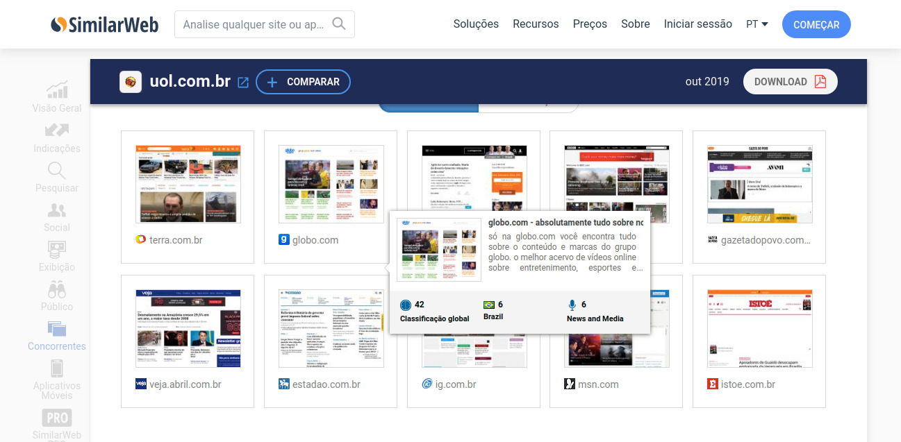
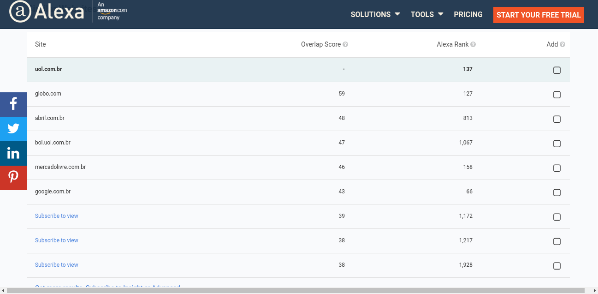
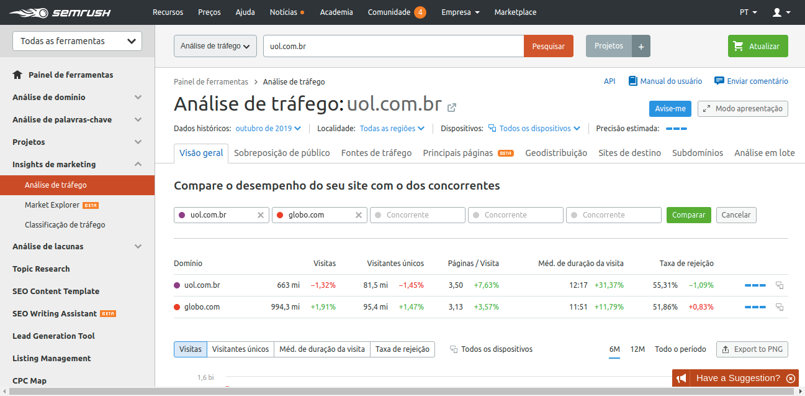

Me han preguntado más de una vez si era posible conocer la visita de un sitio, aunque para el público friki esta pregunta parece ser una bestia, es una pregunta válida y por lo general se concluye con: "Me gustaría analizar el sitio de un competidor". Aunque no es posible tener acceso a los datos exactos sin ser el propietario del sitio podemos con la ayuda de algunas herramientas tener una estimación de visitas e incluso estrategias de palabras clave que los competidores están utilizando.

> Mantén a tus amigos cerca, pero tus enemigos aún más cerca.

Echa un vistazo a algunas herramientas que utilizo para analizar a mis competidores.

## **[Similar Web](https://www.similarweb.com/pt)**

[SimilarWeb](https://www.similarweb.com/pt) es una excelente herramienta para analizar cuánto tráfico están generando sus competidores.

Algunas características:

-   Estimación del tráfico
-   Tiempo estimado invertido en el sitio
-   Tasa de rechazo estimada
-   Sitios de referencia
-   Tráfico estimado a través de las redes sociales

El servicio es gratuito, pero la cantidad de información termina siendo limitada, pero vale la pena para una estimación inicial.

## **[Alexa](https://www.alexa.com/)**

[Alexa](https://www.alexa.com/) es una herramienta de dinosaurios de Internet, está entre nosotros durante mucho tiempo generando análisis y clasificaciones de sitios ya que me conozco por programador. No tan informativo como SimilarWeb, ofrece sólo unas pocas estimaciones aproximadas, pero su clasificación de sitios es una de las más fiables en Internet.

## [SEMRush](https://pt.semrush.com/)

[SEMrush](https://pt.semrush.com/) es una herramienta versátil para analizar a tus competidores y con una interfaz muy intuitiva, excelente para monitorear a tus competidores.

Algunas características:

-   Tráfico orgánico y pagado estimado
-   Variación de los resultados en las búsquedas
-   Palabra clave para que sus competidores estén clasificados
-   Principales competidores

La herramienta es gratuita pero limitada a 5 puntos de datos para su análisis.
