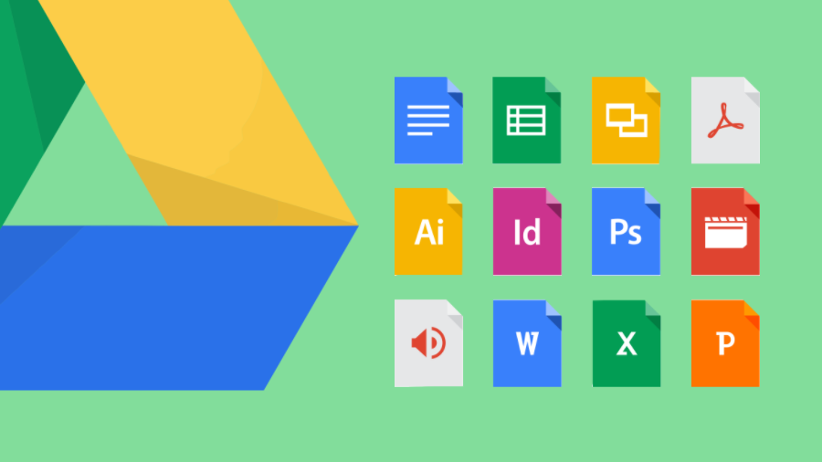

Procurando por exemplos de documentações REST online? Separei 5 documentações de APIs que recentemente me ajudaram como inspiração.

[Twitter API](https://dev.twitter.com/overview/api) 

Twitter (inglês: \[ˈtwɪtər\]) é uma rede social e um servidor para microblogging, que permite aos usuários enviar e receber atualizações pessoais de outros contatos (em textos de até 280 caracteres, conhecidos como "tweets"), por meio do website do serviço, por SMS e por softwares específicos de gerenciamento.

[Github API](https://developer.github.com/v3/#parameters) 

GitHub é uma plataforma de hospedagem de código-fonte com controle de versão usando o Git.

[Google Drive API](https://developers.google.com/drive/v2/reference/files#resource) 

Google Drive é um serviço de armazenamento e sincronização de arquivos que foi apresentado pela Google em 24 de abril de 2012.

[Paypal API](https://developer.paypal.com/docs/api/overview/) 

PayPal é uma empresa de pagamentos online situada em São José, na Califórnia, Estados Unidos. Fundada em 1998 por Peter Thiel e Max Levchin, opera internacionalmente e é uma das maiores do ramo por ser capaz de realizar pagamentos rápidos e auxiliar em envios de dinheiro.

[VTEX Catalog API](https://documenter.getpostman.com/view/845/vtex-catalog-api/Hs44?version=latest) 

VTEX é uma multinacional brasileira de tecnologia com foco em cloud commerce desenvolvedora da plataforma VTEX Cloud commerce, disponibilizada no mercado como SaaS com atuação global.
