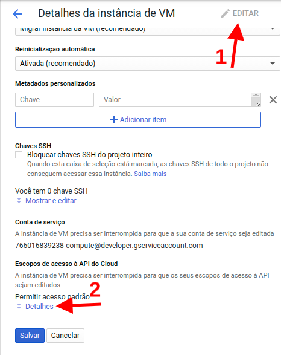

In this article I will teach you how to use the [FileZilla](https://filezilla-project.org/) to connect and access your files on your VM instances in [Google Cloud Compute Engine](https://cloud.google.com/compute/) by SFTP using the [putty](https://www.putty.org/) to generate the SSH keys and [PPK](http://marquesfernandes.com/2019/02/18/convertendo-arquivos-ppk-para-pem-no-linux-ubuntu-debian/) needed.

## Downloading Putty and FileZilla

Download and install the [PUTTY](https://www.ssh.com/ssh/putty/#sec-PuTTY-downloads) it's the [FileZilla](https://filezilla-project.org/download.php) on your computer.

*The PUTTY program is an SSH key generator to create private and public keys that allow you to encrypt connections.*

*FileZilla is a tool to transfer and manage files via FTP protocol.*

## Generating Public and Private Keys with PUTTYgen

open the program **PUTTYgen** and click the generate button ( *Generate* ).

A progress bar will appear asking you to move the mouse to generate randomness. Move your mouse over the gray area of the program, wait for the progress bar to fill completely and then your keys will be generated.

After generating the keys, new fields will appear below. In the field **Key comment** enter the desired user.

Copy the public key and save the private key in a safe place on your computer.

## Adding the public key to your Google Cloud instance

Sign in to your Google Cloud account and navigate to **Compute Engine > VM Instances** .

Select the instance you want to access, click edit and scroll down until you find the session **SSH keys** .

Paste the public key you copied earlier into the " **Enter all key data"** , once that is done, you will see on the left the user you entered when creating the key.

Now update the instance by clicking on **To save** .

## Setting up public key authentication in FileZilla

open the **FileZilla** and navigate to **Edit > Settings** .

In the left side menu navigate to **Connection > FTP > SFTP** .

click in **add key file** and select the private key you saved.

click in **OK** to save the settings.

## Establishing a secure (SFTP) connection to your instance

To connect to your Google Cloud instance you need the IP address and user of the public/private key creation.

In the FileZilla window, in the host field, type **sftp://ipdainstance** . In the field **User** enter your username and click quick connect.

Once this is done you will be able to access and transfer files to your instance.
