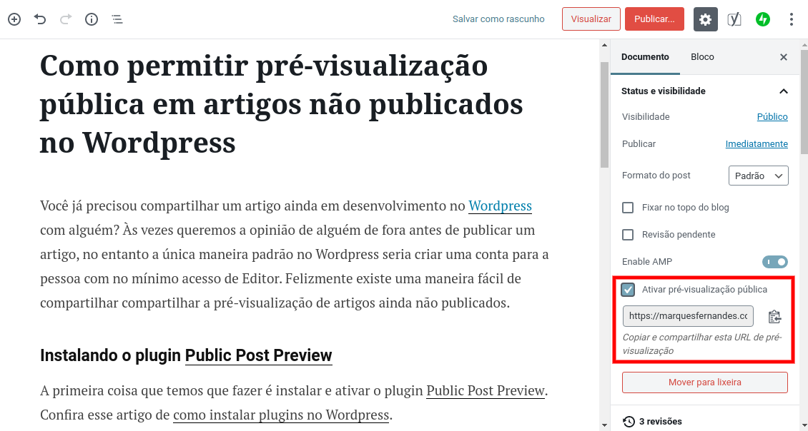
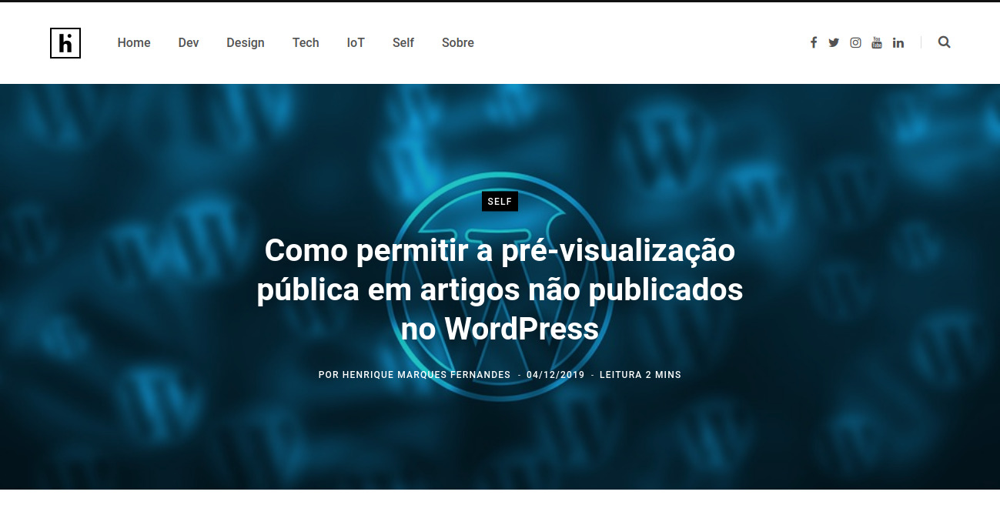

Have you ever wanted to share an article still in development, the famous draft, on [WordPress](https://wordpress.com/) with someone? Sometimes before publishing an article we want an outside opinion and help. By default the only way to do this in Wordpress would be to create an account for the person with at least access to *Editor* . This becomes unnecessary work if we just want a quick opinion. Fortunately there is an easy and simple way to share the preview of unpublished articles.

#### Installing and activating the plugin [Public Post Preview](https://wordpress.org/plugins/public-post-preview/)

For all the magic to happen we need to install and activate the plugin [Public Post Preview](https://wordpress.org/plugins/public-post-preview/) in our WordPress installation. *Check out this article from [how to install plugins in Wordpress](https://kinsta.com/pt/base-de-conhecimento/como-instalar-plugins-no-wordpress/) .*

After activation you need to browse and edit the desired post and you will notice that in the tab *Document* a new "Enable public preview" option has appeared, to activate the functionality just click and activate the checkbox.

After enabling sharing, save any changes made to the article as a draft, copy the generated link and share with the desired person.

*The link contains a unique key that allows anyone with the URL to have preview access, although the link does not allow edit access, please share carefully so your article doesn't leak out too soon.*

To disable public preview just go back to editing the post and deselect the checkbox and save. This immediately stops the shared URL from working.

The shared link renders a preview exactly like the page when the article is finally published.

After the article is launched the public preview option will no longer be available in edit mode and the shared URL will create a redirect to the article's permanent link.
