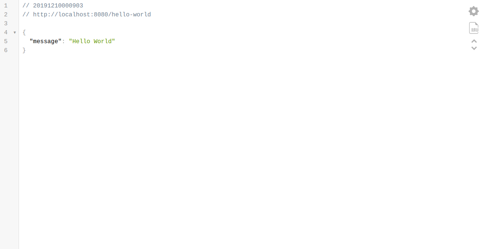
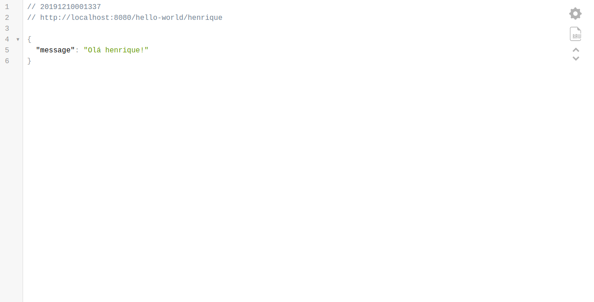

Este artículo se inspiró en mi propia frustración en la optimización de mi configuración de NodeJS con Typescript y Docker. La mayoría de los procesos y tutoriales conducen a configuraciones que hacen que el desarrollo sea agotador y lento, entre tantas reconstrucciones y reinicios su paciencia se agota y su productividad se agota. Después de mucha investigación, pruebas y estrés, pude armar una configuración ideal!

Es necesario que usted tenga al menos el conocimiento básico de nodo, tipo de ley y docker, no voy a explicar ninguna tecnología en profundidad, si usted tiene alguna pregunta específica estaré encantado de ayudar en los comentarios.

Al final de este tutorial tendrá un entorno de desarrollo [NodeJS](http://marquesfernandes.com/2019/03/05/afinal-o-que-e-nodejs) con [Typescript](https://www.npmjs.com/package/typescript), [ts-node-dev](https://github.com/whitecolor/ts-node-dev), [Docker](https://www.docker.com/), [ESlint](https://eslint.org/) con [Airbnb Style Guide](https://www.npmjs.com/package/eslint-config-airbnb-typescript) y [Prettier](https://prettier.io/).

Todos los códigos de este tutorial están disponibles en [GitHub](https://github.com/shadowlik/node-ts-otimizado).

En la primera parte del artículo configuraremos nuestro IDE de [Visual Studio Code](https://code.visualstudio.com/) para el desarrollo, no dude en omitir esta parte si usa otro IDE.

## Configuración de [VS Code](https://code.visualstudio.com/download)

Primero vamos a crear una carpeta vacía para nuestro proyecto e iniciar vs código en él:

$ mkdir node-ts-optimized && code node-ts-optimized/

### Extensiones útiles de VS Code

Recomiendo instalar las extensiones enumeradas a continuación, aumentarán su productividad:

-   [Gramática más reciente de TypeScript y Javascript](https://marketplace.visualstudio.com/items?itemName=ms-vscode.typescript-javascript-grammar) - Extenso da Microsoft para suporte de Typescript e Javascript
-   [Typescript Hero](https://marketplace.visualstudio.com/items?itemName=rbbit.typescript-hero) - Organiza las importaciones de mecanografiados
-   [ESLint](https://marketplace.visualstudio.com/items?itemName=dbaeumer.vscode-eslint) - Integración de ESLint directamente en el IDE
-   [Más bella - Formato de código](https://marketplace.visualstudio.com/items?itemName=esbenp.prettier-vscode) - Integración de Más Bella directamente en el IDE
-   [Docker](https://marketplace.visualstudio.com/items?itemName=ms-azuretools.vscode-docker) para autocompletar, resaltado de código y comandos de Docker
-   [Material Icono Tema](https://marketplace.visualstudio.com/items?itemName=PKief.material-icon-theme) - Esto no es necesario, pero me gustan los iconos lindos y quería compartir

### Configuración del [espacio de trabajo](https://code.visualstudio.com/docs/getstarted/settings)

Dentro del proyecto, si aún no existe, cree una carpeta `.vsco`de y el archivo s`ettings.json`. Agregue las siguientes propiedades:

{
  "eslint.autoFixOnSave": true,
  "eslint.validate": \[
    "javascript",
    {"language": "typescript", "autoFix": true },
  \],
  "editor.formatOnSave": true,
  "\[javascript\]":  {
    "editor.formatOnSave": false,
  },
  "\[typescript\]":  {
    "editor.formatOnSave": false,
  }
}

Esto habilita automáticamente el agente automático ESlint y Prettier al guardar un archivo.

## Inicio de un proyecto NodeJS

Ahora necesitamos inicializar un proyecto de nodo:

$ cd node-ts-optimized && npm init

Dentro del proyecto vamos a crear una carpet`a src`/, es en ella que vamos a poner todos nuestros archivos .ts de fue`nte`s. Disfrutar y crear un archivo vacío con el nombr`e index.t`s, lo usaremos más adelante.

### TypeScript y ts-node-dev

Ahora necesitamos instalar todas las dependencias que necesitaremos para nuestro entorno de desarrollo:

$ npm i --save-dev typescript ts-node-dev 

La opción [--save-dev](https://docs.npmjs.com/cli/install) instala las dependencias como devDependencies, ya que no serán necesarias ni instaladas en nuestra imagen de Docker de producción.

-   ***typescript***: Lib oficial para compilar nuestros archivos **.ts**
-   ***ts-node-dev***: habilita REPL para TypeScript, con reinicio automático, que permite que nuestro código TypeScript funcione en tiempo real, sin compilación (piense en nodemon o node-dev, pero para TypeScript).

Cree el archiv`o tsconfig.j`son con la configuración del compilador Typescript:

{
  "compilerOptions": {
    "target": "ES2020",
    "module": "commonjs",
    "sourceMap": true,
    "outDir": "build"
  }
}

En *el destino* vamos a utilizar la versión 2020 de ECMAScript, puede cambiar la versión de acuerdo con las necesidades de su proyecto.

### ESLint y Más Bonito

Decidí elegir ESLint como el linter para esta configuración por la sencilla razón de que hubo el [anuncio de la discontinuación del proyecto TSLint](https://github.com/palantir/tslint/issues/4534), aunque lo usé y me gustó en otros proyectos, no vale la pena invertir en una dependencia importante, que ya tiene sus días de vida numerados. Instale ESLint y todas sus dependencias localmente:

$ npm i --save-dev eslint @typescript-eslint/eslint-plugin @typescript-eslint/parser eslint-config-airbnb-base eslint-plugin-import eslint-config-prettier eslint-plugin-prettier prettier

En la raíz del proyecto, cree un archivo `.eslintrc.j`s de configuración de ESLint:

module.exports = {
    parser: '@typescript-eslint/parser',
    parserOptions: {
      sourceType: 'module',
      project: './tsconfig.json',
    },
    extends: \[
      'airbnb-base', // Añade las reglas de la Guía de Estilo Airbnb
      'plugin:@typescript-eslint/recommended', // Añade las recomendaciones estándar @typescript-eslint/eslint-plugin
      'prettier/@typescript-eslint', // Añade las configuraciones de prettier para evitar conflictos de reglas @typescript-eslint/eslint-plugin
      'plugin:prettier/recommended', // Añade el plugin de prettier
    \],
  }

Ahora cree el archivo `.prettier.js d`e configuración de Prettier.js:

module.exports = {
  semi: true,
  trailingComma: 'all',
  singleQuote: false,
  printWidth: 120,
  tabWidth: 2,
};

Ahora vamos a agregar un script a nuestro archivo `package.json` para ejecutar pelusas:

...
"scripts": {
  "test": "echo \\"Error: no test specified\\" && exit 1",
  "lint": "eslint --fix ./src/\*"
}
...

Este comando básicamente hace que ESLint escanee todos los archivos dentro de therc/carpet`a e i`ntente automáticamente solucionar cualquier posible problema. No todos los problemas se solucionan automáticamente, y para ser honesto la gran mayoría de los problemas importantes que tendrá que solucionar manualmente.

Ejecute `npm run lint` y compruebe que no se debe devolver ningún error.

Si está utilizando VS Code con la configuración de inicio del artículo, estos errores aparecerán resaltados automáticamente en su IDE, y cuando guarde algún archivo ESLint intentará solucionar cualquier problema y Más Bella hará el formato automático.

## Desarrollar en Typescript sin compilar todo el tiempo

Si ya has desarrollado con Typescript, probablemente te hayas molestado con todo el proceso de compilación y reinicio de tu aplicación. Hay varias maneras de configurar su entorno para compilar sus archivos ***.ts*** y reiniciar su aplicación, aquí nos centraremos en la configuración que me sentí más productiva, utilizando lib **ts-node-dev**. Esta biblioteca compila Typescript pero comparte esta compilación entre reiniciar la aplicación, lo que significa que podremos tener una recarga automática sin tener que esperar a todo el proceso de compilación. Lib ts-node-dev es una mezcla de otras dos bibliotecas, [node-dev](https://github.com/fgnass/node-dev) con [ts-node](https://github.com/TypeStrong/ts-node).

Vamos a crear el s`cri`pt dev que se usará durante el desarrollo:

...
"scripts": {
  "test": "echo \\"Error: no test specified\\" && exit 1",
  "lint": "eslint --fix ./src/\*",
  "dev": "ts-node-dev --inspect=8181 --respawn --transpileOnly src/index.ts"
}
...

-   `--inspect` Define el puerto en el que el *depurador* estará escuchando.
-   `--respawn` Continúa observando los archivos por cambios incluso si el proceso principal muere.
-   `--transpileOnly` Deshabilita la comprobación de escritura y la salida de los archivos de definición, promoviendo una transpilación más rápida.

## Adición de código real al proyecto

Vamos a añadir un código simple para poder probar nuestra configuración. Instale la dependencia express y su escritura:

$ npm i --save express
$ npm install --save-dev @types/express @types/node

Ahora abra el archivo `index.ts` y pegue el siguiente código:

import \* as express from "express";

const PORT = 8080; // Puerto de nuestro servidor web

const app = express(); // Creamos una instancia de express

// Añadimos una ruta de prueba
app.get("/hello-world", (req: express.Request, res: express.Response) => {
  res.json({
    message: "Hello World",
  });
});

// Iniciamos nuestro servidor web
app.listen(PORT, () => {
  console.log(\`Aplicación escuchando en el puerto ${PORT}\`);
});

Ejecute el comando `npm run dev`, abra el explorador y acceda a [http://localhost:8080/hello-world](http://localhost:8080/hello-world)

## Probar nuestra nueva configuración

Para probar si nuestra configuración se realizó correctamente, modifiquemos nuestro código original y agreguemos una nueva ruta:

import \* as express from "express";

const PORT = 8080; // Puerto de nuestro servidor web

const app = express(); // Creamos una instancia de express

// Añadimos una ruta de prueba
app.get("/hello-world", (req: express.Request, res: express.Response) => {
  res.json({
    message: "Hello World",
  });
});

// Añadimos una ruta de prueba con parámetros
app.get("/hello-world/:nome", (req: express.Request, res: express.Response) => {
  const { nome } = req.params;
  res.json({
    message: \`Olá ${nome}!\`,
  });
});

// Iniciamos nuestro servidor web
app.listen(PORT, () => {
  console.log(\`Aplicación escuchando en el puerto ${PORT}\`);
});

Guarde el archivo y vea cómo sucede la magia, el resultado esperado es que la aplicación identifica nuestra modificación y actualiza el proceso automáticamente. Para validar, vaya a [http://localhost:8080/helo-world/henrique](http://localhost:8080/helo-world/henrique):

## Dockerizing la aplicación

Vamos a crear el archi`vo Dockerfile.`dev que será la configuración de nuestra imagen de desarrollo:

FROM node:12-alpine

WORKDIR /app

ADD package\*.json ./

RUN npm i

Ahora necesitamos crear el archivo `docker-compose.yml`:

version: "3.7"

services:
  node-ts-optimized:
    build:
      context: .
      dockerfile: Dockerfile.dev
    container\_name: example-web-server
    volumes:
      - ./src:/app/src
    ports:
      - "8080:8080"
      - "8181:8181"
    command: npm run dev

Vamos a probar nuestro desarrollo iniciando [docker compose](https://docs.docker.com/compose/):

$ docker-compose up

Repita los pasos del último paso y cambie algunos códigos, compruebe el explorador para ver si se ha iniciado la aplicación y si el código se está actualizando.

## Configuración del depurador en VS Code

A medida que estamos desarrollando dentro de nuestro contenedor, necesitamos tener acceso a la depuración remota del nodo, por lo que liberamos el puerto 8181 en l`a ven`tana acoplable de composición y también en nuestro script `de de`sarr`ollo package.jso`n. Vamos a crear un archivo `launch.json` dentro de nuestra carpet`a .vscod`e y pegar la configuración:

{
  "type": "node",
  "request": "attach",
  "name": "Docker ts-node",
  "address": "localhost",
  "port": 8181,
  "localRoot": "${workspaceFolder}",
  "remoteRoot": "/app",
  "protocol": "inspector"
}

Ahora podemos arrancar el depurador. Si está en VS Code, presione **F5**.

## Creación de la imagen de Docker para producción

Finalmente vamos a crear el script de imagen que se implementará en producción, tiene algunas diferencias en la optimización:

FROM node:12-alpine

WORKDIR /home/node/app

ADD . .

ENV NODE\_ENV=production

RUN npm ci

USER node

EXPOSE 8080

CMD \[ "node", "build/index.js" \]

Las diferencias entre el a`rchivo Dockerf`ile.dev y `dockerfil`e son:

1.  Definimos la variable de entorno `NODE_ENV` para `la producci`ón, esto evitará que se instalen las dependencias enumeradas en ***devDependencies*** en nuestro `package.json`.
2.  Para buenas prácticas no usaremos *alias* de script npm para iniciar nuestra aplicación, esto reduce el número de procesos iniciados y obliga a que las señales de terminación sigterm y SIGINT sean recibidas directamente por el proceso Node en lugar de ser interceptadas por npm: [Docker Node - Good Practices](https://github.com/nodejs/docker-node/blob/master/docs/BestPractices.md#cmd).

## Conclusión

Aprendimos a configurar un entorno de desarrollo para NodeJS con Typescript, con auto-recarga e linter. Si usted tiene algún consejo para mejorar este ajuste, por favor deje su comentario!
