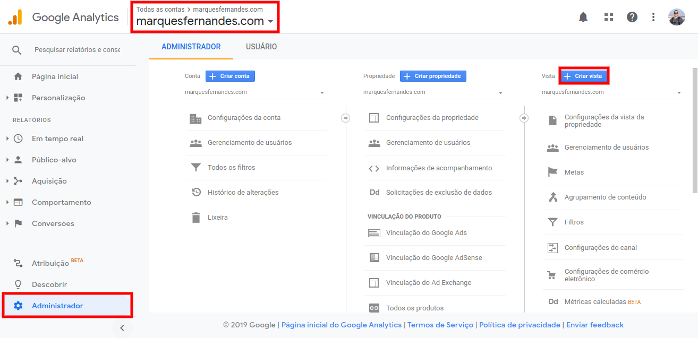
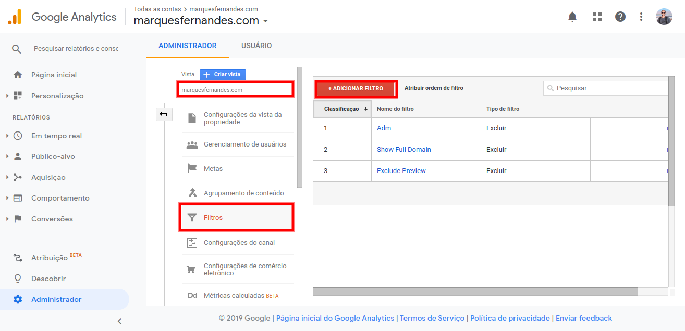
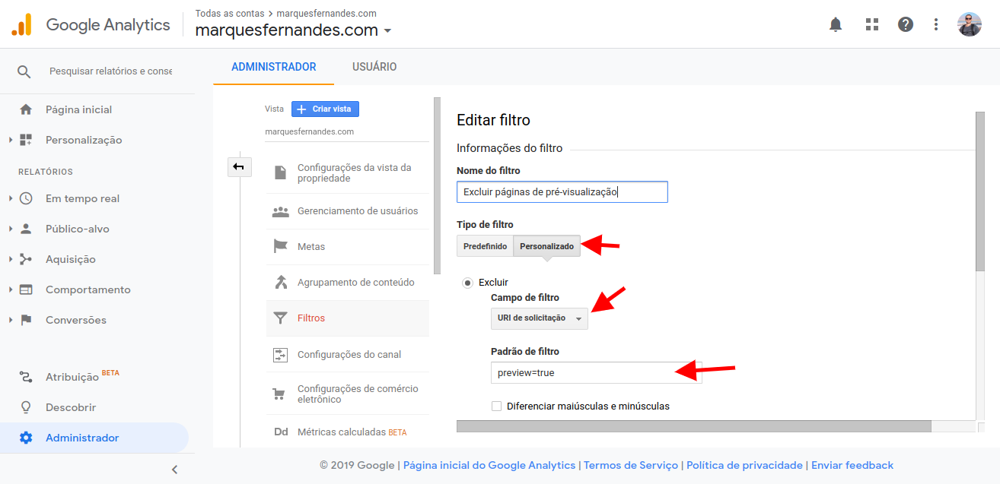

If you run a blog or website on Wordpress, you probably use Google Analytics to monitor your traffic. On new sites, which are still starting to gain traffic, it is very easy to mess up data collection with "fake" accesses when accessing your admin panel (the famous /wp-admin) and when writing and previewing your pages and articles ( preview=true). If you, like me, like to preview and see how your articles will fit and behave with your theme, we need to filter those hits to generate clean, real data for further analysis.

## Filtering the preview pages

Before creating any filter, we must create a new one. **visualization** on the property. This backs up the data to create and test filters; If something goes wrong and we mess up your data, we still have the raw and original property data. To create a new view:

1.  Get in on [Google Analytics](http://analytics.google.com/) and click on **Administrator** .
2.  Check that the correct account and property are selected in the top left drop-down.
3.  in the tab of **visit** click in **create visit** . From a descriptive name such as " *Filter test* ".

Create New View on Property

Once created, return to the Admin page and verify the **Visit** newly created is selected. Now let's create two filters to remove the preview and wp-admin pages:

1.  click in **Filters** in the tab of **Visit** and click the button **+Add filter** .
2.  Put a meaningful name like " *Delete Preview Pages* ".

Create new filter

3.  In **Filter Type** select **Customized** .
4.  Select option **Delete** .
5.  In **filter field** select **request URI** .
6.  In **filter pattern** type it, *preview=true.  
    (This text is present on all preview pages, including the [public previews](http://marquesfernandes.com/2019/12/04/como-permitir-a-pre-visualizacao-publica-em-artigos-nao-publicados-no-wordpress) , if enabled).*

Delete preview pages

8.  click in **To save** .

## Filtering Admin Dashboard Pages (/wp-admin)

To filter the admin panel pages, we will follow almost all the same steps as above except defining the filter.

1.  Create a new filter by clicking the button **+Add filter** (In the same view property).
2.  Put a meaningful name like "Delete Administrative Pages".
3.  In **Filter Type** select **Standard** .
4.  Select option **Delete** , **traffic to subdirectories** and **that contains** .
5.  In **Subdirectory** type it, */wp-admin/*(This path is present on all admin panel pages).

Delete admin pages (/wp-admin/)

Okay, now the data of your new **View** created should be clean of false page views and hits.
