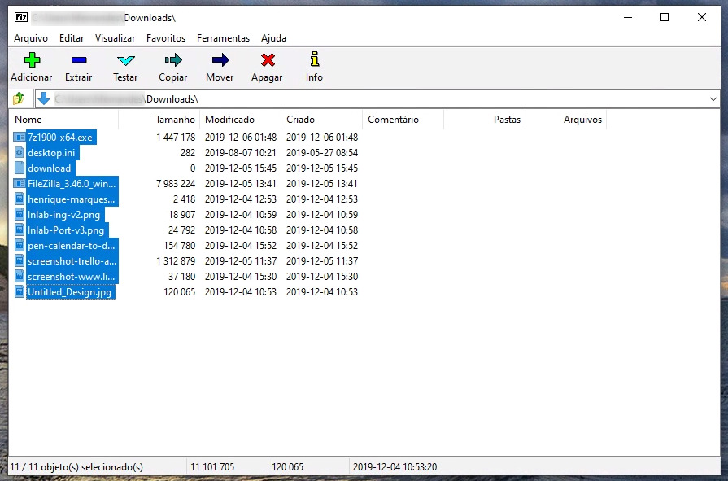
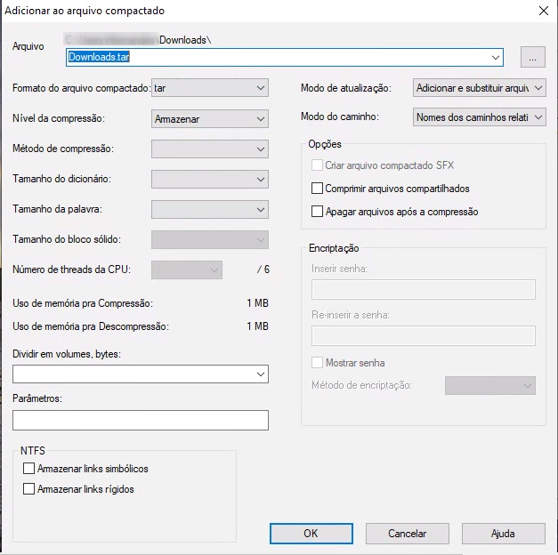
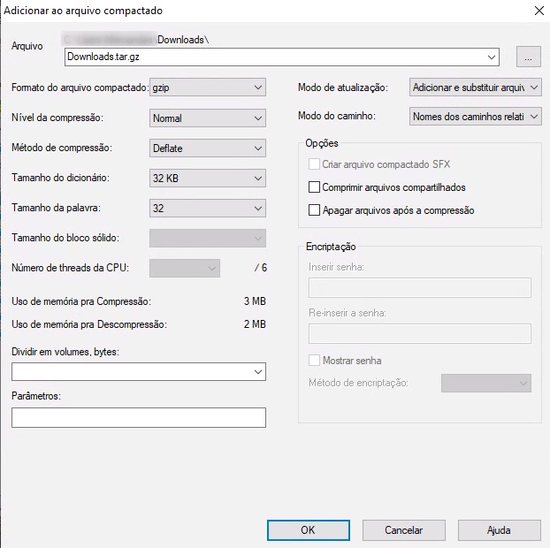

Probablemente llegaste hasta aquí porque te encontró con un archivo de extensión **TAR** o tal vez porque no recuerdas qué combinación loca de opciones (**xzvf**) para extraer el archivo en Linux.

Corto del inglés *"Tape Archive"*, a veces llamado **tarball**, es un archivo en el formato consolidado de Unix. Los archivos **.tar** se utilizan para consolidar archivos y carpetas en uno, otro aspecto importante de los archivos **.tar** es que mantienen la información del sistema de archivos, como permisos de usuario, fechas de modificación y todas las estructuras de directorios, por lo que esta extensión se hizo popular al hacer más fácil compartir scripts y archivos a través de Internet.

El formato **TAR** es muy común en los sistemas Linux y Unix, pero vale la pena mencionar que este tipo de archivo no tiene compresión, para ello necesitamos convertir en un archivo **TGZ**, la también famosa extensión **.tar.gz**.

## Cómo abrir un archivo .tar

Si usted está en Linux esta es una tarea muy simple y no requiere ningún otro programa además de su terminal:

Archivo .tar
$ tar -xvf arquivo.tar #Extrair el contenido de la carpeta actual
$ tar -xvf arquivo.tar -C /tmp #Extrair el contenido de la carpeta /tmp
Archivo .tar.gz
$ tar -xzvf arquivo.tar.gz #Extrair el contenido de la carpeta actual
$ tar -xzvf arquivo.tar.gz -C /tmp #Extrair el contenido de la carpeta /tmp

Si usted está en Windows, archivos TAR se pueden abrir con la mayoría de los programas zip/unzip. Dos grandes opciones para este trabajo son los programas [7-Zip](https://www.7-zip.org/) y [PeaZip](https://www.peazip.org/).

## Cómo crear un archivo .tar

En Linux, crear archivos **.tar** es tan simple como extraer. En el siguiente comando vamos a generar el archivo ya comprimido con **gzip**, lo que dará como resultado un archivo **.tar.gz**. Tenga en cuenta que agregar la extensión **.gz** al final no es obligatorio, pero se recomienda porque es una buena práctica para identificar y facilitar en el momento de la extracción.

$ tar -czvf nombre-arquivo.tar.gz /home/Descargas

En el comando anterior pasamos la opción **\-czvf**, que representa:

-   *\-c:* Crear un archivo
-   *\-z:* Utilice gzip para comprimir el archivo
-   *\-v:* Habilite el modo "verbose" para mostrar el progreso de la creación de archivos
-   *\-f:* Le permite especificar un nombre de archivo distinto del nombre de la carpeta

Ahora, si estás en Windows, la forma menos complicada de crear el archivo **.tar** necesitamos usar alguna herramienta gráfica como 7-Zip:

1.  Seleccione todos los archivos y carpetas que desee en su archivo **.tar**
2.  Haga clic en el primer icono de la barra superior "Añadir"

3.  En "Formato de archivo comprimido" seleccione **tar**
4.  Haga clic en Aceptar

En Windows 7-Zip no le permite realizar la generación y compresión de archivos **tar** con **gzip** en un paso, por lo que necesitamos un paso adicional.

4.  Seleccione el archivo **.tar** recién creado
5.  En "Formato de archivo comprimido" seleccione **gzip**
6.  Haga clic en Aceptar

