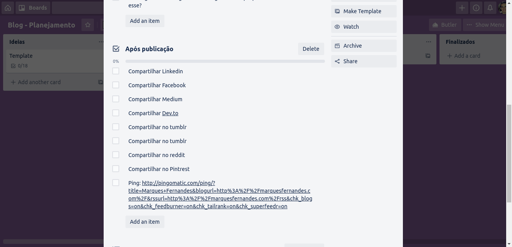
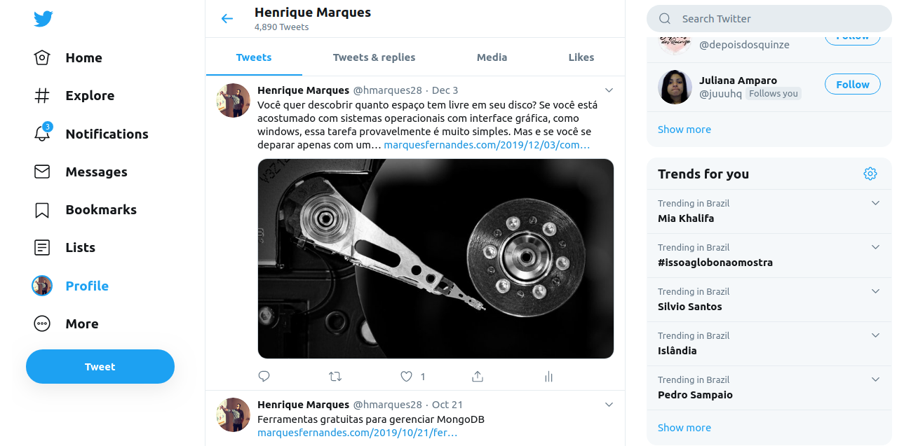
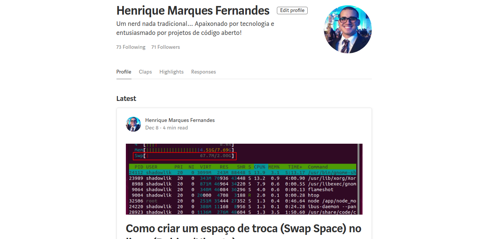
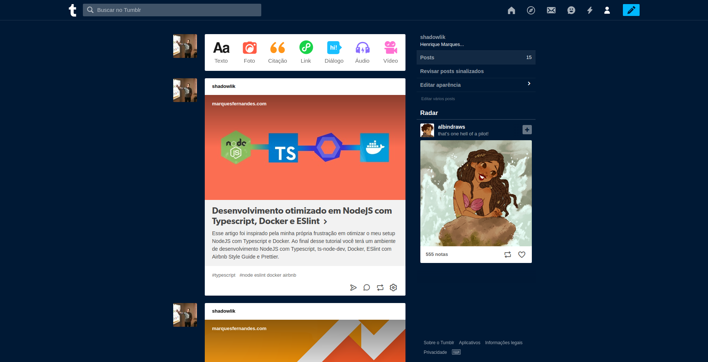
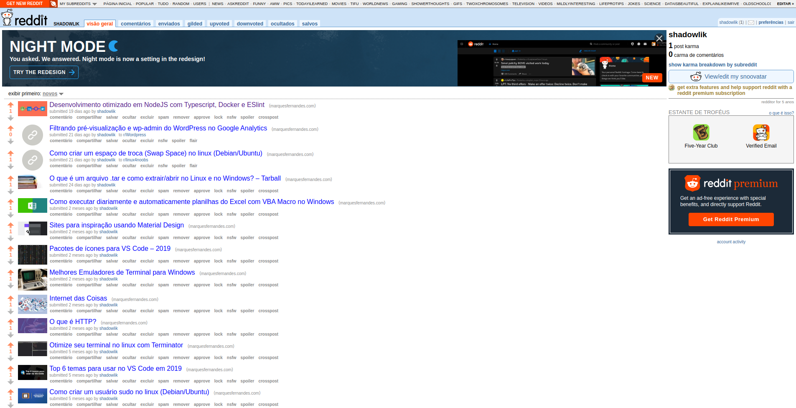

I think it's a very common question for beginner bloggers like me. I've been trying to find the best way to promote my articles, in a healthy and organic way. As I still don't have a large reach on social networks, I depend a lot on our dear search engines (Google basically), I've been studying some SEO tactics and doing a lot of research and testing of the places that generate more return for my blog, both in terms of traffic as in [linking building](https://rockcontent.com/blog/link-building/) .

I'm going to share with you an example board that I use in [Trello](https://trello.com/b/OUj4FMH0/blog-planejamento) to organize and remember everything I need to do when writing a new article, this board is constantly being updated, if you have any comments or tips, please don't hesitate to comment.

Blog - Planning

The networks listed for disclosure are focused on my blog's niche, after some tests it excludes some networks that didn't bring me feedback.

## Social networks

### [Linkedin](https://www.linkedin.com/in/henriquemf28/)

Linkedin is an excellent tool to expand your professional network, and also very good to spread your articles with your followers. Remember to use #hashtags related to your content, this will extend the reach of your post.

### [Facebook](https://www.facebook.com/marquesfernandesblog)

Have one [professional page](https://www.facebook.com/marquesfernandesblog) for your blog is a great way to promote your articles, create a page and start calling all your friends to like it, also take advantage of the promotions of sponsored publications to expand your audience.

### [twitter](https://twitter.com/hmarques28)

[twitter](https://twitter.com/hmarques28) still one of the most used networks to follow and consume news and articles, an eye-catching image and text are needed to attract attention and increase its reach.

## content networks

### [medium](https://medium.com/@shadowlik)

[medium](https://medium.com/@shadowlik) allows you to republish your articles, I recommend using the import tool, in this way a rel=canonical tag is added automatically, preventing Google and other tools from marking your content as duplicate.

### [owed to](https://dev.to/shadowlik)

[owed to](https://dev.to/shadowlik) is a content network focused on the tech world, you can write articles using the markdown format, but don't worry, you can easily set up your profile to automatically search your articles for yours. [rss feed](http://marquesfernandes.com/feed) .

### [Tumblr](https://www.tumblr.com/blog/shadowlik)

Tumblr is a blogging platform that allows users to publish text, images, video, links, quotes, audio and "dialogues". Most posts made on Tumblr are short texts, but the platform is not quite a microblog system, being in an intermediate category between the conventional format blogs Wordpress or Blogger and the microblog Twitter.

### [reddit](https://www.reddit.com/user/shadowlik/)

THE [reddit](https://www.reddit.com/user/shadowlik/) it might be a platform worth considering for sharing content, but it needs to be done right. Redditors are very aware that brands try to "spam" subreddits with their own content. So your articles must be carefully chosen and provide real value to users.

## Conclusion

There are several tactics, tools and places to get your articles out there and start generating traffic to your blog. Something I noticed is that this is not a cake recipe like many sites and SEO courses sell, several tactics rated as foolproof didn't work for me, even after a lot of effort and insistence, so I recommend that you promote your own tests and not spend a lot of effort on tactics that do not bring returns for you, always focus most of your effort producing quality materials, this is sure to be foolproof. I'll be updating this post as I adapt my tests and tactics.
