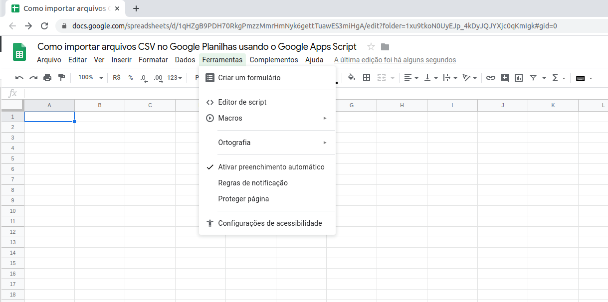
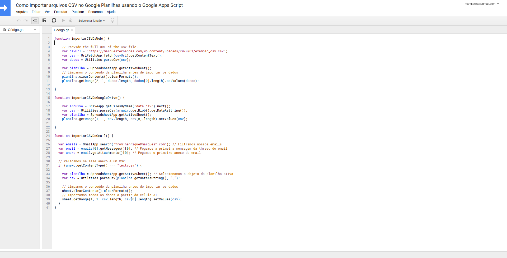

If you use Microsoft Excel, you are probably used to using and importing data from external sources, eg CSV files. We managed to have this same facility in Google Sheets using Google Apps Script.

## What is Google Apps Script?

THE [Apps Script is](https://developers.google.com/apps-script) a scripting platform developed by Google for developing lightweight applications on the G Suite platform. It is based on JavaScript 1.6, but it also includes some functionality from 1.7, 1.8 and a subset of the ECMAScript 5 API. The projects of the [Script apps](https://developers.google.com/apps-script) run on Google's cloud infrastructure. According to the *Google* , the Apps Script "provides easy ways to automate tasks on third-party products and services." Apps Script is also available for Google Docs and Slides.

You find t *All scripts in this tutorial on [example worksheet](https://docs.google.com/spreadsheets/d/1qHZgB9PDH70RkgPmzzMmrHmNyk6gettTuawES3miHgA/edit?usp=sharing)* , make a copy on your drive to be able to view the scripts and edit the spreadsheet.

***Also check out** : [Transferring files over SFTP on Google Cloud using FileZilla](http://marquesfernandes.com/2019/11/19/transferindo-arquivos-por-sftp-no-google-cloud-usando-o-filezilla)*

## Accessing the Apps Script

To access Google Apps Scripts, create a blank spreadsheet or copy the [example worksheet](https://docs.google.com/spreadsheets/d/1qHZgB9PDH70RkgPmzzMmrHmNyk6gettTuawES3miHgA/edit?usp=sharing) ; click in *Tools > Script Editor* :

A new tab with the Google Apps Script text editor will open:

## Creating the Scripts

We can easily import CSV files into Google Sheets using the function `Utilities.parseCsv()` from Google Apps Script. The codes below show how to import and display data from a CSV file by URL, saved in Google Drive, or as an attachment in Gmail.

### Authorizing Google Apps Scripts

For all the examples below, when running the scripts we need to authorize Google Apps Scripts to access some functionality of the Google APIs.

Probably, because your script is not yet approved, the screen below will appear:

click in *Show Advanced* > *Access Project* and proceed to authorization:

### Importing the CSV file from an email attachment into Gmail

function importCSVDoGmail() {
  
  var emails = GmailApp.search("from:henrique@marquesf.com"); // We filter our emails
  var email = emails\[0\] .getMessages()\[0\] ; // We get the first message from the email thread
  var attachment = email.getAttachments()\[0\] ; // We get the first attachment of the email
  
  // We validate if this attachment is a CSV
  if (attachment.getContentType() === "text/csv") {
    
    var sheet = SpreadsheetApp.getActiveSheet(); // We select the object of the active sheet
    var csv = Utilities.parseCsv(sheet.getDataAsString(), ",");
    
    // We clean the contents of the spreadsheet before importing the data
    sheet.clearContents().clearFormats();
    // We import all data from cell A1
    sheet.getRange(1, 1, csv.length, csv\[0\] .length).setValues(csv);
  } 
}

In our emails variable we will perform a filter search in our Gmail to return the first matching email, we can use any Gmail search operator within the function `GmailApp.search("operator:search")` , check here the [full list of operators](https://support.google.com/mail/answer/7190?hl=pt-BR) .

### **Importing Google Drive CSV File**

function importCSVDoGoogleDrive() {

    var file = DriveApp.getFilesByName("data.csv").next();
    var csv = Utilities.parseCsv(file.getBlob().getDataAsString());
    var sheet = SpreadsheetApp.getActiveSheet();
    spreadsheet.getRange(1, 1, csv.length, csv\[0\] .length).setValues(csv);

}

In the example above we are looking for the file `date.csv` which is at the root of Google Drive, change this path as needed.

## **Download and import the CSV file from an external website**

function importCSVDaWeb() {

    // CSV file download URL
    var csvUrl = "/wp-content/uploads/2020/01/example\_csv.csv";
    var csv = UrlFetchApp.fetch(csvUrl).getContentText();
    var data = Utilities.parseCsv(csv);

    var sheet = SpreadsheetApp.getActiveSheet();
    spreadsheet.getRange(1, 1, data.length, data\[0\] .length).setValues(data);

}

Remembering that the service *UrlFetchApp* it only makes HTTP requests, it is not yet possible to connect to FTP servers.
