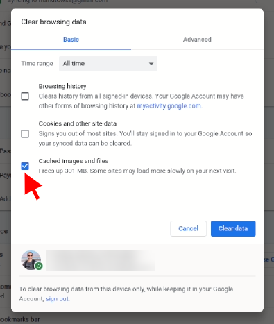
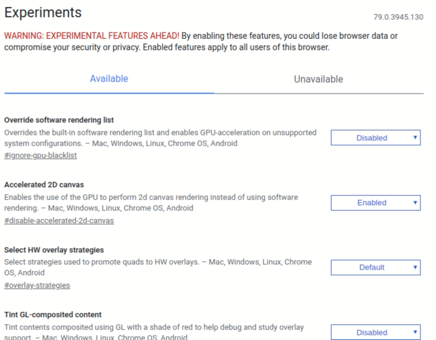

Currently, your browser is probably the most important program on your computer. Everything we do, from email, social media and even editing documents takes place in our browser. Google chrome is the darling of the world and also of Brazil, with the impressive brand of [~80% market share](https://gs.statcounter.com/browser-market-share/all/brazil) , being the most used browser fired, on its far back is Apple's Safari browser with just over 5%.

If your browser feels slower than usual, don't despair, there are some helpful tips to improve your browser speed.

## 1 - Check your internet speed

It may seem obvious, but we often blame the poor browser for a bad connection. Take a speed test on a site like [speedtest.net](https://www.speedtest.net/) . It's possible that you'll spot the problem right away, get tested especially if you're on a public connection, like an airport or restaurant. And if your connection is really slow ( ~curse the net / of course~ ), make sure you or someone on your network isn't downloading or watching a video.

## 2 - Check your open tabs

We all have a friend accumulator of tabs in the browser, if you are that friend, see the real need for all tabs, this ends up with the performance of your browser and consequently of your computer. Now, if you think you really need all the tabs, use some extension like [Outliner Tabs](https://chrome.google.com/webstore/detail/tabs-outliner/eggkanocgddhmamlbiijnphhppkpkmkl?hl=pt-BR) to help you with that.

## 3 - Make sure your browser is up to date

One more obvious but super important tip, not only for its speed but also for its security, Google constantly releases updates that contain new features, security tweaks and performance improvements. When an update is available a visible yellow alert will appear in place of the three dots in the top right corner, if you want to make sure there is an update available click on the three dots in the top right, Help > About Google Chrome.

( [Image](https://tecnoblog.net/wp-content/uploads/2018/11/Atualizar-Google-Chrome-700x326.png) [:](https://tecnoblog.net/wp-content/uploads/2018/11/Atualizar-Google-Chrome-700x326.png) [technoblog](https://tecnoblog.net/wp-content/uploads/2018/11/Atualizar-Google-Chrome-700x326.png) )

## 4 - Check your extensions - Chrome Extensions

If you have Google Chrome extensions installed, now is the time to check, confirm the extensions you use frequently and disable the ones you don't use, also see if any extensions are draining your computer's resources, via the shortcut `Shift + ESC` open Google Chrome's task manager and see the processor and memory consumption of your tabs and extensions.

## 5 - Clear temporary data

Google Chrome saves several files in order to improve the user experience, but in some cases these files can overload and hamper your browser performance, so clean click on the three dots in the upper right corner, **More tools** > **Clean navigation data** . Clear all data from images and files, I don't recommend selecting the other options, earnings are low and you will lose all your history and will have to log in to all the sites you use.

## 6 - Scan with your anti-virus

Malware can often be compromising your computer's performance, consequently slowing down your browser. Do a good scan with your anti-virus: If you are on Windows you can the [AVG,](https://www.avg.com/pt-br/homepage#pc) its free version is very good, and if it's on linux [check out this tutorial on how to scan your system for malware](http://marquesfernandes.com/2019/12/04/como-escanear-seu-servidor-linux-por-malwares-debian-ubuntu) .

## 7 - Enable hidden Chrome features (Advanced)

Google Chrome has some hidden features, they can change, disappear or even generate unexpected behavior in your browser, so only change things here if you need a lot and are sure of what you are doing.

-   Experimental Screen Features - This allows Chrome to use opaque screens to increase load times and increase performance.  
    [chrome://flags/#enable-experimental-canvas-features](chrome://flags/#enable-experimental-canvas-features)
-   Number of Scan Threads - Changing this number from "Default" to "4" will speed up image rendering.  
    [chrome://flags/#num-raster-threads](chrome://flags/#num-raster-threads)
-   Enable fast tab / window closing - This will run Chrome's onload JavaScript handler, independently of the GUI, to speed up tab closing.  
    [chrome://flags/#enable-fast-unload](chrome://flags/#enable-fast-unload)
-   Automatic tab discard - If enabled, tabs are automatically discarded from memory when system memory is low. Discarded tabs are still visible in the tab strip and reload when clicked.  
    [chrome://flags/#automatic-tab-discarding](chrome://flags/#automatic-tab-discarding)
-   FontCache Scaling - Reuse a cached font in the renderer to accommodate different font sizes for faster layout.  
    [chrome://flags/#enable-font-cache-scaling](chrome://flags/#enable-font-cache-scaling)
-   Optimize background video playback - Disable video tracks when video plays in the background to optimize performance.  
    [chrome://flags/#disable-background-video-track](chrome://flags/#disable-background-video-track)
-   Enable HTTP Simple Cache - HTTP Simple Cache is a new cache. It relies on the file system for disk space allocation.  
    [chrome://flags/#enable-simple-cache-backend](chrome://flags/#enable-simple-cache-backend)
-   Enable V8 caching mode - Caching mode for the V8 JavaScript engine.  
    [chrome://flags/#v8-cache-options](chrome://flags/#v8-cache-options)

## 8 - Your computer is just slow

Sometimes your computer just doesn't have the capacity and just an upgrade can save your patience. More and more we demand from our browser, more complex pages, 8k videos, multi tabs for multi tasking... Resource-poor computers may simply not be able to handle so much workload, so maybe it's time to do one. [upgrade or buy a new](https://click.linksynergy.com/deeplink?id=FPuxaVz3TuY&mid=42758&murl=https%3A%2F%2Fwww.americanas.com.br%2Fcategoria%2Finformatica%2Fnotebook) .

