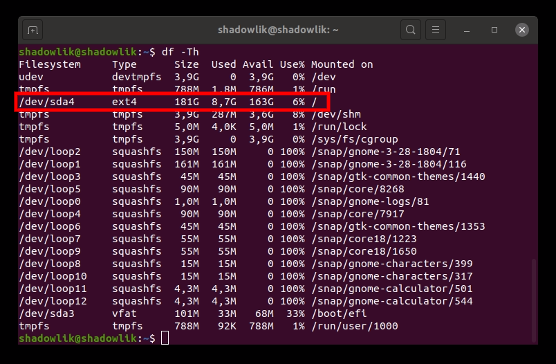
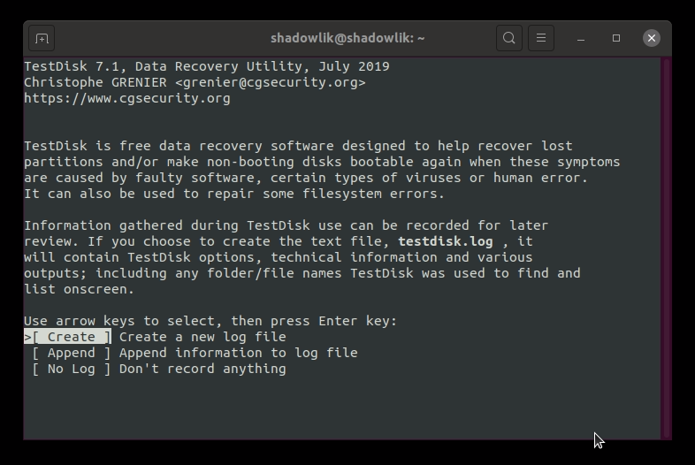
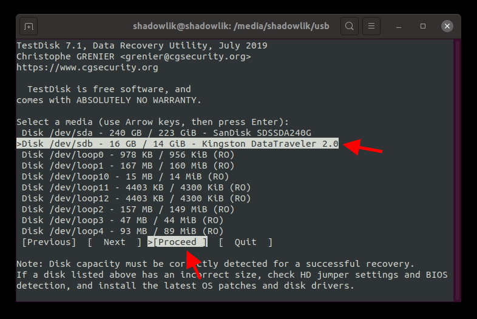
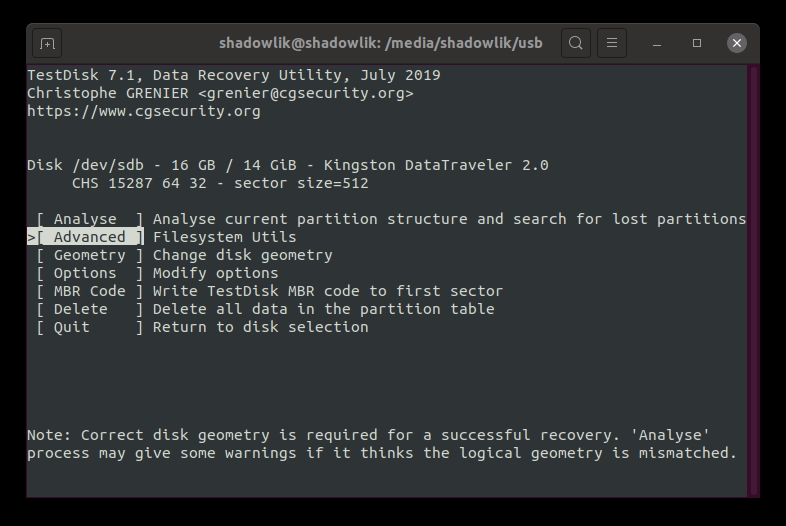
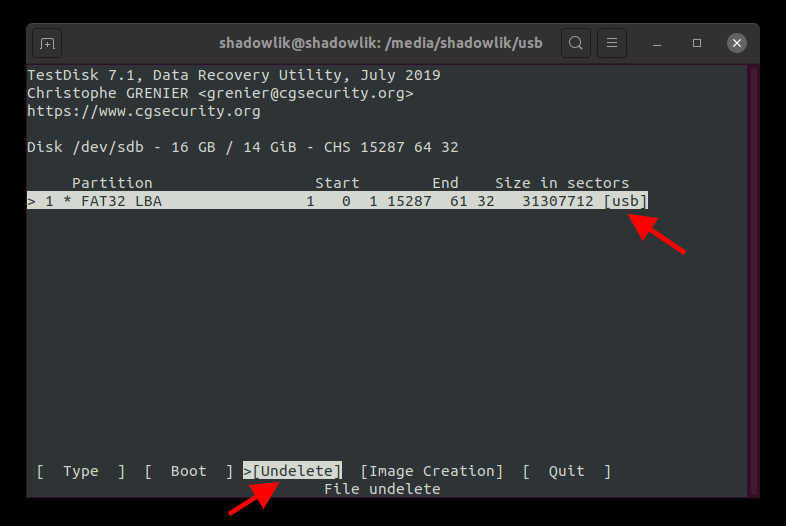
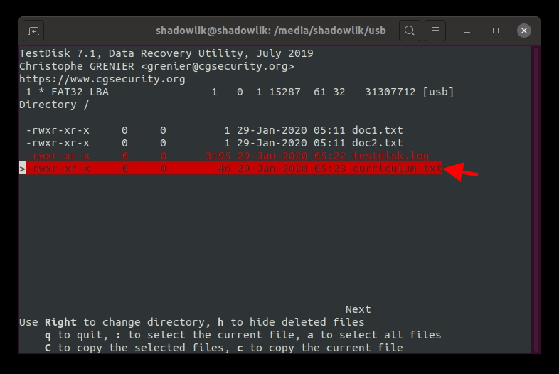
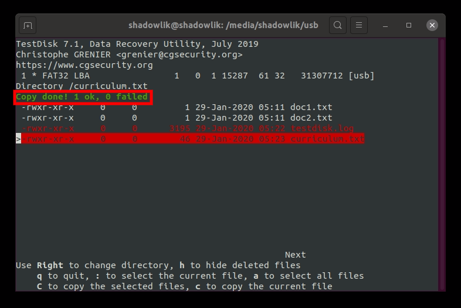
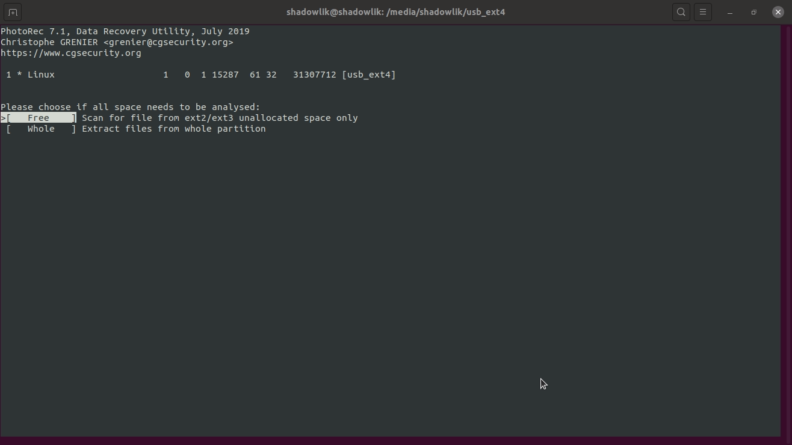

Have you ever had that horrible feeling? A hopeless feeling that comes when you realize you've accidentally deleted an important file and it's not in the trash? Here begins the process of grief, denial, anger...

But how about not going through all the stages of grief? Breathe, don't worry and remember you're not alone! Sooner or later [everyone ends up doing it](https://www.tecmundo.com.br/programacao/103701-cara-cade-firma-rapaz-deleta-empresa-linha-codigo-errada.htm) in a moment of distraction.

*\- But how do you tell me not to worry? Are you crazy?! I just deleted a script that was working for hours!!!*

Calm down little grasshopper, in this article we'll learn how to recover deleted files on Linux using TestDisk and Photorec tools. Don't be scared if you don't have a lot of experience with the command line, it's very easy to use and you'll be able to recover any deleted files on Ubuntu/Debian and other Linux distributions.

When we delete a file in Linux, it is removed from a list and not necessarily from disk. As long as you haven't saved or changed many things on your machine, this list still exists! Ufa! And just so you understand, depending on file size and free space on your hard drive, deleted files can persist indefinitely, even if you change a lot of files on your hard drive.

[See how to permanently and securely delete files on Linux.](http://marquesfernandes.com/como-deletar-permanentemente-arquivos-no-linux/)

Now that you're calmer, let's get to the good part, you don't need to be a hacker to recover your deleted files, just know how to open the terminal, copy/paste some commands and follow the step-by-step instructions I'll show you how. use the tools to recover your deleted files.

## 0 - Finding the partition type

If you are in EFI mode and/or the partition your deleted file was on is **ext3** or **ext4** , follow her [**step 1.1**](#Instalando-o-TestDisk) and then jump to **[Recovering Deleted Files with Photorec](#photorec)** .

If you are not sure what the partition type is, use the command `df -Th` to list all partitions and their disk drive types:

df -Th

## 1 - How to recover deleted files on Linux using TestDisk

I'll explain our example: I have a pendrive with three files, and I accidentally deleted it with the command `rm curriculum.txt` my precious resume, I spent hours writing, oh heavens! When we delete it from the command line, our file doesn't automatically go to the trash, so it looks like it's gone for good.

Our example scenario

And look how cool, I don't panic anymore, and it's not because we're in a simulated scenario but because I know that all I need to do to recover is use the right tools! As a bonus, you'll get that feeling that you've become a hacker recovering files from the beyond.

### 1.1 - Installing TestDisk

First we need to install the TestDisk tool. Most linux distributions already have this tool in their repository. On Ubuntu/Debian you can install using the package manager straight from the terminal:

`sudo apt install testdisk`

### 1.2 - Running TestDisk

Now run TestDisk on the terminal with the command:

`sudo testdisk`

### 1.3 - Creating a log file

Don't be scared by the interface, it's very intuitive. Keep calm, we're close to recovering your file! Use arrow keys to navigate between menus and enter key to select.

You are probably using a higher version of 7.0, so many of the recommended commands will already be highlighted. The recommendation is almost always right, so the first thing we need is to create a log file with the option `Create` . Select it and press enter.

### 1.4 - Selecting your disk

In this step you will see a listing of your disks. Select the partition where your file was, if you don't know which one it is, continue following the tool's recommendations, in my case it's Kingston's pendrive disk. *Do not forget to select the option in the navigation menu* `proceeded` .

### 1.5 - Selecting the partition type

Now let's follow the same advice as in step **4** and trust TestDisk's suggestion.

### 1.6 - Selecting the utility

At this stage we will need to analyze it a little better. In case you haven't noticed, this tool is not just for recovering deleted files, but a powerful disk utility. But if you take a hard look at the description of the options, you'll see that what we want to do is in `Advanced` .

### 1.7 - Selecting the partition

Now we need to select the partition where our file is located, probably the correct partition will be the partition with the highest number of sectors. From the navigation menu select `Undelete` .

### 1.8 - Find our file directory

We found our file folder, and look who's there in red! Our deleted file lives!

Don't mind the difference in the prints, I had to redo the steps and ended up needing to delete the previous TestDrive log file

### 1.9 - Recovering the deleted file

Now to recover our files we need to select our file and press " **ç** ". Then you will need to choose which directory you want to recover the file to and if everything works out a message like the following should appear: "Copy done! 1 ok, 0 failed".

Ready! If you did all the steps and got the success message, your file will be safe. Make sure its content is still intact, if something went wrong, repeat all the steps. And if you've done all the steps, maybe your partition type cannot be restored using TestDisk, ext4 for example, but don't worry... We can use another tool that is installed together with the TestDisk package, Photorec!

## 2 - How to recover deleted files on Linux using Photorec

Unfortunately, the steps above are not possible for some types of partitions (ext3 and ext4 for example), to recover deleted files on this type of partition we will need to go through a process a little more boring and using another program. Keeping in mind that this method can be used for practically all other types of partitions as well.

The process may take a little longer depending on the amount of deleted files you have on disk that have the same extension as the one you want to recover.

Let's say I deleted a file called **curriculum.doc** .

### 2.1 - Running Photorec

run the command `sudo photorec` on your terminal to start the recovery program.

### 2.2 - Selecting file types

Select the type of files we want to recover, the more specific it is, the less time it will take to recover our file. click the button **"s"** to deselect all options and look for the extension of your file, in our case **.doc** . Once you have selected all the extensions you want, click **"B"** to save the new configuration and then click enter on the quit option to return to the main menu.

### 2.3 - Selecting the partition

Select the partition, and with Search selected press enter.

In this step, we need to select the type of our partition, select it according to your need, in our case the automatic selection has already set the correct option.

### 2.4 - Selecting the search mode

Select the free option for a faster search only in deallocated memory spaces, or if you prefer, search the entire partition.

### 2.5 - Selecting the destination folder

Now we need to select which folder we want our recovered files to be sent to, I recommend that you create a folder on a different disk than the one you are trying to recover. I created a folder called Recovery on the main drive to upload the recovered files. Navigate until you find the desired destination and then press the "c" key to start the recovery.

### 2.6 - Performing file recovery

Photoreco's search process tends to take longer than TestDrive's because it scans the entire partition looking for all deleted files with the extensions we've selected to search for, you can follow the process and check in real time if any files have already been retrieved to the folder selected in the last step.

### 2.7 - Finding the recovered file

In the destination folder you will see that one or more folders `retrieve_dir.*` will be created, they will contain the recovered files, if you notice that there are many folders to look for your file, use the command `find . -name *filename*.doc` to recursively find the desired file.

## Conclusion

As you have seen, deleting a file is not the end of the world, there are ways to recover our files even if they don't appear in the trash. But let's not just rely on "luck", always try to be very careful when deleting and executing commands in the terminal, some commands and situations can be irreversible.
