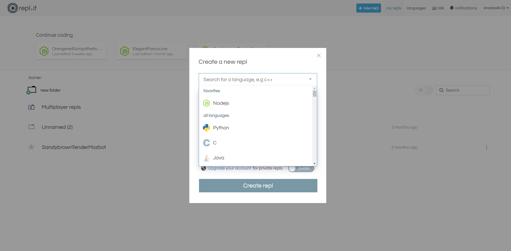

Este post no está patrocinado, por desgracia, pero he utilizado una gran cantidad de una herramienta y vi que muchos desarrolladores no conocen esta herramienta todavía! Probablemente muchos de ustedes deben conocer [Codepen](https://codepen.io/) o [JSFiddle](https://jsfiddle.net/), pero hoy vine a hablar de un servicio que va más allá de HTML, CSS y JS.

## Insertar

Puede compartir fácilmente proyectos en artículos o con otros, a continuación un ejemplo de un proyecto de nodo:

## Idiomas

Más de 60 idiomas diferentes están disponibles! Echa un vistazo a la lista completa:

[Clojure](https://repl.it/languages/clojure)  
[Haskell](https://repl.it/languages/haskell)  
[Kotlin (beta)](https://repl.it/languages/kotlin)  
[QBasic](https://repl.it/languages/qbasic)  
[Forth](https://repl.it/languages/forth)  
[LOLCODE](https://repl.it/languages/lolcode)  
[BrainF](https://repl.it/languages/brainfuck)  
[Emoticon](https://repl.it/languages/emoticon)  
[Bloop](https://repl.it/languages/bloop)  
[Unlambda](https://repl.it/languages/unlambda)  
[JavaScript](https://repl.it/languages/javascript)  
[CoffeeScript](https://repl.it/languages/coffeescript)  
[Scheme](https://repl.it/languages/scheme)  
[APL](https://repl.it/languages/apl)  
[Lua](https://repl.it/languages/lua)  
[Python 2.7](https://repl.it/languages/python)  
[Ruby](https://repl.it/languages/ruby)  
[Roy](https://repl.it/languages/roy)  
[Python](https://repl.it/languages/python3)  
[Nodejs](https://repl.it/languages/nodejs)  
[Enzyme](https://repl.it/languages/enzyme)  
[Go](https://repl.it/languages/go)  
[C++](https://repl.it/languages/cpp)  
[C++11](https://repl.it/languages/cpp11)  
[C](https://repl.it/languages/c)  
[C#](https://repl.it/languages/csharp)  
[F#](https://repl.it/languages/fsharp)  
[HTML, CSS, JS](https://repl.it/languages/html)  
[Rust](https://repl.it/languages/rust)  
[Swift](https://repl.it/languages/swift)

[Python (con Tortuga)](https://repl.it/languages/python_turtle)  
[Jest](https://repl.it/languages/jest)  
[Django](https://repl.it/languages/django)  
[Express](https://repl.it/languages/express)  
[Sinatra](https://repl.it/languages/sinatra)  
[Ruby en Rails](https://repl.it/languages/rails)  
[R](https://repl.it/languages/rlang)  
[Next.js](https://repl.it/languages/nextjs)  
[GatsbyJS](https://repl.it/languages/gatsbyjs)  
[React](https://repl.it/languages/reactjs)  
[React Typescript](https://repl.it/languages/reactts)  
[React Reason](https://repl.it/languages/reactre)  
[bash](https://repl.it/languages/bash)  
[Quil](https://repl.it/languages/quil)  
[Crystal](https://repl.it/languages/crystal)  
[Julia](https://repl.it/languages/julia)  
[Elixir](https://repl.it/languages/elixir)  
[Nim](https://repl.it/languages/nim)  
[Reason NodeJs](https://repl.it/languages/reason_nodejs)  
[Erlang](https://repl.it/languages/erlang)  
[TypeScript](https://repl.it/languages/typescript)  
[Pygame](https://repl.it/languages/pygame)  
[Love2D](https://repl.it/languages/love2d)  
[Tkinter](https://repl.it/languages/tkinter)  
[Java Swing](https://repl.it/languages/java_swing)  
[Emacs Lisp (Elisp)](https://repl.it/languages/elisp)  
[PHP Web Server](https://repl.it/languages/php7)  
[SQLite](https://repl.it/languages/sqlite)  
[Java](https://repl.it/languages/java10)  
[PHP CLI](https://repl.it/languages/php_cli)  
[Pyxel](https://repl.it/languages/pyxel)

Si estás buscando una herramienta versátil para crear prototipos o probar algún código, echa un vistazo a la Repl.it, ha sido muy útil en mi día a día, especialmente cuando necesito validar alguna lógica de programación o incluso probar algo de lib sin tener que crear toda la configuración de un proyecto desde cero.
