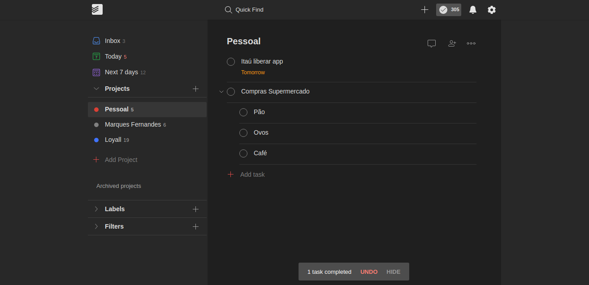
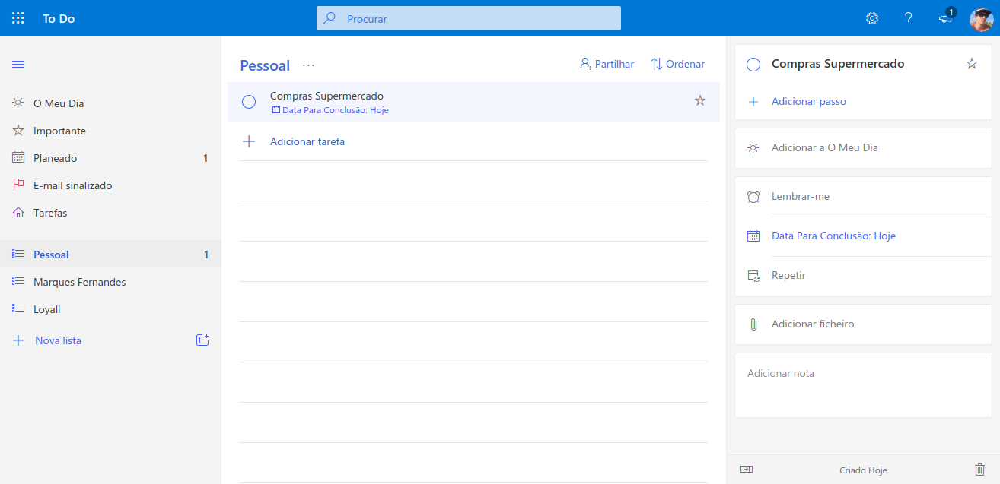
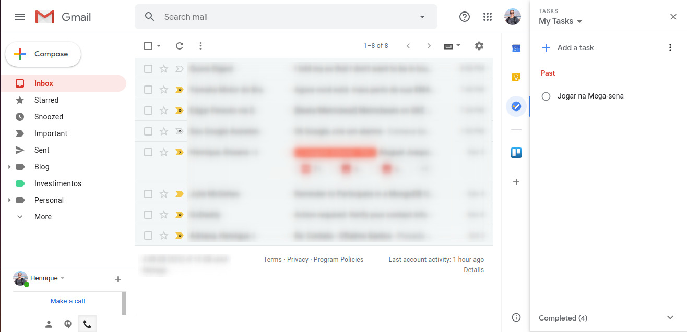
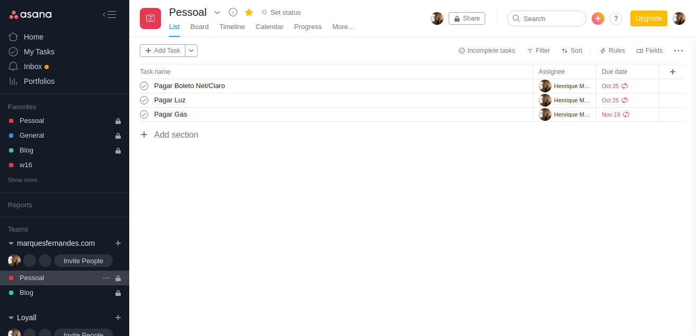

Do you ever feel like you're losing control of everything you have to do on a daily basis? If you only rely on your memory, you will likely end up stressed and frustrated for forgetting to do something.

But don't worry, there is a solution! When you organize your to-do lists and find the app that best fits your lifestyle, you end up worrying less about remembering everything you need to do and more about the tasks themselves. 

Choosing the right app for you is a very personal task, but it doesn't have to be complicated, a lot of people still use the pen and paper method, now if you're looking for something more modern, available on all your devices and that in fact play the active role of reminding yourself of tasks:

## #1 [Todoist](https://todoist.com/)

[Todoist](https://todoist.com/) it has a very minimalist interface, but it still has many advanced features and even AI-based recommendation. It is my day-to-day application, it has an effective integration with the google calendar, it is simple and efficient, fulfilling its role of organizing your tasks well.

Adding tasks is very fast thanks in part to processing in AI (type "buy beer Tuesday" and the task "buy beer" will be added with next Tuesday set as the due date). You can put new tasks in your Inbox and then move them to relevant projects.

Todoist is flexible enough to fit most workflows, but not so complicated that it's overwhelming.

### Platforms

[browser](https://todoist.com/) | [Mac](https://todoist.com/downloads/mac?lang=en) | [Windows |](https://todoist.com/downloads/windows?lang=en) [Android](https://play.google.com/store/apps/details?id=com.todoist&hl=en_US) | [iOS](https://itunes.apple.com/us/app/todoist-organize-your-life/id572688855?mt=8) | [Chrome Extension](https://chrome.google.com/webstore/detail/todoist-to-do-list-and-ta/jldhpllghnbhlbpcmnajkpdmadaolakh?hl=en)

## #two [Microsoft To-Do](https://todo.microsoft.com/pt-br)

In 2015, Microsoft purchased Wunderlist and put this team to work on a new to-do list app. THE [Microsoft To-Do](https://todo.microsoft.com/pt-br) is the result of that, and you can find the DNA of Wunderlist (some features are still missing) throughout the project. The main interface is clean and user-friendly, adding tasks is quick, but there's a lot of flexibility below the surface.

But the real highlight here is the integration with the Microsoft ecosystem. Outlook users can sync their tasks from this app to Microsoft To Do, which means there is finally a way to sync Outlook tasks to mobile devices. Windows users can add tasks using Cortana or by typing in the Start menu (for example, you can type "add beer to my shopping list" and the cherry will be added to a list called "shopping").

I particularly liked the integrated features and the new look of the app a lot, but for me the lack of integration with the google calendar was a decisive factor in opting for Todoist, but who knows, when they decide to integrate, I won't come back to take a look.

### Platforms

[navigated](https://todo.microsoft.com/pt-br) [r](https://todo.microsoft.com/pt-br) | [Mac](https://apps.apple.com/us/app/microsoft-to-do/id1274495053?mt=12) | [Windows](https://www.microsoft.com/en-us/p/microsoft-to-do-list-task-reminder/9nblggh5r558) | [Android](https://play.google.com/store/apps/details?id=com.microsoft.todos&hl=en_US) | [iOS](https://itunes.apple.com/us/app/microsoft-to-do/id1212616790?mt=8)

## #3 [Google](https://support.google.com/tasks/answer/7675772?co=GENIE.Platform%3DDesktop&hl=pt) [Tasks](https://gsuite.google.com/learning-center/products/apps/keep-track-of-tasks/)

Google Tasks is a great solution if you want a simple, no-frills app that works seamlessly within the Google ecosystem (especially Gmail and Google Calendar). But don't expect too many advanced features, it's a simple tool.

If you're the type of person who always has Gmail open, it's likely that direct browser integration is very useful, and it also has mobile apps that let you quickly access tasks.

### Platforms

[browser](https://gsuite.google.com/learning-center/products/apps/keep-track-of-tasks) | [Android](https://play.google.com/store/apps/details?id=com.google.android.apps.tasks&hl=en_US) | [iOS](https://itunes.apple.com/us/app/google-tasks-get-things-done/id1353634006?mt=8) | [Chrome](https://chrome.google.com/webstore/detail/google-tasks/dmglolhoplikcoamfgjgammjbgchgjdd?hl=en)

## #4 [Any.do](https://www.any.do/)

THE [Any.do](https://www.any.do/) offers a user-friendly application that makes it easy to add tasks, organize them into lists and the task due date. But what really stands out about Any.do is the "Plan My Day" daily feature, which forces you to schedule when you'll be doing various tasks, so you remember to actually get things done. Any.do also features integration with Google and Outlook calendars, allowing you to see your appointments and tasks in one place.

### Platforms

[browser](https://desktop.any.do/) | [Mac](https://electron-app.any.do/Any.do.dmg) | [Windows](https://electron-app.any.do/_windows/Any.do.exe) | [Android](https://play.google.com/store/apps/details?id=com.anydo) | [iOS](https://itunes.apple.com/us/app/microsoft-to-do/id1212616790?mt=8)

## #5 [Trello](https://trello.com/)

[Trello](https://trello.com/b/AwYSWOyt/ultimate-to-do-list) is an excellent tool for those who like Kanban, it can be adapted for a to-do list board like [in this example](https://trello.com/b/AwYSWOyt/ultimate-to-do-list) . Although it is not made specifically to be a task application, if you are used to working on this model it can be something very useful, there are numerous integration plugins with the most diverse services, making it a very versatile tool.

### Platforms

Browser | [Mac](https://itunes.apple.com/app/trello/id1278508951?ls=1&mt=12) | [Windows](https://www.microsoft.com/en-US/store/p/trello/9nblggh4xxvw?rtc=1) | [Android](https://play.google.com/store/apps/details?id=com.trello) | [iOS](https://itunes.apple.com/app/trello-organize-anything/id461504587)

## #6 [asana](https://asana.com/pt)

THE [asana](https://asana.com/pt) follows the line of Trello, being a tool basically made to manage projects, but with a little imagination and tweaking it becomes a useful tool to organize your tasks.

### Platforms

[browser](https://asana.com/pt) | [Android](https://play.google.com/store/apps/details?id=com.trello) | [iOS](https://itunes.apple.com/us/app/asana-mobile/id489969512?mt=8)

I hope that some of these services help you get organized, I recommend that you test all platforms until you find the one that best suits your taste and lifestyle. I guarantee that once you organize (and keep organized) all your tasks, your life will be much easier.
