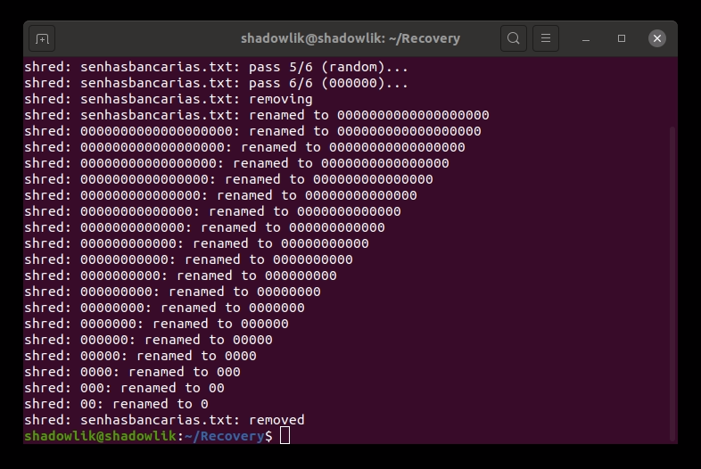
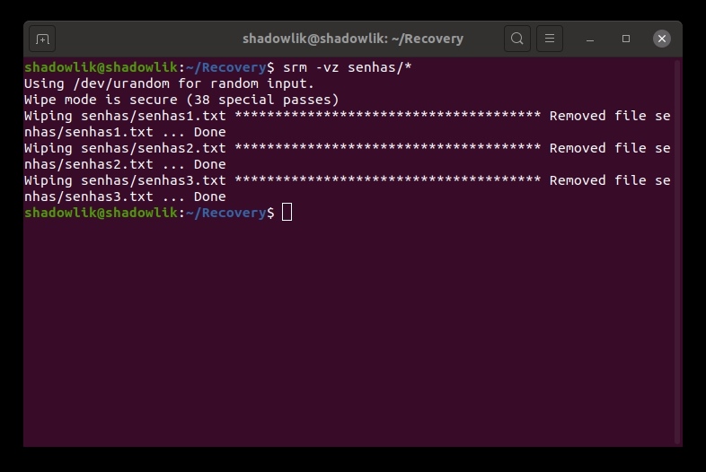

En la mayoría de los casos, la forma en que eliminamos un archivo de nuestros equipos, ya sea por la clave Del, la papelera de reciclaje o el comando `rm`, en realidad no eliminan el archivo del disco duro de forma permanente y segura (o de cualquier otro medio de almacenamiento).

Si usamos los métodos anteriores, suponiendo que queremos eliminar un archivo con contenido confidencial, un archivo con usuarios y contraseñas, por ejemplo, todavía es posible que alguien malintencionado pueda [recuperar esos archivos](http://marquesfernandes.com/como-recuperar-arquivos-excluidos-no-linux-ubuntu-debian/).

Vamos a aprender algunas maneras de eliminar archivos de forma segura de nuestro ordenador en Linux.

## 1\. Triturar - Sobrescribir el archivo para ocultar su contenido

El comando `shred` utiliza el método de sobrescritura del archivo para ocultar su contenido y también tiene la opción de eliminar posteriormente.

Esta herramienta ya está instalada de forma predeterminada en la mayoría de las distribuciones de Linux.

$ shred -zvu -n 5 passwordsbancarias.txt

-   `-z`- añadir ceros al final para ocultar
-   `-v` - permite la visualización del progreso del comando
-   `-u`\- elimina los archivos después de sobrescribir
-   `-n` - número de veces para sobrescribir el archivo (predeterminado: 3)

**Consejo:** Nunca escriba sus contraseñas en un archivo de texto. Desafortunadamente, es una práctica muy común pero totalmente insegura de almacenar dicha información.

## 2\. Limpiar - Eliminar archivos de forma segura en Linux

El comando Limpiar elimina de forma segura los archivos de la memoria, lo que hace imposible recuperar archivos o carpetas.

Para instalar esta herramienta, ejecute el siguiente comando:

$sudo apt-get install wipe\[Em distros baseados no Debian\]
$sudo yum install wipe\[Em distros baseadas no RedHat\]

Para eliminar de forma segura un archivo o incluso una carpeta completa:

$ borrar contraseñas -rfi/\*

-   `-r` - habla con el comando de eliminar recursivamente las carpetas
-   `-f` - permite la eliminación forzada y desactiva las confirmaciones
-   `-i` - muestra el progreso

***Nota**: La herramienta Limpiar solo funciona de forma segura en memoria magnética (HDD), utilice los otros métodos si va a eliminar archivos o carpetas en un SDD o USB.*

## 3\. Kit de herramientas de eliminación segura para Linux

Secure-deletetion es una colección de herramientas de eliminación de archivos seguras, que contiene la herramienta srm (secure\_deletion), la usaremos para eliminar nuestros archivos de forma segura.

Para instalar esta herramienta, ejecute el siguiente comando:

$sudo apt-get install wipe\[Em distros baseados no Debian\]
$sudo yum install wipe\[Em distros baseadas no RedHat\]

Para eliminar de forma segura un archivo o incluso una carpeta completa:

$ srm -vz contraseñas/\*

-   `-v` - modo detallado, muestra más información del proceso
-   `-z` - borra la última eliminación con ceros en lugar de datos aleatorios

