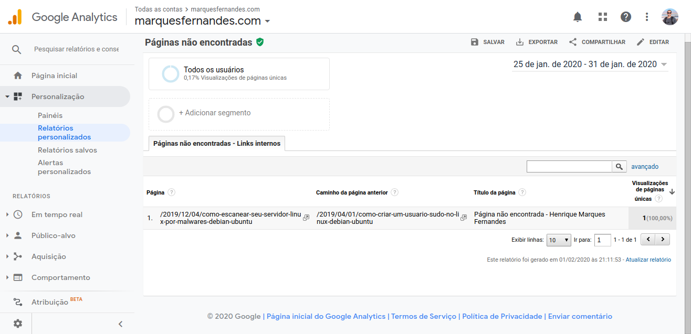

In this article we'll learn how to monitor your website's 404 errors by [Google Analytics](https://analytics.google.com/analytics/web/) . If your website is correctly configured for this type of error, Google Analytics can automatically monitor it. The custom reports we'll learn how to create will help to easily identify and fix which pages are causing this error.

**Also check:** [Filtering WordPress Preview and wp-admin in Google Analytics](http://marquesfernandes.com/filtrando-pre-visualizacao-e-wp-admin-do-wordpress-no-google-analytics/)

First we need to find out if our 404 pages are set up correctly:

-   Your 404 page must always load at the same URL that gave the error, **NO** we must redirect to a custom page (Example: /404/)
-   If a page does not exist on your site, it must return the status code **HTTP 404 (Not Found)** , not code 200 (Ok) and not some redirect code, read the point above.
-   **To facilitate monitoring:** Default the title of this page, preferably with titles that easily identify the error, such as "Page not found" or "404".

We can use this page as an example: [http://marquesfernandes.com/esta-pagina-nao-existe](http://marquesfernandes.com/esta-pagina-nao-existe) .

## Custom report to find 404 errors caused by INTERNAL links

The first report we're going to learn how to create monitors the internal links that are causing 404 errors on your site. Internal links are links that point from one page to another within your website. As theoretically we have full control over these links, we will be able to work on fixing them faster. Broken links are terrible for SEO performance and user experience.

1.  On your Google Analytics dashboard go to **Customization > Custom Reports > + New Custom Report** .
2.  Select the type **Fixed table** .
3.  Select dimensions **Page; Previous Page Path; Title of the page.**
4.  Select metric **single page views** .
5.  Add a filter that **delete** the value **(entrance)** to the dimension **Previous Page Path** . This filter ensures that only 404 errors caused by an internal link appear.
6.  Add a filter to the **page title** that identifies your pages not found.

Now save your report and see the result:

## Custom report to find 404 errors caused by EXTERNAL links

Now let's learn how to monitor 404 errors coming from external links. External links are links that point to some page on your site on a site other than yours. Normally you don't have direct control over these links, but once found you can easily tell the site administrator to fix it.

1.  On your Google Analytics dashboard go to **Customization > Custom Reports > + New Custom Report** .
2.  Select the type **Fixed table** .
3.  Select dimensions **Page; Full Referrer; Title of the page.**
4.  Select metric **single page views** .
5.  Add a filter that **include** the value **(entrance)** to the dimension **Previous Page Path** . This filter ensures that only 404 errors caused by an internal link appear.
6.  Add a filter to the **page title** that identifies your pages not found.

If all goes well, you will now have two reports to help you identify and correct these errors. Monitor these reports whenever possible, don't let a simple fixable mistake affect your SEO!

