When I started as a Freelancer, I didn't know anything about hosting websites, much less servers. DNS? Is this a disease? Everything seemed so complicated that it led me to opt for services like [UOL Host](https://uolhost.uol.com.br/#rmcl) , [Locaweb](https://www.locaweb.com.br/) and [hostgator](https://www.hostgator.com.br/17815.html) , and with them I stayed and struggled for a long time...

**Disclaimer 1:** If you are a lay user who is looking to set up a blog or an institutional website for your company and you don't have much technical knowledge, don't think twice, opt for one of these services! I personally recommend the [hostgator](https://www.hostgator.com.br/17815.html) , they have an intuitive admin panel and the support is relatively good...

**Disclaimer 2** : Website hosting can be somewhat ambiguous, so clarify that in this article when I refer to "website hosting": System to create and manage websites in PHP; Creation and configuration of user account, email, FTP; Some other standard hosting features found on the market.

**Disclaimer 3:** If you are going to set up and offer hosting services, think and ponder about all the positives and especially negatives of taking this responsibility: You will have to deal and control the use of machine resources by your customers, spam on your server IP, access and account creation, possible downtime, managing back-ups and much more... It's quite a job!

Normally I am against reinventing the wheel and whenever possible I prioritize the use of ready-made services that make my life easier, as long as they meet my needs... This was not the case and after many problems in “advanced” situations where I needed to optimize some configuration, I decided to look for a solution that would give me more autonomy.

## Services used

-   [cloudflare](https://cloudflare.com/) : Perhaps one of the most complete "freemiuns" services I've ever used, here I manage all my DNS settings and can count on many other very useful native free services: Security and DDOS prevention, Content Delivery Network (CDN), Cache and optimizations performance... 

-   [DigitalOcean](https://m.do.co/c/6bc37502c1d9) : All my "cloud infrastructure" is here, for R$22/month ($5 doletas/month, quote from 02/24/2020) you can upload a server that can handle smoothly between 10~15 institutional sites that don't receive many visits, and you also have all the freedom to scale on demand, with just one click you can increase your machine resources, with no extra configuration required! Another positive is their support, yyyy DigitalOcean <3 support, it's wonderful! (DigitalOcean, sponsor me!)
-   [virtualmin](https://www.virtualmin.com/) : Our hosting administrative system, opensource software, beautiful, extremely complete and configurable. He will do all the magic of installing, configuring and administering all the services necessary for our hosting, Apache + PHP for dynamic websites, email service, FTP access configuration, creation and administration of user and email accounts, and much more.

## Phases

## Cloud Server Creation

First of all, create your account at [DigitalOcean](https://m.do.co/c/6bc37502c1d9) (duh).

Let's create a server with the operating system Ubuntu Server 18.04, in [DigitalOcean](https://m.do.co/c/6bc37502c1d9) , let's use the most basic Droplet for testing:

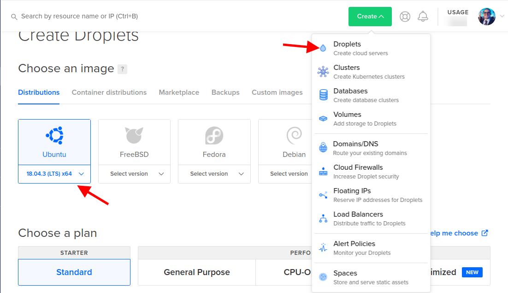

Now select the plan, for this article I will use the cheapest machine, select it as needed, I currently use a 15 dollar Droplet to host my blog and 14 other sites, 4 of which have more than 20k monthly hits:

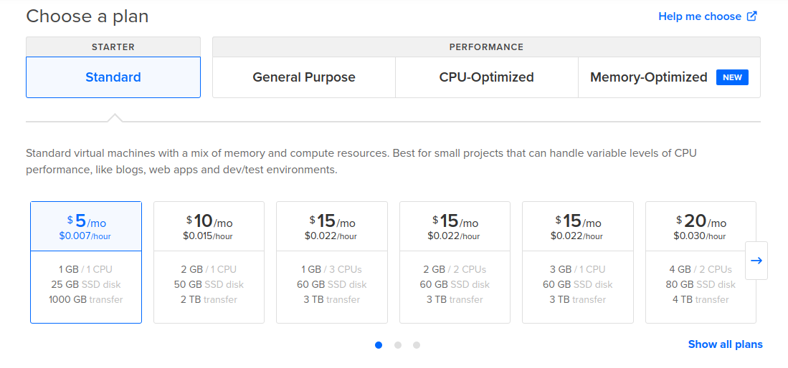

Now let's select in which region we want our Droplet to be created, let's also configure some optional services:

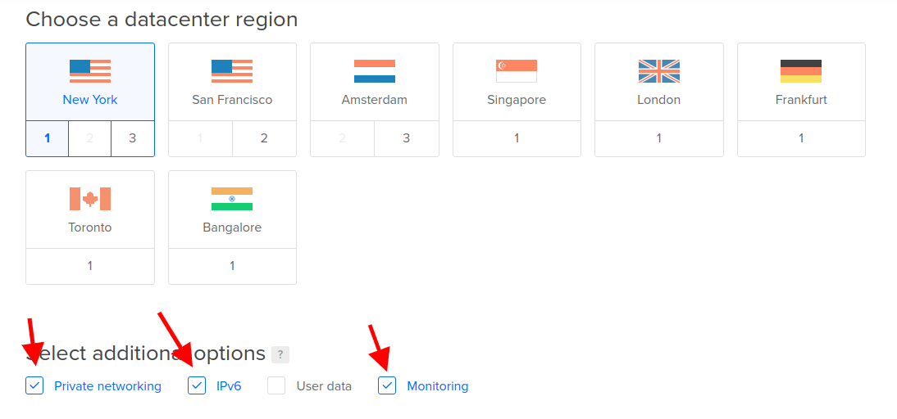

**Private networking:** Create a local IP, useful if in the future you want to create a hosting cluster, so you can use an internal IP with low latency.  
**IPv6** : Enables support for the new Internet protocol, IPv6  
**Monitoring:** It installs some monitoring packages from DigitalOcean, useful for you to follow the status of your machine right from the DO control panel.

Now a very important step of creation, first let's select the authentication method with the virtual machine, the safest way is through SSH keys, but for ease let's choose the "One-time password" method, it will send a temporary password to our email. In hostname, let's put which domain we want our machine to be responsible for, it's important to use some intuitive name as it will appear in some places, like in headers when sending emails, and we'll also use it as the path to our admin panel:

Click on create and wait for the process to complete. When the creation is successfully completed, an email will be sent with your temporary root password.

## Server Configuration and DNS Notes - Part 1

First of all, create your Cloudflare account (duh).

First you need to add and validate your domain on Cloudflare, you need to have access to the domain's advanced settings, either in your Registro.br account or at the reseller where you purchased the domain. Cloudflare has a very intuitive walkthrough so I found it redundant to write, if anyone has any questions leave in the comments I'll be happy to help.

So let's configure our domain `hosting-test.marquesfernandes.com` to point to the IP of our newly created machine:

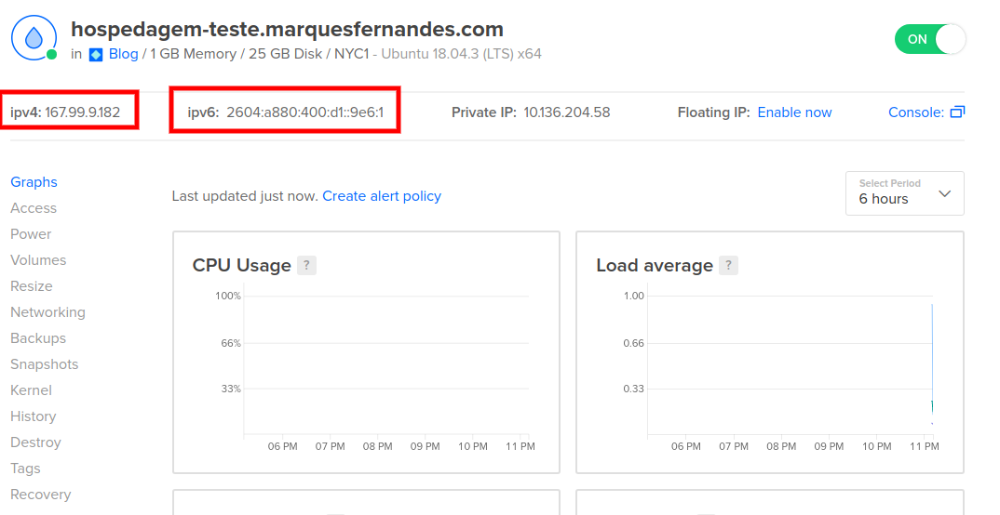

### Configuring the A - IPv4 Appointment

Let's create first note of the type `THE` for our `IPv4` , remember to disable the *Proxy Status* for now:

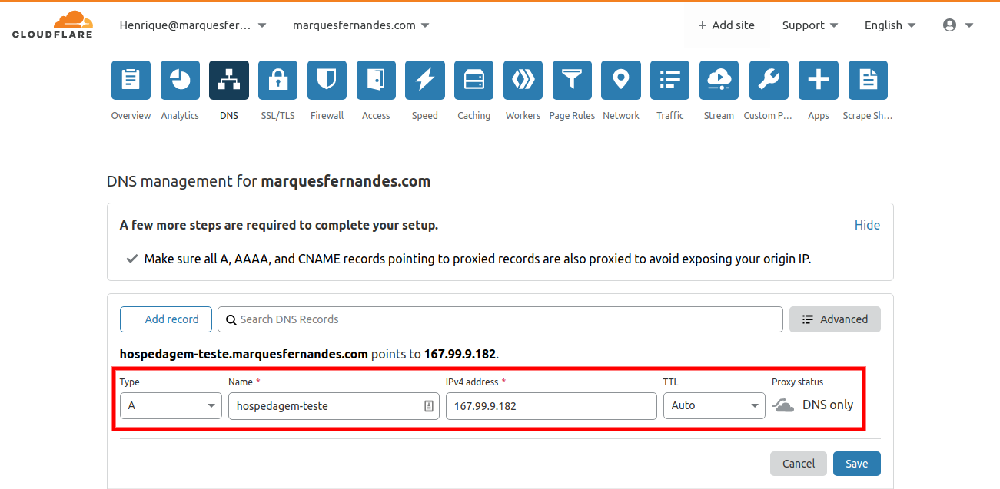

### Configuring AAAA Annotation - IPv6

Now let's create the note of the type `YYYY` for our `IPv6` , remember to disable the *Proxy Status* for now:

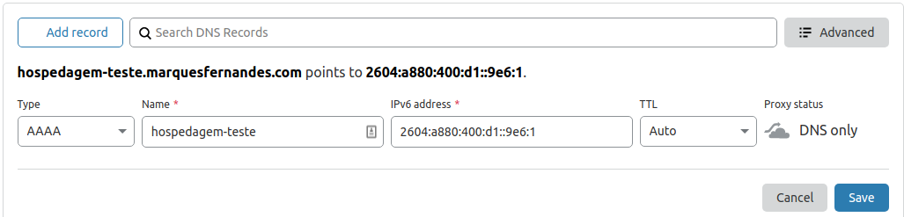

## Installing and configuring Virtualmin

Let's test our DNS configuration logging via SSH on our machine using the root username and the password sent to the email. If you're on Windows you can use PowerShell for that, or some [terminal emulator](http://marquesfernandes.com/melhores-emuladores-de-terminal-para-windows/) that has SSH functionality.

\# ssh root@hosting-test.marquesfernandes.com

Attention, you will need to enter the password sent to your e-mail twice, and then enter a new secure password twice, remember to create a very secure password, after all, many important things for you and perhaps for clients will be on this server:

Virtualmin Installation - P1

First of all we will update any packages from our newly created virtual machine, this will install recent security and system updates on our system:

\# sudo apt-get update
# sudo apt-get upgrade

Installing Virtualmin is very simple, we just need to download the official installation Shell Script:

\# wget http://software.virtualmin.com/gpl/scripts/install.sh

Now run the installation script as root:

\# sudo /bin/sh install.sh

Be aware that some questions will be asked during the installation process:

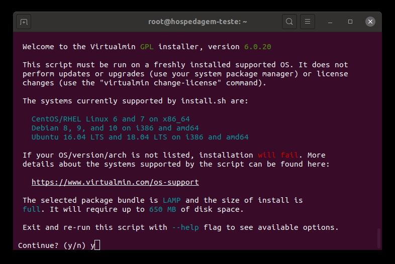

Virtualmin Installation - P2

You will probably want to answer yes to every question. Installation may take a few minutes:

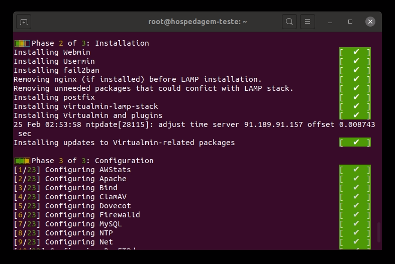

Virtualmin Installation - P3

Now to test our installation, we need to access in our browser the following address `https://hospedagem-teste.marquesfernandes.com:10000` . Replace the URL with your hosting address and keep the default port `10000` , you will probably encounter the privacy error, that's because we haven't configured our SSL certificate yet:

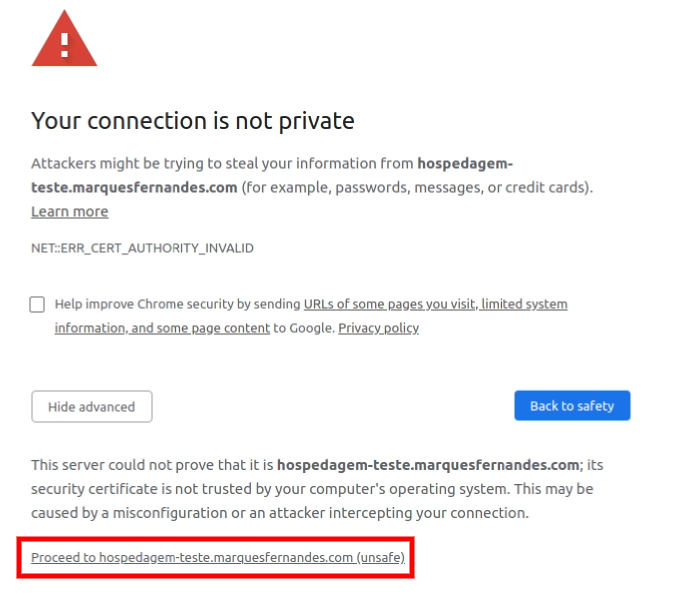

Proceed to login, here we will use the user `root` and the password defined for machine access in the first step of the tutorial:

If that works out, you should see the Virtualmin admin panel like the one below:

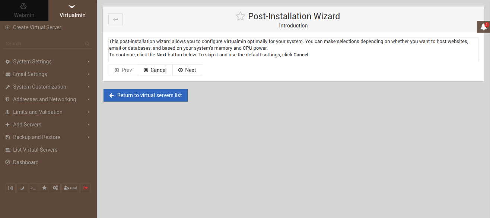

On our first login, Virtualmin will do an initial setup based on several questions, read them carefully and respond as needed. Now I recommend that you take the time to read the Virtualmin/Webmin documentation, so you don't get confused, Virtualmin is the system that manages one or more Webmin, this is the client part (website, and services). There are several settings you'll want to tweak, create customer account templates, with different limits and services, and much more.

## Customer account creation on Virtualmin

Now let's create a customer account on our Virtualmin installation, that is, let's create a website and configure all the minimum steps to make it work.

### creating the server

Let's create a server for the website `test-site.marquesfernandes.com` , with the default server configuration template and chart of account as well. Let's enable the "Setup SSL Website" functionality, to configure the website in *Https* also:

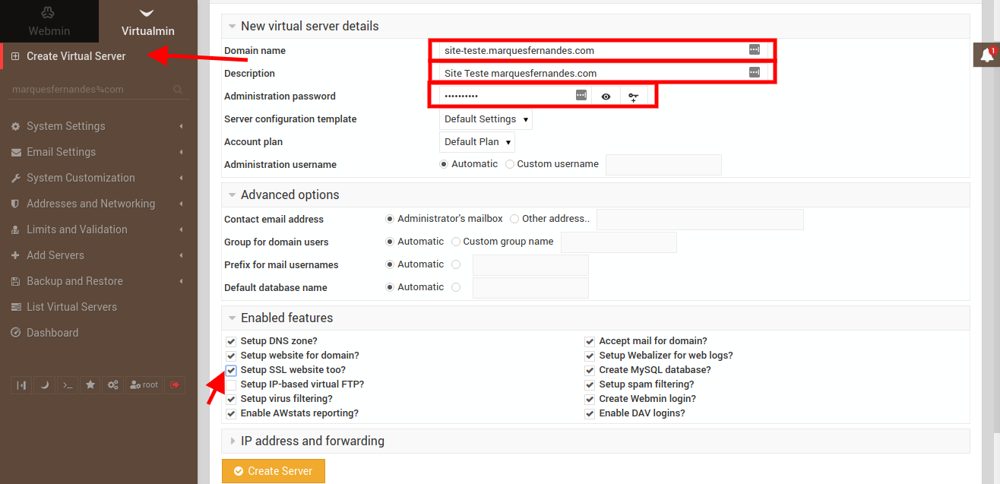

Server creation

### Creating a new user and email account

Let's now create a test email account/user on our new server.

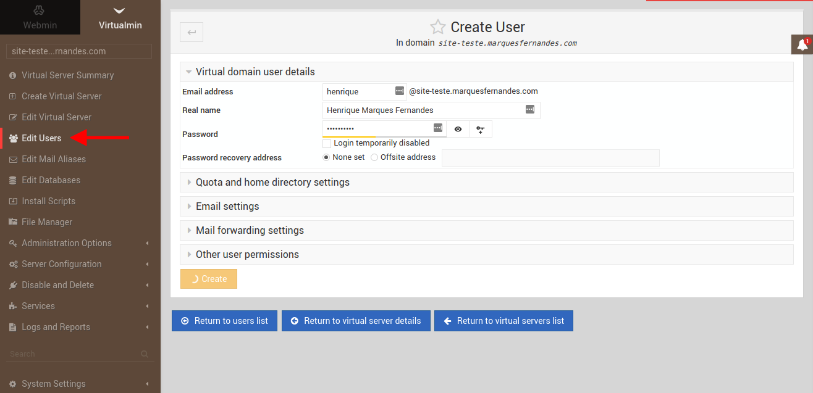

Creating a new user and email account

## DNS Server Configuration and Notes - Part 2

Now let's configure the DNS notes for our newly created website `test-site.marquesfernandes.com` , we're going to add entries for both our website and FTP and email server access. For this we will find all the basic DNS settings of our server and replicate them on Cloudflare:

DNS configuration

Remembering that the FTP and MX settings must not have Proxy Status enabled on Cloudflare, as our appointment needs to reflect the real IP and this option serves to mask the real IP of the appointment, very useful if you want to hide and use the services from Cloudflare, let's leave this option enabled for all other annotations. After configuring all the necessary DNS, it's time to test if our site is up:

Voila, that means our appointment and website are working, as we don't have any html files or system installed, the default system message is "Forbidden".

## Generating SSL certificate with [Let's Encrypt](https://letsencrypt.org/pt-br/getting-started/)

Now that we have our notes working, let's configure our site to use the SSL certificate, so we can access our site via the secure protocol `https://` .

THE [Let's Encrypt](https://letsencrypt.org/pt-br/getting-started/) is a free, automated and open certification authority (CA) that operates for the public benefit. It is a service provided by [Internet Security Research Group (ISRG)](https://www.abetterinternet.org/) .

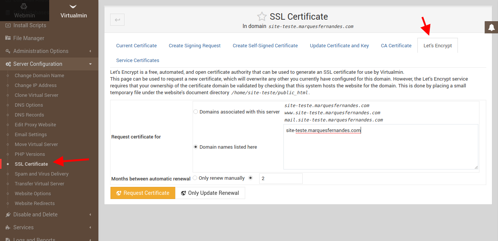

Generating a valid SSL certificate - Part 1

Simple as that, if everything goes as expected you will have a valid certificate installed and will be able to access your website using the secure protocol.

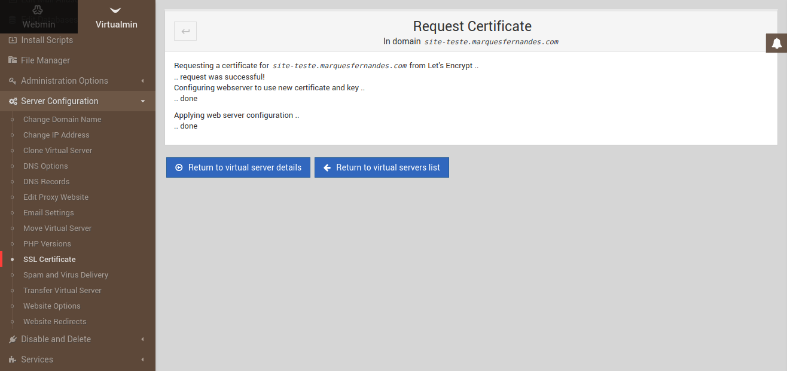

Generating a valid SSL certificate - Part 2

Let's test by accessing our website `https://site-teste.marquesfernandes.com` :

## Uploading content to the website

Well, now that we've got everything set up and running, let's upload a home page to our site via FTP, it will be a very simple PHP page just for testing:

<!-- index.html -->
<!DOCTYPE HTML>
<html>
<head>
  <meta http-equiv="Content-Type" content="text/html; charset=UTF-8" />
  <title>Marques Fernandes - Virtualmin</title>
</head>
<body>
  <h1><?php echo "Today's date: " . date("d/m/Y"); ?></h1>
</body>
</html>

Let's upload our file `index.php` to our server via FTP by host `ftp.site-test.marquesfernandes.com` , before we need to create a user with access to the site's root FTP:

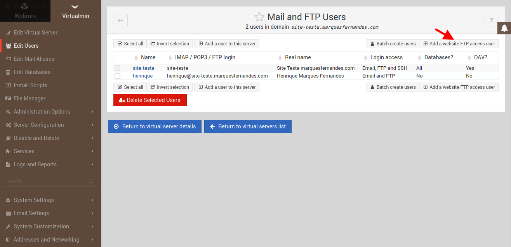

Creating an FTP User

Now we can log in with the username and password using the Filezilla program to upload our file:

Uploading content via FTP with Filezilla - Part 1

If all goes well, when accessing our website we should see the following message:

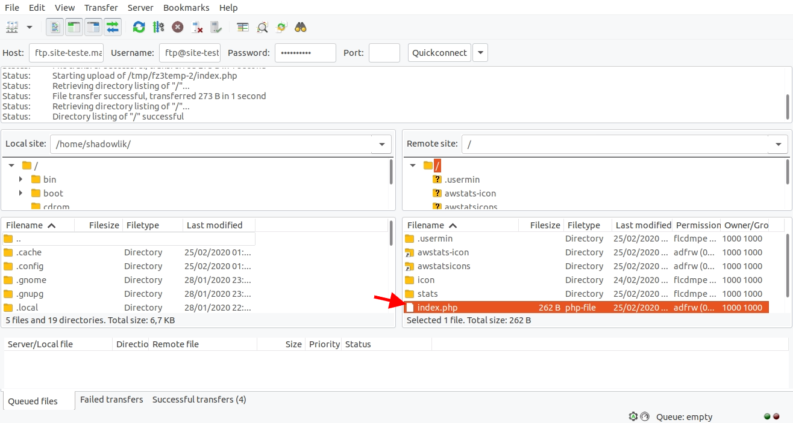

Uploading content via FTP with Filezilla - Part 2

Well, with this tutorial you will be able to create your own hosting, and even reseller hosting at a very affordable price. That was part 1 of the creation, soon I will be writing part 2 with some important tips for your email server, server maintenance and some more relevant topics that I learned in the race after 5 years managing my own machines and accommodation.

If you have any questions or would like a tutorial, leave your comment! I will be happy to try to help.
