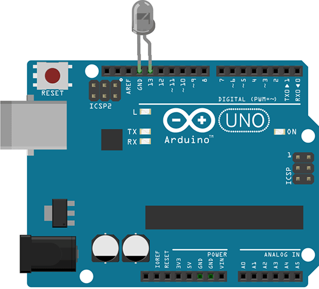

**JavaScript,** or **JS** for intimates, it is one of the most popular and used programming languages in the world. It is a high-level, multi-paradigm (object-oriented, functional, imperative, and prototype) interpreted language. With it, it is possible to develop from dynamic pages, applications for smartphones, complex systems and even electronic games.

Today we're going to learn more about what JavaScript is, how it works, and where we can use this language.

## Disclaimer: JavaScript is not Java

The name is similar and causes a lot of confusion but, **JavaScript** It is NOT Java. There is a brief relationship in the creation of language, but it stops there. I'll explain it better in the next paragraph.

## Brief History of JavaScript

The internet was very different from how we know it today, there was a time when pages were just static, boring and lifeless sites. In its early days, the *World Wide Web* it was just a large cluster of tabbed pages written in HTML, with links and eye-catching images. Over the years, and the popularization of the internet, the needs and functionalities became more and more complicated and required a more advanced way of creating pages that interacted better with users.

One of the most famous sites of the 90's and a [example still alive](https://www.spacejam.com/) of what the root internet was like.

JavaScript was created by Brendan Eich in 1995 during his time at Netscape Communications (for Generation Z, Netscape was one of the first browsers), who, in addition to creating JavaScript, was also one of the founders of Mozilla Corporation. Initially called Mocha, its first versions were for the exclusive use of Netscape and its development was inspired by the languages Java, Scheme and Self. Over the course of history, Netscape ended up partnering with Java developer Sun, who wanted to use Netscape's technology to strengthen their newly created language (Java), so they began to ship the JavaScript scripting language as a companion to Java. Java, without noticing the possible competition the two would eventually have.

For a while, the struggle for space from other technologies on the web kept JavaScript somewhat "frozen" and with a certain rejection from some developers. But around 2000, [Douglas Crockford](https://pt.wikipedia.org/wiki/Douglas_Crockford) , one of the main responsible for the popularization of the JSON format and consequently the rediscovery of JavaScript, so in a short time the language gained traction and dominated the internet world thanks to the work of independent developers and a growing community. JavaScript becomes more and more a robust language with multi-applications, practically a Bombril with its thousand and one uses.

## How it works?

> Computers don't understand JavaScript, environments do.

JavaScript is an interpreted and uncompiled language for machine code, meaning JavaScript doesn't turn a lot of 1's and 0's, so "computers don't understand javascript". For this to happen, language needs an engine *(engine)* and an execution environment ( *runtime environment* ) so that it can work.

One engine ( *engine* ) JavaScript is a program "written in C++" (not all engines are, just for example), which is a compiled language that the computer can understand and execute, so the engine goes through all the JavaScript code and transforms it into something that the computer's processor can understand and execute - machine code. This engine runs within a context, which makes up our *runtime environment* , as in the case of Chrome browser and NodeJS, both use the same engine but have some different contexts and functionality. We have some famous engines, the aforementioned [V8](https://v8.dev/) runs on Chrome, Opera and Node and was developed by Google, while Firefox ships the engine [SpiderMonkey](https://developer.mozilla.org/pt-BR/docs/Mozilla/Projects/SpiderMonkey) developed by Mozilla.

And all this context makes JavaScript a high level language, the engine is responsible for all the abstraction and problem of communicating with the machine, making development easier and more streamlined.

## ECMAScript

JavaScript follows the specifications defined in the [ECMAScript](https://www.ecma-international.org/publications/standards/Ecma-262.htm) , a script-based programming language specification, standardized and maintained by [Ecma International](https://pt.wikipedia.org/wiki/Ecma_International) . It was created to standardize scripting languages and help organize the various language-independent implementations.

## What is it for?

JavaScript is a very versatile language, with a community that grows every day, and its applications too, making it a popular choice for companies with small staff: JavaScript, one language to rule them all . you will probably listen [many ~truths~ jokes](https://dayssincelastjavascriptframework.com/) that every 5 minutes a new JavaScript library is born...

### JavaScript in Browser

As we learned earlier, this language was born to give life to the navigator and remains firm and strong in its objective. In the past, the main and practically the only famous framework on the internet was the [jQuery](https://jquery.com/) (actually currently more than [70 million sites](https://trends.builtwith.com/websitelist/jQuery) still run with jQuery), but with the advancement of engines and the processing capacity of computers and cell phones, new, more robust and complex frameworks emerged to improve the user experience.

Some of the most popular frameworks today:

-   [ReactJS](https://pt-br.reactjs.org/) - Developed and maintained by Facebook, and open to the community.
-   [VueJS](https://vuejs.org/) - Developed and maintained by [Evan You](https://twitter.com/youyuxi) (ex Google), and open to the community.
-   [Angular](https://angular.io/) - Developed and maintained by Google, and open to the community.

### Backend JavaScript with [NodeJS](http://marquesfernandes.com/afinal-o-que-e-nodejs/)

In 2009, the [Node.js](http://nodejs.org/) was developed by Ryan Dahl around the V8; Essentially as a way to run JavaScript programs outside the context of a browser. Check out the article [After all what is NodeJS](http://marquesfernandes.com/afinal-o-que-e-nodejs/) , where I better explain the history of NodeJS and how it works.

In the example below, we have a simple script that consumes an internet resource that contains [all Pokemon data](https://pokeapi.co/) and returns Pikachu's information:

### JavaScript in Mobile Development

JavaScript has good libraries for mobile development, making it a good alternative to native development. With just a code base, we were able to develop web pages, iOS and Android apps. Some famous apps like Facebook, Instagram and Airbnb are developed with JS. See some of the most famous frameworks:

-   [React Native](https://facebook.github.io/react-native/)
-   [phonegap](https://phonegap.com/) / [Cordova](https://cordova.apache.org/)
-   [NativeScript](https://www.nativescript.org/)
-   [ionic](https://ionicframework.com/)

In the example below we have a calculator app built with React Native:

See the Pen<a href='https://codepen.io/necolas/pen/KrBQmd'> React Native Calculator</a> by Nicolas Gallagher (<a href='https://codepen.io/necolas'> @necolas</a> ) on<a href='https://codepen.io'> CodePen</a> .

### JavaScript in [IoT](http://marquesfernandes.com/internet-das-coisas/)

Its wide portability also allows the programming of [embedded devices](http://marquesfernandes.com/internet-das-coisas/) . Libraries like the [Johnny-Five](http://johnny-five.io/) allow you to develop for boards [Arduino](http://johnny-five.io/#arduino) , [Tessel 2](http://johnny-five.io/#tessel) , [Raspberry Pi](http://johnny-five.io/#raspberrypi) , [Intel Edison](http://johnny-five.io/#edison) , [Particle Photon](http://johnny-five.io/#spark) , [and much more...](http://johnny-five.io/platform-support/) using JavaScript, the language is compiled to each device's native language.

var five = require("johnny-five");
var board = new five.Board();

board.on("ready", function() {
  var led = new five.Led(13);
  led.blink(500);
});

### JavaScript for Game Development

And finally, thanks to major advances in engine performance improvements and new features built into browsers, we can create games that run directly in the browser:

See the Pen<a href='https://codepen.io/davisonpro/pen/pGbxmP'> JavaScript Game</a> by Davison Pro (<a href='https://codepen.io/davisonpro'> @davisonpro</a> ) on<a href='https://codepen.io'> CodePen</a> .

More examples of games made with JavaScript can be found in this [link](https://developer.mozilla.org/en-US/docs/Games/Examples) .

## Where to learn to program with JavaScript?

If you got excited about the language and all its applications, I have good news for you! There are many good materials on the internet, you can also find good courses on Udemy.

