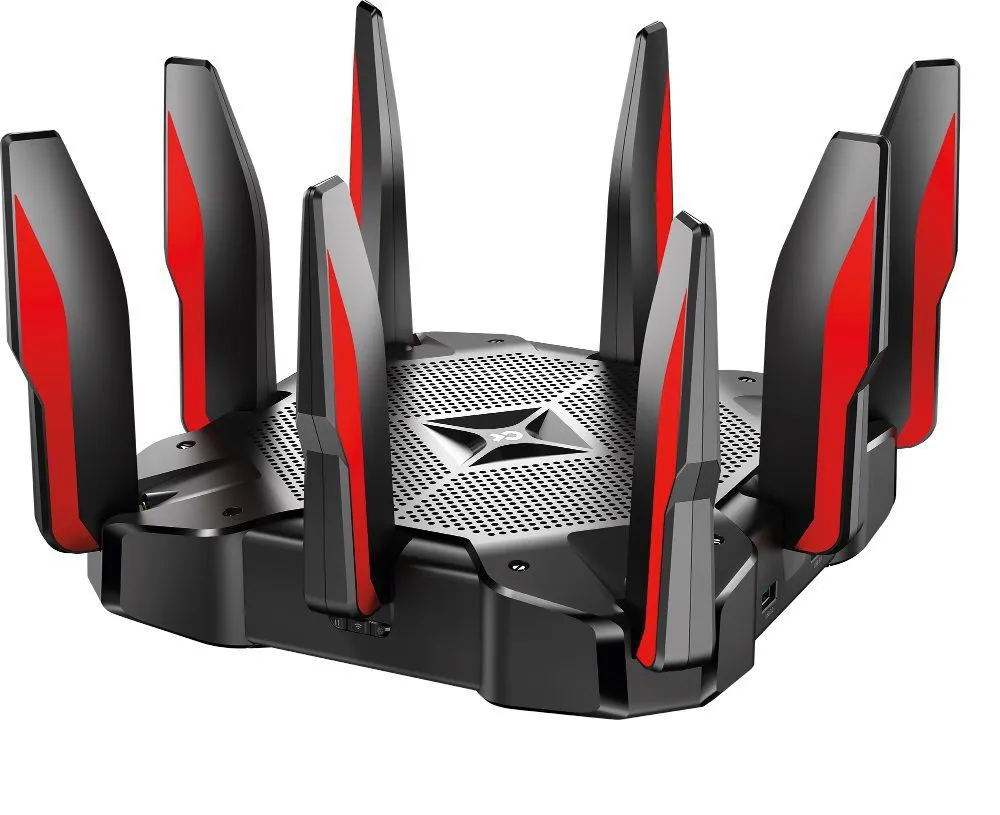
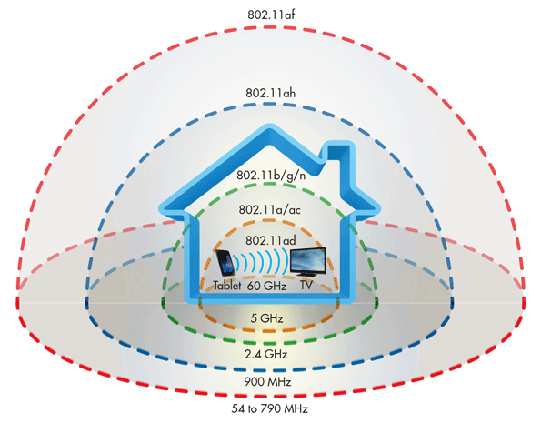

Se você se encontra frequentemente fazendo a dança do Wi-Fi, mexendo e chacoalhando seu roteador toda vez que a sua internet cai, talvez seja hora de um novo roteador. Mas entender se o seu roteador ainda está bom e de acordo com as novas velocidades de internet, ou saber o que procurar em um novo, é muito mais fácil falar do que fazer. Muitos termos técnicos, como 802.11ac, banda dupla e Mbps, confundem e complicam fazendo você acreditar se realmente precisa de 6 antenas ou não - Já te adianto: 99% das vezes, não.

Então, quais recursos e informações realmente importam quando se trata sobre o desempenho do roteador? Veja a seguir os principais termos, protocolos, velocidades e outras especificações que você precisa entender e ficar atento na hora de escolher um novo roteador.

*Confira também:*

-   [O que é HTTP?](http://marquesfernandes.com/o-que-e-http/)
-   [O que é CGNAT (Double NAT)?](http://marquesfernandes.com/o-que-e-cgnat-double-nat/)

## 1\. Antenas - Uma, duas ou trinta antenas?

Meu Deus, quantas antenas! Isso é um roteador ou uma nave espacial?

Acredito que uma das primeiras dúvidas que surgem é: Para que servem tantas antenas e se eu preciso delas. Elas vão melhorar meu sinal? Meu Wi-Fi vai chegar na China?

Independentemente se você pode ver a antena ou não, todos os roteadores Wi-Fi possuem uma antena de transmissão e recepção (TX-RX), usada para se comunicar sem fio com seus dispositivos, de seus laptops e smartphones até sua Smart TV ou lampada inteligente.

Intuitivamente, faz sentido que mais antenas em um roteador se correlacionem com melhor sinal e velocidade. Isso é verdade, até certo ponto. Várias antenas criam vários fluxos para compartilhar dados através de canais de rádio, o que traz mais largura de banda aos seus dispositivos. No entanto, antenas externas adicionais não são necessariamente importantes - o hardware e software que acionam as antenas é o que realmente importa. Ao comprar um roteador, pense menos no número de antenas e mais na funcionalidade adicionada. Especificações como **MIMO** e **MU-MIMO** aumentam a capacidade de um roteador de transmitir e receber dados, e é isso que realmente torna sua rede mais rápida.

Confira também a potência das antenas embarcadas no seu roteador, procure as métricas de dBi para entender a potência e alance máximo das antenas, lembrando que o alance medido é sempre em cenários controlados, normalmente medido em campos abertos e sem interferência de outras redes (eles são espertinhos não...), e não se engane pensando que apenas trocando a antena do roteador por uma gigante de 200 mil dBis que você comprou no mercado livre por R$1,99 vai ajudar em algo, se o transmissor não tiver potência para utilizar o amplificador da antena, não mudará nada.

## 2\. Bandas, canais de frequências - Single, Dual ou Tri-band?

[Alcance e frequência dos padrões IEEE 802.11.](https://www.gta.ufrj.br/grad/15_1/802.11ah/ieee80211ah.html)

Single, Dual ou Tri-band referem-se aos canais de frequência de um roteador. Os roteadores de banda única (single-band) operam com uma frequência mais baixa - na faixa de 2,4 GHz - que possui menos canais e, portanto, ficam mais cheia. De fato, a maioria dos aparelhos domésticos - como microondas, telefone sem fio e dispositivos Bluetooth também operam nessa frequência. Os roteadores de banda dupla (dual-band) suportam tanto a frequências de 2,4 GHz quanto 5 GHz. A banda de 5 GHz é capaz de transmitir mais dados em velocidades mais altas, e possui também mais canais, mas por se tratar de uma frequência mais alta ela tem mais dificuldade em rotear paredes e móveis e não tem um alcance tão longo quando a frequência menor de 2,4 GHz. Já os roteadores de banda tripla (Tri-band) suportam uma terceira banda no canal de 5 GHz, a de 5,8 GHz.

Atualmente a maioria dos novos dispositivos eletrônicos já vem com suporte a frequência de 5 GHz, então o ideal é procurar roteadores que tenham no mínimo suporte as duas frequências, dando suporte a dispositivos mais antigos e ao mesmo tempo usufruindo das novas velocidades, sem abrir mão de uma frequência mais baixa para quando precisar utilizar a internet em lugares mais distantes da sua casa.

## 3\. Protocolo sem-fio - 802.11 e as benditas letras a/b/g/n/ac

Os protocolos da Internet sem fio são provavelmente as variáveis ​​mais confusas e desconhecidas em um roteador. Existem 802.11a, 802.11b, 802.11g, 802.11n e 802.11ac - porque todos adoramos nomes alfanuméricos, certo? 802.11ac e 802.11n são os padrões que você encontrará na maioria dos roteadores atuais, e os padrões "a", "b" e "g" são mais antigos e considerados desatualizados.

Embora alguns dispositivos possam ainda operar no 802.11n, você deve buscar usar o mais novo padrão, o 802.11ac. Esse padrão é mais rápido e transmite mais dados, pois utiliza as duas bandas de 5GHz e 2.4GHz. A desvantagem é que você precisa estar próximo ao roteador para usar os dois canais - caso contrário, o roteador volta automaticamente a usar apenas a banda de 2,4 GHz. Para obter Wi-Fi em todos os quartos, e não apenas ao lado do seu roteador, em vez de depender de um roteador, vários pontos de acesso 802.11ac podem ser criados utilizando repetidores Wi-Fi.

## 4\. Velocidade - Quantos Mbps e qual ACXXX escolher?

Os roteadores têm todos os tipos de velocidades listados em suas embalagens - de 8 Mbps (megabits por segundo) a 1900 Mbps. Em teoria, quanto maior o número, maior a velocidade da sua internet - mas não fique preso aqui, antes de tudo vale lembrar que sua internet sempre se limitará ao lado mais fraco, se você tem uma internet contratada de 10 Mbps, não espere milagres de seu roteador. Ao comparar roteadores, você provavelmente verá rótulos divulgando *AC1200*, *AC1750*, *AC3200* e assim por diante.

O "AC" refere-se ao padrão sem fio, que foi mencionado no tópico 3 acima, enquanto o número refere-se à velocidade. Por exemplo, um roteador com uma taxa máxima de link de 450 Mbps na banda de 2,4 GHz e 1.300 Mbps na banda de 5 GHz é considerado um roteador *AC1750*. Mas nenhum dispositivo normal, nem mesmo sua smart tv 4k, usa toda essa largura de banda sozinha, e cada dispositivo pode usar apenas uma banda ou outra.

Vale apena lembrar que as velocidades anunciadas na maioria dos pacotes de roteadores tradicionais são os chamados máximos teóricos, igual comentamos sobre as antenas, essas velocidades divulgadas são testadas em ambientes controlados. As velocidades reais que você terá em sua casa dependem de vários fatores: seu modem claro/vivo/etc, o layout e a construção de sua casa, se existem muitos sinais sobrepondo o seu canal, e muito mais... Para escolher uma velocidade, considere seu uso diário na Internet, para um usuário comum, que vai apenas navegar na internet e assistir alguns filmes, os roteadores *AC1200* geralmente são mais do que suficientes, agora se você tem uma família grande ou muitos dispositivos conectados e sendo usados simultaneamente, procure por uma especificação maior.
