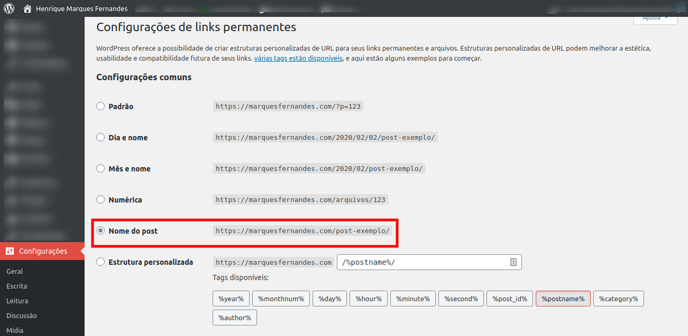

If you have a blog on [WordPress](https://br.wordpress.org/) , you've probably already noticed that your URL comes in the format `/year/month/day/post url` . This format creates longer links, and this date stamp can be detrimental to your site, many users look at the link and select the site with the latest content, so even if you keep your posts up to date it can impact the reach of your articles.

In this article we'll learn how to configure Wordpress to use a simpler url format and redirect posts already indexed or shared to the new format using the `.htaccess` .

## Setting up permanent links in Wordpress

Enter your WordPress admin panel and change to the desired format, in this article we will use the simple format, just with the post name in the URL:

`/%postname%/`

## Redirecting old links using mod\_rewrite in .htaccess

Now let's add a little configuration to our **.htaccess** (It is located at the root of your Wordpress installation).

`RewriteRule ^([0-9] +)/([0-9] +)/([0-9] +)/(.*)$ /$4[R=301,NC,L]`

Your file should look like this:

<IfModule mod\_rewrite.c>
RewriteEngine On
RewriteBase /
RewriteRule ^(\[0-9\] +)/(\[0-9\] +)/(.\*)$ /$3\[R=301,NC,L\]
RewriteRule ^index.php$ -\[L\]
RewriteCond %{REQUEST\_FILENAME} !-f
RewriteCond %{REQUEST\_FILENAME} !-d
RewriteRule . /index.php\[L\]
</IfModule>

**Tip:** If you use some SEO optimization, performance or redirection extension in Wordpress, most likely your file is much larger than the example above, remember to put the line right at the beginning of the file for the redirect to work.

Test some old URLs and see if your redirect is working correctly, to monitor for possible 404 errors check out the article: [How to track 404 errors and pages not found in Google Analytics](http://marquesfernandes.com/como-monitorar-erros-404-e-paginas-nao-encontradas-no-google-analytics/)
