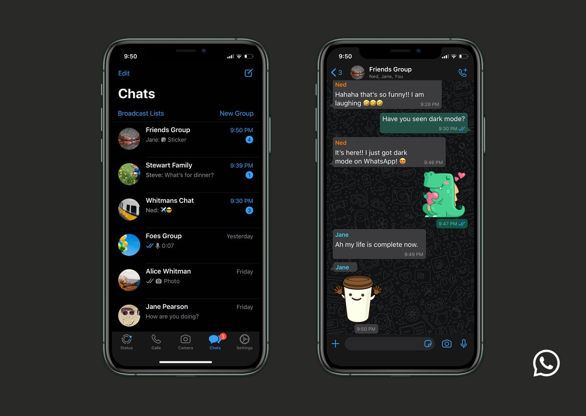
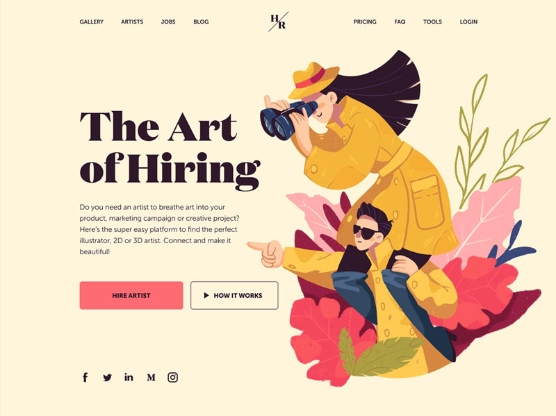
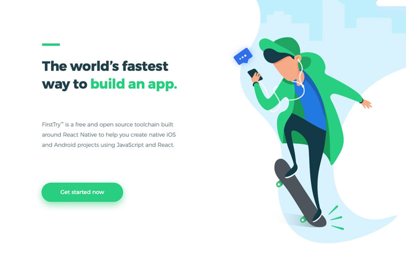
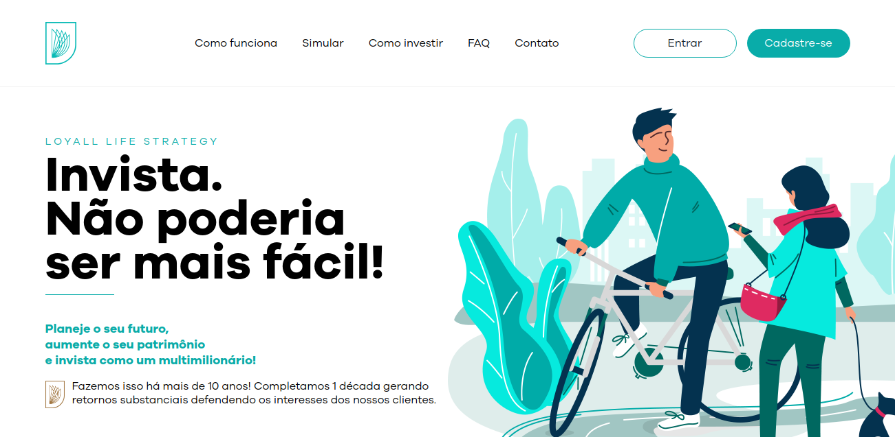
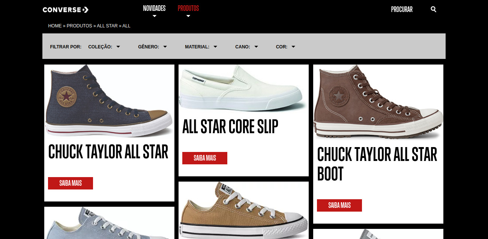
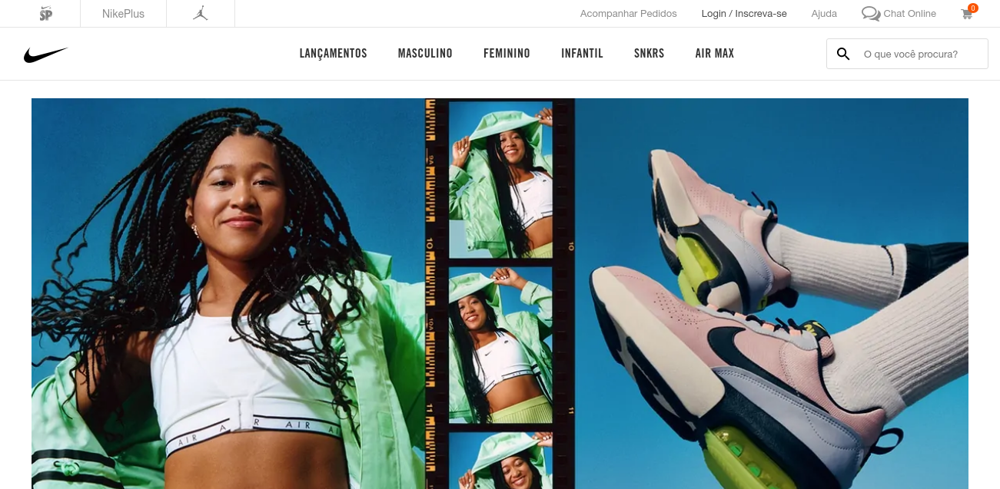
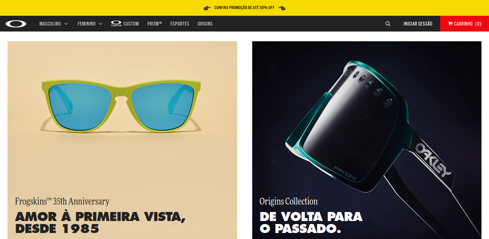
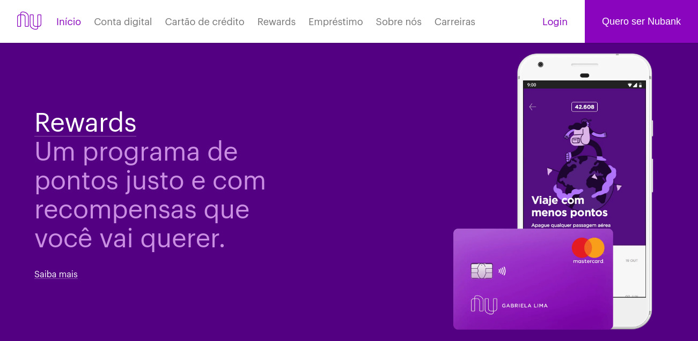
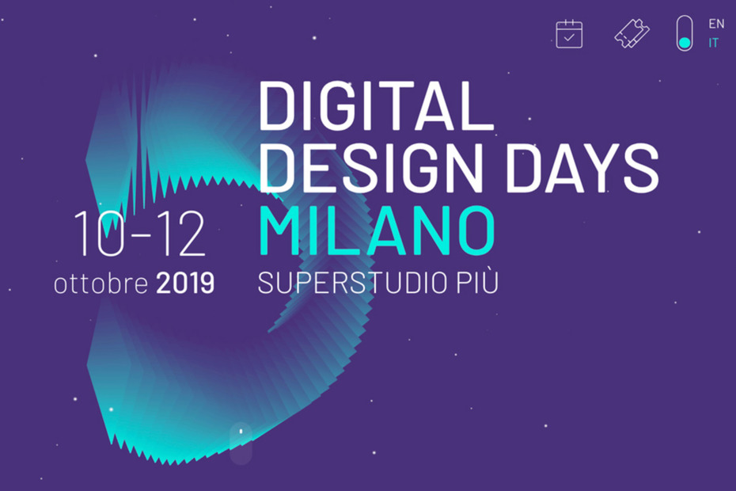

Hay un dicho del mundo de la moda que se aplica a las tendencias de diseño del mundo online: "*La moda es cíclica*". Si te detienes a notar verás que de vez en cuando, cosas que pensamos que volver pegajosamente para estar de moda en Internet, un ejemplo de esto son los GIF, duramente criticados y juzgados, hoy se han convertido en parte de nosotros.

Entonces, ¿qué esperar de 2020 para Web Design? Una cosa interesante que podemos notar en los temas es cómo ux ha estado afectando cada vez más las tendencias de diseño, cambiando tanto la forma de interacción con el usuario como la presentación de información al mismo, hoy más que nunca el diseño tiene un papel fundamental en la conversión de los usuarios.

## 1\. Modo Oscuro

Los diseños de modo oscuro se ven ultramodernos, fáciles de ver y resaltan colores y elementos de diseño. Bien conocido por los desarrolladores, el modo "hacker" ha atraído a más y más usuarios.

Esa es una tendencia que va más allá de la belleza, hay principios prácticos detrás de ella también. Los temas oscuros son los mejores para las pantallas OLED, ahorran energía y prolongan la vida útil de la pantalla. Y otra cosa que muchas personas no saben es que los fondos oscuros reducen la fatiga ocular y mejoran la visibilidad de otros colores destacados para un diseño verdaderamente dinámico. Veremos más y más empresas que se embarcan en modos oscuros, recientemente tuvimos el caso de [WhatsApp lanzando esta característica](https://canaltech.com.br/apps/whatsapp-modo-escuro-como-ativar/) a sus usuarios.

## 2\. Sombras suaves y elementos flotantes

Después de un poco de la ola del [Material Design de Google](http://marquesfernandes.com/sites-para-inspiracao-usando-material-design/), la apuesta por elementos flotantes con sombras suaves está sin duda garantizada. Esta tendencia trae las páginas web, sin exagerar, un poco de profundidad y sensación 3D.

## 3\. Ilustraciones personalizadas

-   
    
-   
    
-   
    

Hoy en día, el objeto visual no existe sólo para dar color a sus páginas, puede y debe utilizarlas para crear una identidad y qué mensaje desea transmitir a su audiencia.

Ciertamente, poner una ilustración en el lugar correcto puede hacer una gran diferencia. Pueden dar un tono audaz y moderno, o quieres un tono más sobrio y tradicional, ¡tú decides! Incluso puedes encontrar increíbles ilustraciones en bancos de imágenes gratis como [UnDraw](https://undraw.co/illustrations) y [OpeanDoodle.](https://www.opendoodles.com/)

## 4\. Marcos sólidos

-   
    
-   
    
-   
    

Recordando un poco el marco de un marco, o incluso esa camiseta fresca con una simple fotografía impresa en el pecho, enmarcar se ha convertido en una tendencia creciente. Puede encontrar esta plantilla en muchos sitios web y especialmente en tiendas virtuales. Su estructura limpia y organizada separa bien los contenidos y favorece el enfoque en lo que es importante!

## 5\. Colores vibrantes y luminosos

-   
    
-   
    
-   
    
-   
    

Una tendencia que necesita ser utilizada con mucho cuidado, la línea es tenue entre pegajoso y llamativo. El uso de los antelesos y colores luminosos desarrolla un aspecto moderno y atrevido, si se utiliza de la manera correcta puede deleitar a su audiencia.
