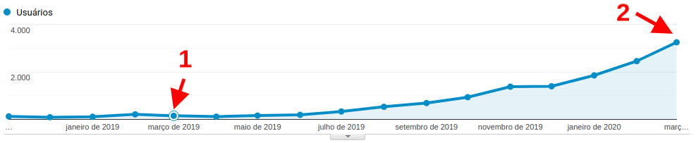
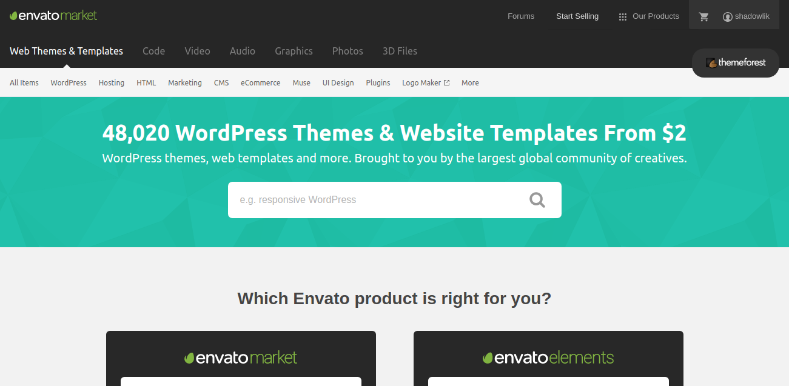
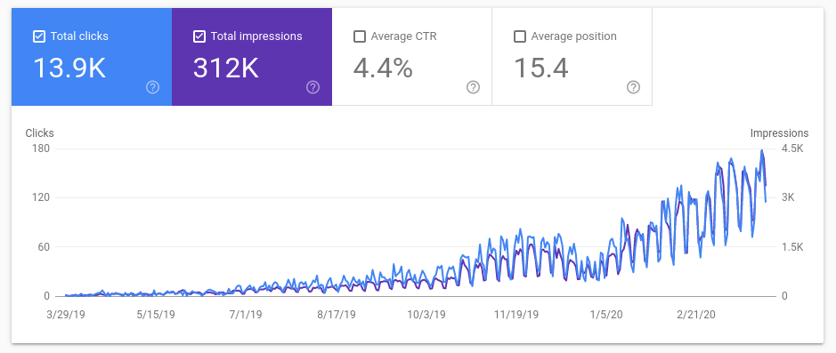

Vou compartilhar com vocês como eu fiz para começar escrever e gerar tráfego para o meu blog e aumentar as visitas em 20 vezes em um ano, estratégias simples mas que geram muito resultado.

Esse mês faz exatamente um ano que comecei a me dedicar a escrever no meu blog e resolvi contar um pouco como tem sido a minha experiência, táticas e resultados. Imagino que muitas pessoas devem ter as mesmas dúvidas que eu tinha, e muitas que eu ainda tenho. Começar a escrever não é uma tarefa fácil, mas fique tranquilo, a pior parte é a mais difícil e ao mesmo tempo a mais fácil de conseguir: Começar.

Quando comecei a querer escrever meu blog, tive muitas dúvidas e receios, medo de escrever algo errado (tanto técnicamente como gramaticalmente), medo do que os outros iriam pensar e até duvidar da minha capacidade e conhecimento. Mas hoje, um ano depois, vejo que todos esses medos eram reais e que a melhor maneira de lidar e melhorar era exatamente escrevendo.

Você realmente só vai se aprofundar em um assunto se você souber ensinar ele; Você só vai começar a escrever melhor, adivinha? Escrevendo; E por ai vai... Até hoje apanho pra usar vírgula, eu, tenho, a, mania, de usar, muito.

Mas vamos ao que interessa, vou contar um pouco do que fiz pra conseguir aumentar em 20 vezes o tráfego para o meu blog. Tentarei ser o mais honesto possível, na minha busca por dicas e ajuda, acabei notando que existem muitos charlatões querendo vender a fórmula mágica de SEO ou de estratégias pra melhorar seu site, e muitas vezes notei que eram apenas ideias furadas.

## Evolução do tráfego

Google Analytics - Evolução do tráfego

Bom, a primeira coisa que você precisa ter é uma ferramenta pra monitorar seu tráfego e usuários, eu optei pelo Google Analytics, ela é a ferramenta padrão de mercado, traz diversas métricas importantes e úteis, e o melhor: Gratuita.

Em março de 2019 foi quando eu decidi realmente focar e tentar escrever no meu blog pra valer, tinha nessa época algo em torno de 152 visitas mensais, e agora em março de 2020, fechando o mês com alto em torno de 3400 visitas. Em números absolutos pode não parecer grande coisa, mas se pararmos para analisar foi uma aumento de 22 vezes no tráfego mensal, para mim foi um número bem animador. Foram 90 artigos publicados nesse período, e agora vou contar um pouco mais sobre algumas decisões e estratégias que tomei até agora.

## Escolha um tema ou design perfeito para você

Eu tenho o meu dominio desde 2015, e desde então já teve alguns propósitos diferentes: Site pessoal, portfólio de serviços (na minha época dedicada a freelancer), e agora blog de tecnologia. Como sou desenvolvedor sempre gostei de fazer os meus próprios sites, desde o design até toda a parte de Frontend, e talvez a decisão mais importante que tomei foi comprar um tema pronto.

Desenvolver um blog ou site com qualidade requer tempo, e quando fazemos algo para nós parece que nunca está perfeito, ou seja, nunca acabamos e isso sempre fez com que eu postergasse a minha ideia de escrever.

[https://themeforest.net/](https://themeforest.net/)

Eu escolhi o Wordpress com a minha plataforma de conteúdo, amplamente usado no mundo e conta com muitos plugins e temas disponíveis, encontrei o meu tema no site [https://themeforest.net/](https://themeforest.net/), fiz muita pesquisa e teste antes de comprar esse tema, pois queria um tema que conversasse com o que eu imaginava que seria o meu público alvo, mas que também seguisse todas as boas práticas de SEO e performance.

## Encontre o seu público alvo

Se você já escolheu o seu tema ou como vai ser o seu site, provavelmente já tem uma ideia da persona que você quer atingir com o seu material. É muito importante você entender pra quem você quer escrever, mas o que pra mim foi mais importante e eu só descobri depois que comecei a escrever foi quem eu era e qual seria o ponto forte do meu blog. Acabei descobrindo o que na realidade eu já sabia, eu não sou um "influencer" e não desejo ser, não tenho muita presença e alcance nas redes sociais, ou seja, meus artigos deveriam ganhar espaço de tráfego orgânico por mecanismos de buscas, meus artigos não são "compartilháveis", então a chance deles entrarem no modo viral nas redes sociais é praticamente nulas, e tudo bem, agora eu já sei onde preciso focar meus esforços: **SEO e conteúdos de longo prazo.**

## Escreva com calma e gere conteúdo de qualidade

Essa é a dica que você provavelmente mais vai encontrar na internet, mas encontrar seu público alvo e desenvolver conteúdo de qualidade é o que realmente vai te ajudar a gerar tráfego para o seu blog. Traçar um plano de artigos e escrever com calma vai te ajudar a gerar conteúdo de qualidade, atualmente eu utilizo o [Trello](https://trello.com/) para organizar todas as ideias que tenho para artigos e priorizo conforme dificuldade de escrita, tenho feito a tática de escrever em média 5 artigos "fáceis" por mês e 2 artigos que vão precisar de mais trabalho, assim consegui manter uma constância alternando estilos de conteúdo.

## SEO - Estude, teste e acompanhe

Você precisa entender o que é [SEO](https://resultadosdigitais.com.br/especiais/o-que-e-seo/) e quais são as estratégias para o seu modelo. Não ache que SEO é uma fórmula mágica e não caia no conto de quem falar isso, é um processo demorado, trabalhoso e requer muito estudo, treino e teste. Existem diversos sites especializados nisso, recomendo que você junte o máximo possível de informação e comece a aplicar e acompanhar as estratégias.

## Engajamento - Converse com seu público

Incentive o seu público a interagir com você, além de ser muito gratificante e isso aumenta a sua taxa de retorno e pode fidelizar um leitor. Convide no final de seus artigos para que seus leitores comentem, dúvidas e críticas devem ser sempre bem-vindas, deixa seu ego de lado.

## Tempo - Tenha paciência

Google Webmaster

No começo eu estava constantemente abrindo o meu Google Analytics para acompanhar o tráfego, e isso acaba tirando o foco do que realmente importa: Conteúdo. Acompanhe seus dados mas não se prenda a eles, essa ansiedade pode acabar em decepção e desmotivação.

Atualmente o Google é o meu maior gerador de tráfego, algo em torno de 85% de todas as visitas vem por ele, e notei que ele demora em média 2 meses para ranquear bem um artigo de qualidade e gerar tráfego, então tenha paciência, confie no seu conteúdo e tente atualizar sempre que necessário.

## Conclusão

Espero que esse texto tenha ajudado a quem está com dúvidas de como começar a gerar tráfego para o seu blog, não sou nenhum especialista SEO mas tenho estudado bastante e visto resultado em algumas estratégias, sei que o texto não foi técnico mas deixe seu comentário se alguém tiver dúvidas específicas, alguma dica ou até mesmo queira compartilhar sua experiência.
