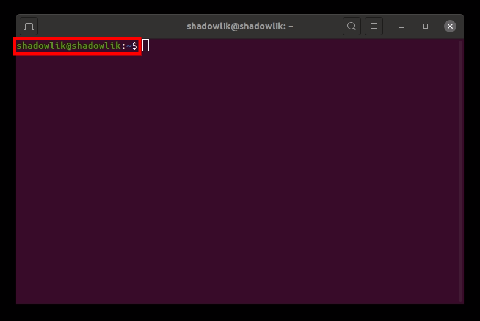
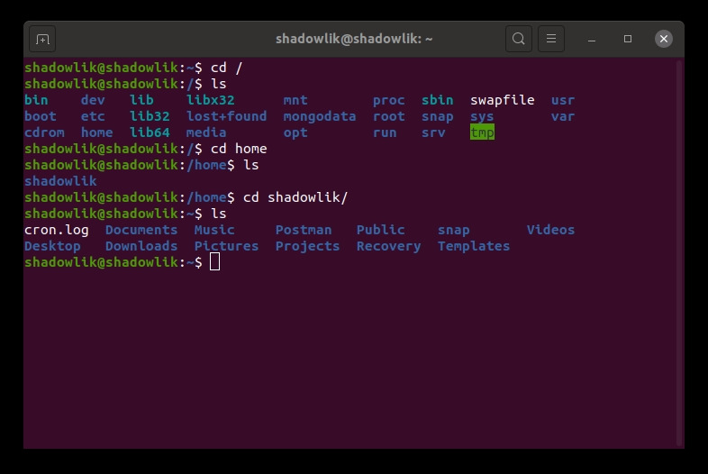
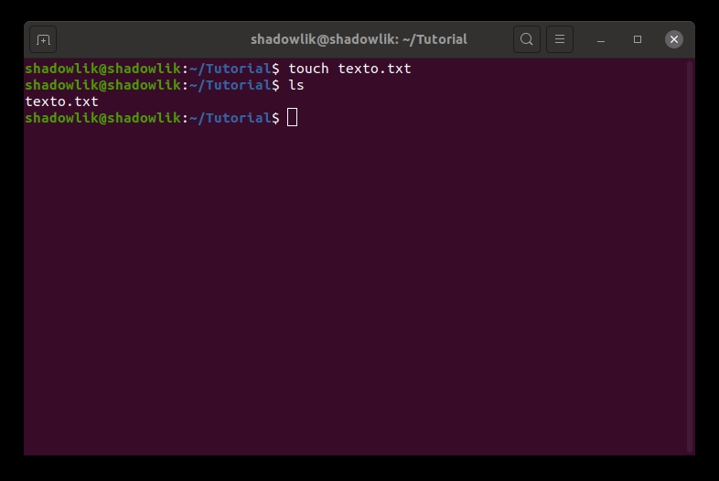
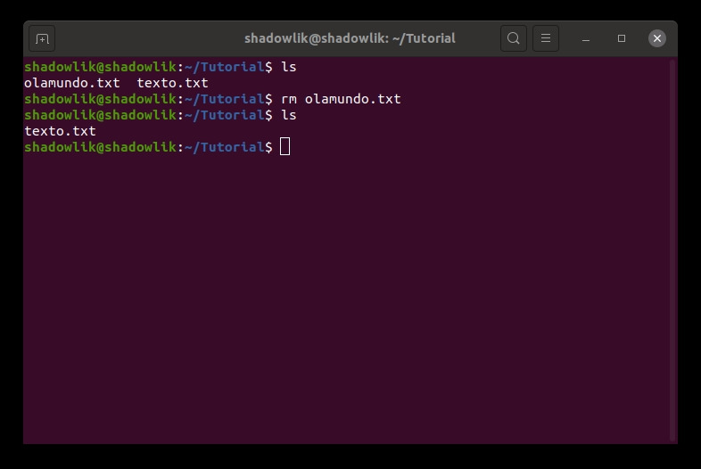
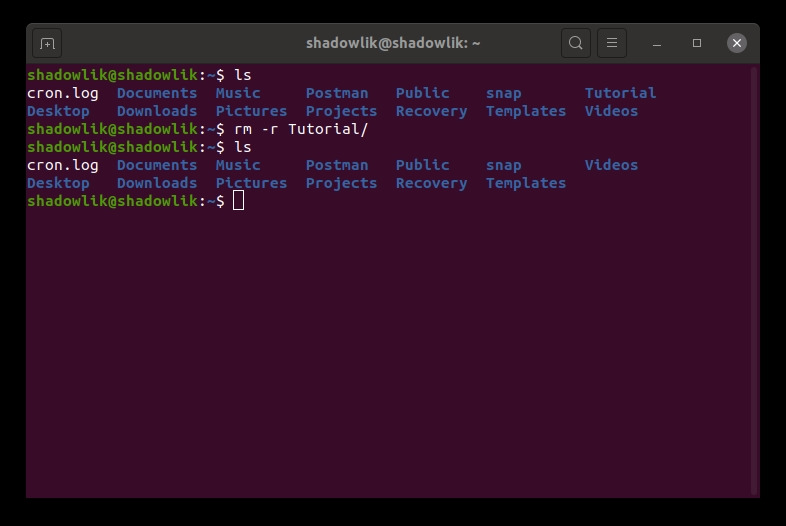
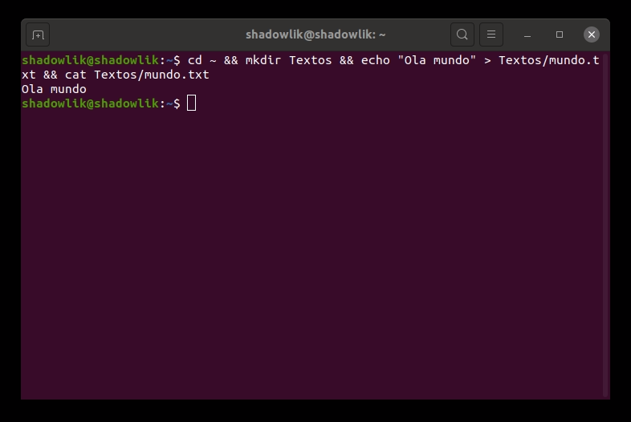
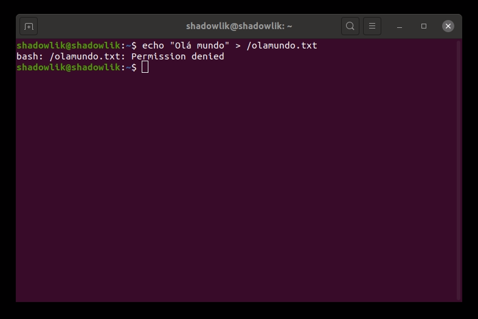
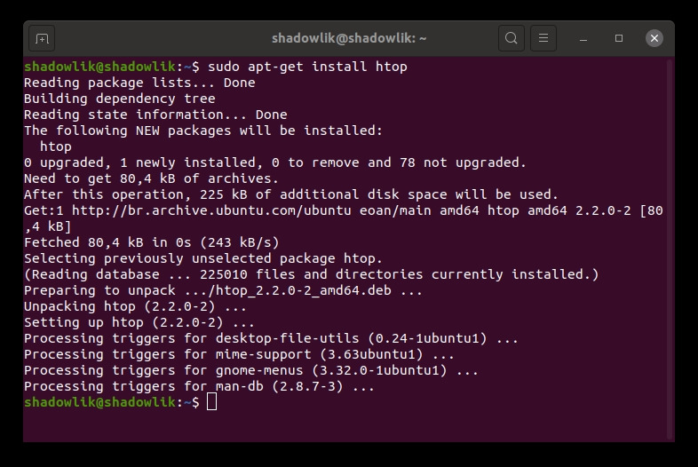
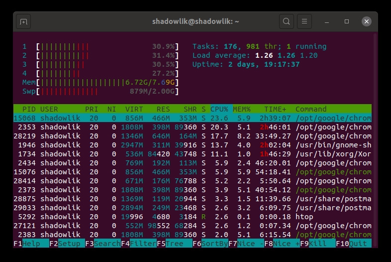

O terminal no linux é uma ferramenta muita poderosa e pode facilitar muito sua vida. Você não precisa ter medo dele, o terminal não é feito só para os hackers de filmes usarem, você também pode e deve!

## Terminal; Console; Shell; Prompt;

A linha de comando do Linux é uma interface de texto, todos os comandos são inseridos no formato de texto. Possuí diversos nomes, podendo ser habitualmente chamado de *shell*, *terminal*, *console* ou *prompt*.

## O que você irá aprender

1.  Uma breve história da linha de comando
2.  Como acessar seu Terminal
3.  Como manipular pastas e arquivos (Comandos Básicos)
4.  Outros comandos úteis
5.  Encadeamento de comandos
6.  Comandos com privilégio

## O que você irá precisar

Nesse tutorial usaremos exemplos usando o sistema operacional [Ubuntu](https://ubuntu.com/), mas todas as distribuições linux possuem linha de comando e podem ser utilizadas, alguns comandos talvez precisem ser adaptados.

## Breve história da linha de comando

Durante os primeiros anos da ,até então, nova indústria de computadores, um dos primeiros sistemas operacionais criados foi o Unix. Ele foi projetado para funcionar como um sistema multiusuário em computadores mainframe (computadores de grande porte computacional - para a época), e os usuários são conectados remotamente por meio de terminais individuais. Esses terminais eram bastante básicos se compararmos com o que conhecemos hoje: apenas um teclado e uma tela, sem cor e sem poder para executar programas localmente. Seu uso era restrito em apenas enviar comandos por teclas para o servidor e exibiam os dados recebidos.

Comparado as interfaces gráficas, o texto é muito leve, portanto, mais performáticos, exigindo menos recursos computacionais. Mesmo em máquinas da década de 1970, executando centenas de terminais em conexões de rede épicamente lentas (se comparado com os padrões atuais), os usuários ainda eram capazes de interagir com os programas de maneira rápida e eficiente. Os comandos também foram otimizados para reduzir ao máximo o número de o necessário para se digitar, acelerando ainda mais o uso do terminal por seus usuarios. A velocidade e eficiência são uma das razões pelas quais a linha de comando ainda é amplamente usada atualmente e a preferência por muitos desenvolvedores.

Ao conectar em um mainframe Unix por meio de um terminal, os usuários conseguiam executar praticamente tudo o que executamos hoje com as interfaces gráficas. Seja criando arquivos, renomeando, movendo, os usuários nos anos 70 só podiam fazer tudo isso através de uma interface de texto. Se você ficou com dó, não se engane, quem domina a linha de comando acha muito mais trabalhoso e as vezes complicado realizar tarefas básicas usando telas e mouse, e esperamos que ao final desse tutorial você entenda o por quê.

O programa original do shell Unix era inicialmente chamado sh, mas foi aprimorado e substituído ao longo dos anos, portanto, em um sistema Linux atual, é provável que você esteja usando um *shell* chamado *bash*, mas não vamos nos preocupar com isso agora.

Em resumo, o Linux é descendente do Unix, a sua base foi projetada para se comportar de maneira semelhante.

## Acessando seu Terminal

Existem duas maneiras de acessar seu terminal no Ubuntu: Digitando *Terminal* no campo de busca de aplicativos ou pelo atalho de teclado `ctrl + alt + t`.

Busca de Aplicativos

Uma janela parecida com a abaixo aparecerá:

Linha de Comando - Terminal

Vamos começar com alguns conceitos básicos do terminal, primeiro precisamos entender o que significa os textos que já aparecem na tela.

Entendendo o Terminal

Em nossa esquerda, para todos os comandos que forem executados, notaremos as seguintes informações:

usuario@computador:local$

-   **usuario**: Identifica com qual usuário estamos navegando e usando o nosso terminal.
-   **computador**: Identifica a qual computador estamos conectados, nesse tutorial vamos utilizar o nosso computador local, mas esse é uma informação importante quando estamos conectados a terminais remotos.
-   **local**: Identifica em qual pasta o terminal está navegando, inicialmente seu terminal por padrão deverá abrir com a informação **~**, isso significa que você está na pasta raiz do usuário, falaremos disso mais pra frente.
-   **$**: Identifica o nível de privilégio, **$** significa que você está executando os comandos como usuário sem privilégios maiores, e **#** significa que você está executando como usuário com privilégios, chamamos isso de *root*.

Vamos agora experimentar o nosso primeiro comando, o `pwd`, do inglês  '**p**rint **w**orking **d**irectory', ele exibirá o caminho completo para qual pasta estamos referenciado ao executar os comandos, digite o comando em seu terminal e pressione *enter*.

Usando o comando pwd

Temos então o resultado *`/home/shadowlik`*, esse é o caminho da pasta raiz de nosso usuário, por convenção sempre que você estiver navegando nessa pasta ou em pastas filhas a ela, você não verá o caminho completo, o caminho da sua pasta raiz é substituto por **`~`**.

Diferente do Windows, onde convencionalmente a raiz de todos os programas fica localizado no `c://`, no Linux a raiz de todas as pastas, incluindo outros discos como pendrivers, é `/`.

***Continuamos o tutorial na próxima página desse artigo***:

## Navegando pelas pastas com o Terminal

Agora vamos navegar para a raiz de nosso computador e voltar para a nossa pasta raiz do usuário, para isso usaremos o comando **cd**, do inglês '**c**hange **d**irectory', para mudar de basta. Digite o comando `cd /` e pressione enter.

Usando o comando cd

Podemos observar que conseguimos navegar para **/**, note que na última linha já podemos ver o **/** depois dos dois pontos. Agora vamos listar todas as pastas que temos nesse diretório com o comando `ls`. Digite ls e pressione enter.

Usando o comando ls

A convenção de pastas pode variar por distribuição linux, estamos interessados na pasta `/home`, queremos navegar até ela, para isso vamos repetir os passos anteriores, agora executando o comando `cd home` e em seguida `ls` para listar o conteúdo da pasta.

Navegando para a pasta raíz

Aqui notamos que existe apenas uma pasta dentro da pasta /home, isso porque existe apenas um usuário criado em meu computador, se você tiver mais de um usuário, as pastas raízes deles estarão ai. Repita novamente a sequência de comandos, `cd shadowlik` (no caso o nome da pasta de seu usuário) e `ls`.

Navegando para a pasta do usuário

Muito bem, aqui voltamos a esta inicial, como você pode ver estamos onde começamos quando o terminal abriu, na pasta raiz de nosso usuário (**~**).

Agora, se você deseja voltar uma pasta na navegação sem precisar digitar o caminho completo, podemos usar o `..`, quando digitamos `cd ..`, estamos querendo voltar uma pasta dentro de nossa navegação, eles podem ser encadeados também, por exemplo, o comando `cd ../..` volta duas pastas.

## Limpando o Terminal

Antes de seguir vamos aprender a limpar nosso terminal, como já executamos alguns comandos a nossa tela está um pouco poluída, para isso usaremos o comando `clear`. Digite e pressione enter para limpar todo o conteúdo do seu terminal.

## Criando pastas com o Terminal

Agora vamos aprender como criar uma pasta em nossa home (~), para isso usaremos o comando `mkdir`, do inglês '**m**a**k**e **dir**ectory (criar pasta)', vamos criar uma pasta chamada Tutorial, digite `mkdir Tutorial` e na sequência use o comando ls para validar se nosso diretório foi criado.

Criando a pasta Tutorial

## Criando arquivos com o Terminal

Agora vamos criar um arquivo de texto simples, vamos aprender dois modos de fazer isso, usando o comando `touch` e o comando `echo`.

Com o comando touch podemos criar um arquivo de texto vazio, para isso digite `touch texto.txt` e `ls` para verificar a criação.

Criando um arquivo com o comando Touch

Agora usaremos o comando echo para criar um arquivo de texto com conteúdo, para isso digite `echo "Olá mundo!" > texto2.txt`. Para validar o conteúdo desse arquivo usaremos o comando `cat`, ele retornará para nós todo o conteúdo dentro do arquivo, digite `cat texto2.txt`.

Criando um arquivo com o comando echo

## Movendo/Renomeando arquivos e pastas com o Terminal

No Linux não existe uma maneira de renomear arquivos, não entrarei em detalhes técnicos do porque, o que podemos fazer é mover esse arquivo com um novo nome e conseguiremos o comportamento semelhante desejado. Para isso usaremos o comando `mv`, do inglês '**m**o**v**e', digite `mv texto2.txt olamundo.txt` e use o comando `cat olamundo.txt` pra validar a execução.

Movendo arquivos

O primeiro argumento é a localização do arquivo e o segundo a localização final para mover o arquivo, essa localização pode ser referencial a pasta que estamos navegando ou completa, por exemplo, `mv /home/shadowlik/Tutorial/texto2.txt /home/shadowlik/olamundo.txt`, nesse comando estamos movendo o nosso arquivo da pasta Tutorial para a pasta shadowlik.

## Removendo arquivos com o Terminal

Agora que já aprendemos a criar pastas e arquivos, vamos aprender a deletar-los. Para deletar pastas vazias você pode usar o comando `rmdir`, do inglês '**r**e**m**ove **d**irectory', mas esse comando só é possível se a pasta estiver vazia. Já para remover arquivos e pastas com conteúdo, usamos o comando `rm`, para deletar arquivos é muito simples, use o comando `rm olamundo.txt` e `ls` para validar a execução.

Removendo arquivos

Agora vamos voltar para a nossa pasta raiz do usuário para remover a pasta Tutorial que criamos anteriormente, para isso digite `cd ..` para voltar uma pasta, e use o comando `rm -r` Tutorial, esse comando indica que queremos remover, forçadamente e recursivamente (-r), a pasta e qualquer conteúdo dentro.

Removendo pastas

### Muito cuidado com o comando RM

Tenha muito cuidado ao utilizar o comando rm, ele pode realizar operações irreversíveis, principalmente se executado com privilégios de administrador. Se por algum motivo você deletou um arquivo que não queria, não se preocupe, talvez eles [ainda possam ser recuperados](http://marquesfernandes.com/como-recuperar-arquivos-excluidos-no-linux-ubuntu-debian/).

## Encadeamento de comados

Até agora executamos um comando por vez, mas é possível encadear uma sequência de comandos. O terminal do linux aceita o uso de operadores, como os usados em linguagens de programação, nesse tutorial focaremos apenas no uso do operador `&&`, conhecido como *and* (e), ele nos permite encadear comandos. Da nossa pasta raiz do usuário usaremos o encadeamento para criar uma pasta; um arquivo de texto com conteúdo; exibir o conteúdo desse arquivo:

cd ~ && mkdir Textos && echo "Ola mundo" > Textos/mundo.txt && cat Textos/mundo.txt

Executando comandos encadeados

## Comandos com privilégio root

O Linux é baseado em privilégios e níveis de acesso, cada pasta e arquivo possuí sua própria tabela de qual usuário/grupo pode realizar o que, seja modificar, criar um arquivo naquela pasta ou remover algo. Todas as pastas cruciais do linux precisam de acesso root para realizar qualquer operação, isso é uma maneira de segurança, nesse tutorial vamos explicar por cima como realizar comandos com esses níveis de acesso, **mas tome muito cuidado, comandos errados podem acabar com o seu computador**.

### Como usar um comando como root

Podemos usar qualquer comando com privilégios de root, pra isso precisamos apenas digitar `sudo` no início de qualquer comando, a senha do usuário root será necessária, mas isso só é preciso uma vez por sessão de terminal.

Vamos fazer um teste para ver como as permissões funcionam na prática, vamos tentar criar um comando na raiz do nosso sistema, que por padrão requer privilégios root para qualquer operação de escrita, o resultado esperado é um erro de privilégio.

Executando comandos sem privilégios

### Instalando uma aplicação

A instalação de qualquer aplicação pelo gerenciador de pacotes do Ubuntu requer privilégios root, usaremos esse comando como exemplo. Vamos instalar um programinha simples, semelhante ao gerenciador de tarefas do Windows, o *htop*. Digite o comando `sudo apt-get install htop` e pressione enter, a senha será necessária.

Instalando aplicação htop

Por segurança no linux, quando você digite sua senha, nada aparece, nem mesmo os \*\*\*\*\*\*, por isso é importante que você digite sua senha com calma e pressione enter. Três tentativas erradas cancelarão o seu comando.

Instalando aplicação htop - parte 2

Se tudo ocorrer conforme o esperado, teremos instalado com sucesso o programa *htop*, agora você pode abrir o gerenciador de tarefas do linux, ver recursos como memória, processamento e serviços abertos com um simples comando, digite `htop` e pressione enter.

Usando a aplicação htop

## Conclusão

Espero que você tenha conseguido aprender alguns comandos básicos e perder o medo da linha de comando. As aplicações do terminal são infinitas e poderosas, quanto mais você treinar e aprender novos comandos, mais otimizado será seu dia a dia no Linux. Se você ficou com alguma dúvida ou gostaria de saber algo sobre comandos mais avançados, deixe nos comentários!
