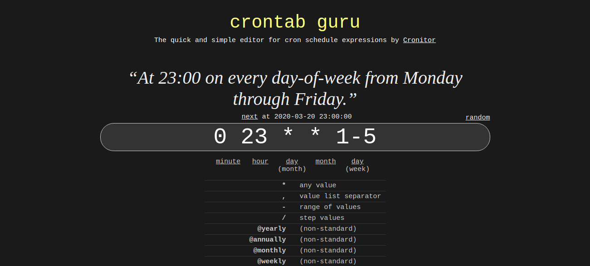
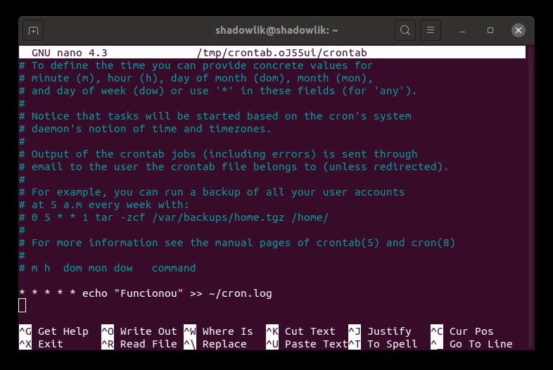
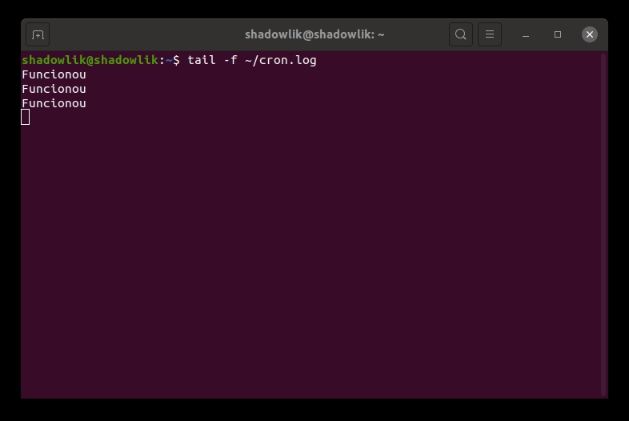

O daemon cron, ou Crontab, no Linux executa tarefas em segundo plano em horários específicos programados, é o equialente ao Agendador de tarefas (Task Scheduler) do Windows. Você basicamente pode executar qualquer comando do terminal com esse agendador.

Uma tarefa muito comum realizada com o Crontab é para automatizar backups, manutenção do sistema e outras tarefas repetitivas. A sintaxe é poderosa e flexível, para que você possa executar uma tarefa a cada quinze minutos ou em um minuto específico em um dia específico a cada ano.

## Significado de Crontab

Não há uma explicação conclusiva, mas a resposta mais aceita é de Ken Thompson (autor do unix cron): O nome *cron* vem de *chron*, o prefixo grego para '*tempo*'. E tab referencia tabela, uma tabela contendo crons: Timetable (Tabela de Tempo).

## Sintaxe da Crontab

A sintaxe cron consiste em um grupo de 5 variáveis separadas por espaço: `* * * * *`. Cada grupo pode conter um ou mais números, separados por vírgula para valores unitários ou por um traço simples identificando uma faixa de intervalo, e por último o comando a ser executado. Veja abaixo alguns exemplos de sintaxes de agendamento:

| min | hora | dia do mês | mês | dia da semana | descrição |
| --- | --- | --- | --- | --- | --- |
| \* | \* | \* | \* | \* | Executa a cada minutos |
| 0 | 2 | 1,2,3 | \* | \* | Executa às 2hs todos os dias 1, 2 e 3 de cada mês |
| 0 | 23 | \* | \* | 1-5 | Executa às 23hs de segunda a sexta |
| 0 | 0 | 25 | 12 | \* | Executa às 00hs do Natal |

## [Crontab.guru](https://crontab.guru/)

Um site que eu uso bastante para validar minhas crons: [Crontab.guru](https://crontab.guru/). Nesse site você consegue visualmente ver como sua cron cai se comportar, é muito importante ter cuidado ao criar crons complexas pois isso pode levar a resultados catastróficos se configurado errado!

## Criando um agendamento na Crontab

Vamos ao que interessa, vamos aprender a criar um agendamento. Como exemplo vamos criar uma cron que executa a cada minuto e escreve uma mensagem de log em um arquivo. A primeira coisa que devemos fazer é executar o seguinte comando:

$ crontab -e

Se essa for a sua primeira vez executando o comando, você precisará informar qual editor de texto deseja usar:

Escolha o editor padrão para sua Crontab

Eu gosto do editor nano, por isso selecionei a opção 1. Em seguida você um arquivo de texto com alguns comentários explicando como utilizar, podemos seguir para o final do arquivo, onde vamos criar o nosso agendamento.

Comentários do arquivo Crontab

Vamos adicionar a seguinte linha no final do arquivo:

\* \* \* \* echo "Funcionou" >> ~/cron.log

Basicamente esse agendamento vai rodar a cada minuto adicionando uma linha no arquivo cron.log localizado na nossa pasta home. Para salvar a sua cron use o atalho Ctrl + O para salvar e fechar o arquivo, agora o seu agendamento já está vigente! Para verificar se ela está funcionando corretamente vamos usar o seguinte comando:

$ tail -f ~/cron.log

Se tudo ocorrer igual o esperado, após alguns minutos você verá algumas linhas com o nosso texto: "Funcionou". Esse exemplo é bem simples, você pode executar qualquer comando aceito no terminal via Crontab.
