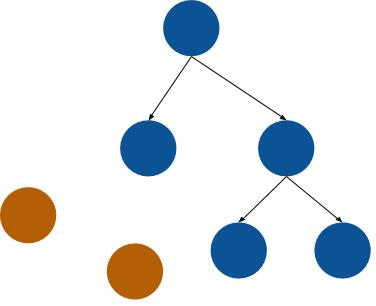
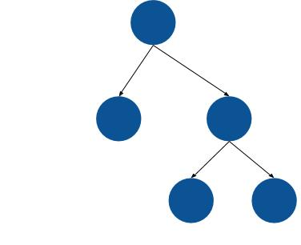

A medida que desarrollamos aplicaciones más complejas, la necesidad de entender cómo funciona nuestro lenguaje bajo las cubiertas en ciertos aspectos se hace necesaria. El [NodeJS](http://marquesfernandes.com/afinal-o-que-e-nodejs/), más específicamente el motor v8 que es el motor que ejecuta nuestras aplicaciones tiene algunas limitaciones, no voy a entrar en detalle de todas ellas, nos centraremos sólo en uno: El *límite de memoria*. De forma predeterminada, el límite máximo de memoria asignada es de alrededor de 700 MB y 1400 MB, para sistemas de 32 bits y 64 bits respectivamente, y esto puede convertirse en un cuello de botella para algunas aplicaciones y, por lo tanto, es importante comprender cómo se asigna y desasigna esta memoria.

## Gestión de la memoria

La administración de memoria consta de formas de asignar memoria dinámicamente cuando se solicita y libre cuando esa memoria ya no es necesaria, lo que libera espacio para que esa memoria se reutilice.

Hay dos maneras de administración de memoria:

-   **Manual:** Consiste en delegar esta responsabilidad para desarrollarla por sí misma, es responsable de asignar y desasignar memoria en el desarrollo de su aplicación.
-   **Automático:** Consiste en el uso de un "programa" nativo, generalmente llamado *recolector de basura*, que se encarga de hacer todo este proceso y tratar de evitar pérdidas de memoria.

## Coletor de Lixo - Recolector de Basura

El concepto de "recolección de basura" es una forma de administrar la memoria de la aplicación automáticamente. El trabajo del recolector de elementos no utilizados (GC) es recuperar la memoria ocupada por objetos no utilizados (basura). Fue concebido y utilizado por primera vez en [LISP](https://pt.wikipedia.org/wiki/Lisp) en 1959, inventado por John McCarthy.

La forma en que el GC sabe que los objetos ya no están en uso es que ningún otro objeto tiene referencias a ellos.

### Memoria antes de que el colector funcione

Analizando el diagrama siguiente, dará una visión general de cómo se ve la memoria cuando se hace referencia a los objetos en él (están "vivos") y cuando ya no tiene referencia (son "basura").

### Memoria después de las obras del colector

Después de que el recopilador funciona, las memorias inalcanzables se eliminan liberando espacio de memoria.

El intervalo de longitud que ejecuta el recopilador varía según la aplicación, mantiene una metodología inteligente para saber con qué frecuencia necesita borrar la memoria. Tiene un

### Ventajas del recolector de basura

-   Evita errores de referencias perdidas y pendientes.
-   No intentará liberar espacio que ya se liberó, ahorrando procesamiento.
-   Evitará algunos tipos de fugas de memoria.

Obviamente, el uso de un recolector de elementos no utilizados no resuelve todos los problemas y no es una solución mágica para la administración de memoria. Algunas cosas que tenemos que tener en cuenta, es que todavía tiene que preocuparse por las fugas de memoria, si el código crece el uso de memoria exponencialmente sin razón, esta es una señal de pérdida que puede conducir a la lentitud e incluso accidente de la aplicación. Otro punto a tener en cuenta y que su funcionamiento automático puede no cumplir con las expectativas de todas las aplicaciones, pueden ser necesarios ajustes.

## Comprender el "montón"

El montón es la estructura de memoria utilizada por NodeJS para almacenar objetos, texto y cierres. Aquí es donde sucede toda la magia.

Pero el montón va mucho más allá de eso: un proceso NodeJS en ejecución almacena toda su memoria dentro de un conjunto residente. Se puede pensar en ella como una caja grande que contiene algunas cajas más.

El conjunto residente también contiene el código Javascript real (que se ejecuta dentro del segmento de código) y la pila, donde residen todas las variables.

## ¿Cómo organiza V8 la pila?

El motor NodeJS V8 divide el montón en varios espacios diferentes para una gestión eficaz de la memoria:

-   **Nuevo espacio:** la mayoría de los objetos se asignan aquí. El nuevo espacio es pequeño y está diseñado para ser recogido rápidamente.
-   **Espacio de puntero antiguo:** contiene la mayoría de los objetos que pueden tener punteros a otros objetos. La mayoría de los objetos se mueven aquí después de sobrevivir en el nuevo espacio después de un cierto tiempo.
-   **Espacio de datos antiguo:** contiene objetos que contienen solo datos muertos (sin punteros a otros objetos). Las cadenas, los números y las matrices se mueven aquí después de sobrevivir en un nuevo espacio durante un tiempo.
-   **Espacio de objetos grandes:** contiene objetos que son mayores que los límites de tamaño de otros espacios. Cada objeto obtiene su propia región de memoria de mmap. El recolector de elementos no utilizados nunca mueve los objetos grandes.
-   **Espacio de código:** los objetos de código, que contienen instrucciones JIT, se asignan aquí. Este es el único espacio con memoria ejecutable (su código está aquí)
-   **Espacio de celda, espacio de celda de propiedad y espacio de mapa:** contiene celdas, PropertyCells y Maps, respectivamente. Cada espacio contiene objetos que tienen el mismo tamaño y están restringidos en punteros, lo que simplifica la colección.

## Operación más detallada

Básicamente, el recolector de elementos no utilizados tiene los modos de operación.

### Colección Corta - Breve GC

Como vimos anteriormente el V8 divide el montón en dos generaciones. Los objetos se asignan en el nuevo espacio, que es bastante pequeño (entre 1 y 8 MB). La asignación en un nuevo espacio es muy barata: solo tenemos un puntero de asignación que incrementamos cada vez que queremos reservar espacio para un nuevo objeto. Cuando el puntero de asignación llega al final del nuevo espacio, se desencadena una eliminación (ciclo de recolección de elementos no utilizados más pequeño), que elimina rápidamente los objetos muertos del nuevo espacio.

### Colección completa - GC completo

Los objetos que han sobrevivido a dos ciclos de pequeñas recolecciones de elementos no utilizados se promueven a "espacio antiguo". El espacio antiguo es la basura recogida en el GC completo (ciclo principal de recolección de elementos no utilizados), que es mucho menos frecuente. Un ciclo de GC completo se activa cuando se alcanza una cierta cantidad de memoria en el espacio antiguo.

Para recopilar espacio antiguo, que puede contener varios cientos de megabytes de datos, utilizamos dos algoritmos estrechamente relacionados, [Mark-sweep](https://www.geeksforgeeks.org/mark-and-sweep-garbage-collection-algorithm/) y [Mark-compact](https://en.wikipedia.org/wiki/Mark-compact_algorithm).

## Forzar al recolector de basura

Aunque el recolector de elementos no utilizados NodeJS se ha mejorado, y mucho, en los últimos tiempos, puede tener sentido para usted forzar la recolección de elementos no utilizados en algunos casos. Pero recuerde, hay un costo de procesamiento completo para esto.

Ejecutar en modo normal esto no es posible, Node no nos permite asignar o desasignar memorias o tener acceso al recolector de elementos no utilizados, si queremos tener acceso a la función que llama al receptor, necesitamos ejecutar nuestra aplicación con la siguiente opción:

$ node --expose-gc index.js

Al iniciar el programa con esta opción, tendrá acceso a la función:

global.gc();

Para hacerlo más seguro, puede utilizar:

function forceGC()
   if (global.gc) {
      global.gc();
   } else {
      console.warn('GC no habilitado! Ejecute el programa con \`node --expose-gc index.js\`.');
   }
}
