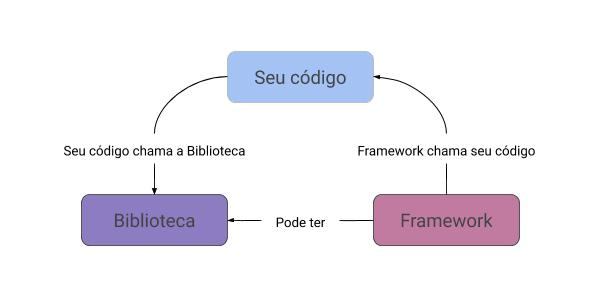

Ever wonder what the difference is between a Framework, Library and Toolkit? There are many definitions and this can confuse anyone. Although there is not 100% consensus between the limits of definitions for each, we can try to frame and generalize so that beginners can at least understand what it means when a tutorial or course uses each term.

## framework

A framework is a generic framework that provides a standard architecture, a skeleton with which we can develop specific software. This abstraction allows common design patterns to be easily reused, while still allowing business rule details to be left to developers. Reusing common design patterns means having the overall framework to solve similar types of problems. For example, React provides the functionality and framework for programming complex web pages by creating a standard architecture and set of features that enable consistent design creation. Another example is the famous Model-View-Controller (MVC) Frameworks, which separate in very abstract terms the three main parts of a web application. These structures can manifest themselves as functions, classes, and even folder organization that necessarily need to be implemented, such as the render() method in React, which is the method required for rendering any component.

## Library

A library refers to code that provides standard functions that can be run within your own code to handle common tasks. For example, a math library will provide functionality for common math calculations such as trigonometric or logarithmic functions. Programming languages usually have libraries for all kinds of tasks like data processing, text analysis, database connection, etc. Once included, libraries save you the trouble of writing all these functions.

## Toolkit

Toolkit is an underused and somewhat ambiguous definition, what we can conclude is that it refers to any collection of "tools" (another loose term) that have a common purpose. *You will hardly see the term being used today.*

## What's the difference?

Okay, we described above what each one is, but what is their difference in practice?

The most important difference, and indeed the defining difference between a library and a structure is the [Inversion of Control](https://pt.wikipedia.org/wiki/Invers%C3%A3o_de_controle) .

Okay, but what does this mean? Well, that means when you call a library, you're in the control, but in a Framework, the control is flipped: The Framework calls you. *Also called the Hollywood Principle: Don't Call Us, We'll Call You.* I drew a sketch to try to better illustrate this difference:

So we can conclude that basically, all the control flow is already in the Framework and there are just some predefined blank "screens" that you can fill with your code and with your project's business rule, already a library, on the other hand, it's "just" a collection of functionality that you can call.

Of course, this interpretation is not the only one that exists and many people may disagree with the definition presented, if you have any better idea of how to define or exemplify, please contribute to the community and leave your comment!
