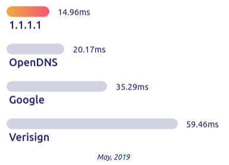

Some of the best DNS servers are actually also the backbone of the Internet: They allow information available across the internet to reach your IP address and your web browser. However, some DNS servers are better than others, depending on your preferences.

There are some very fast commercial DNS that usually come with your ISP's package, there are also servers with other features like anonymous DNS, which help protect your information when browsing the internet.

## After all, what is DNS?

The Domain Name System (DNS) is like an Internet phone book. We access information online through domain names such as google.com or uol.com.br. Browsers interact via Internet Protocol (IP) addresses, so DNS basically converts domain names into IP addresses so that browsers can load resources from the Internet.

When we change the DNS server that our network uses, we are basically choosing which phone book we want to look at.

## Why should I change my DNS?

As explained above, DNS is essential for all activities on the Internet, so if the DNS servers provided by your ISP are slow or not properly configured to improve browsing speed, they can end up reducing response time and , hence your browsing speed. This is very noticeable when you load a page that loads content from several other different domains, sites with lots of advertisements, or third-party content. Changing and choosing an optimized DNS server can speed up your browsing, whether at home or at work.

Some companies offer DNS services with business add-ons, for example they can filter out malicious websites at the DNS level so these pages never reach an employee's browser.

The DNS server caches frequent requests so it can respond quickly without having to look up these requests from scratch.

Another point to choose your DNS that has become a frequent concern is the **anonymity** . Unless you are connected via a VPN (Virtual Private Network), your ISP's DNS servers have access to all your requested domains. Your ISP knows exactly where you are surfing the internet and probably doesn't care, but it could end up using that information. For example, some providers have found a way to monetize their DNS service: When you hit a domain that doesn't exist, they redirect the request to a preloaded search and advertising page, typically domain sales pages.

## Best DNS to use in 2020

## 1\. cloudflare

-   **DNS** **primary:** *1.1.1.1*
-   **Secondary DNS:** *1.0.0.1*

I put the [cloudflare](https://1.1.1.1/) first on the list because it's the DNS I use and recommend. Cloudflare is a highly regarded infrastructure company and today provides services to millions of websites around the world. They created their public DNS solution called WARP, and according to the company's own benchmarks, its speed surpasses those of its competitors. In addition to focusing on performance, WARP encrypts your entire connection to your server, in order to preserve your anonymity and possible scams on the internet.

## two. Google

-   **DNS** **primary:** *8.8.8.8*
-   **Secondary DNS:** *8.8.4.4*

THE [Google public DNS](https://developers.google.com/speed/public-dns/) it is probably the best known and most used DNS server in the world, they have high availability and speed, even more so if we consider the number of users who use the service. My only caveat is for data control, Google stores all the information that passes through its servers and may possibly use this for other purposes.

## 3\. OpenDNS

-   **DNS** **primary:** *208.67,222,222*
-   **Secondary DNS:** *208.67.220.220*

THE [OpenDNS](https://signup.opendns.com/homefree/) is another well-established server on the market, a great alternative to popular DNS. It even offers child protection services that block inappropriate content.

## 4\. Quad9

-   **DNS** **primary:** *9.9.9.9*
-   **Secondary DNS:** *149,112.112,112*

THE [Quad9](https://www.quad9.net/) tends to focus on its ability to block malicious domains, supposedly collecting information from various sources, public and private. Its effectiveness is not known for sure, but it is a good option in terms of quality and speed.

## 5\. Verisign

-   **DNS** **primary:** *64.6.64.6*
-   **Secondary DNS:** *64.6.65.6*

The DNS service of [Verisign](https://www.verisign.com/en_US/security-services/public-dns/index.xhtml) it's free and the company highlights the three features they consider most important: *stability* , *safety* and *privacy* . The service definitely serves this account, especially if you are looking for a secure and stable DNS server, regarding anonymity the company guarantees that your data will never be used or sold to third parties, and until then, no problem is known about this.

Probably due to its layers of security, its performance ends up being inferior to that of its competitors, which may not be as impactful if your main objective is security.

## Conclusion

There are several DNS services available out there, part of the search must take into account speed and stability, while on the security and anonymity side it is up to you to decide how much you trust the company that is providing the service, unfortunately it is difficult to create a benchmark for that. You can get metrics and ranking of DNS services around the world by going to the website: [https://www.dnsperf.com/](https://www.dnsperf.com/)
