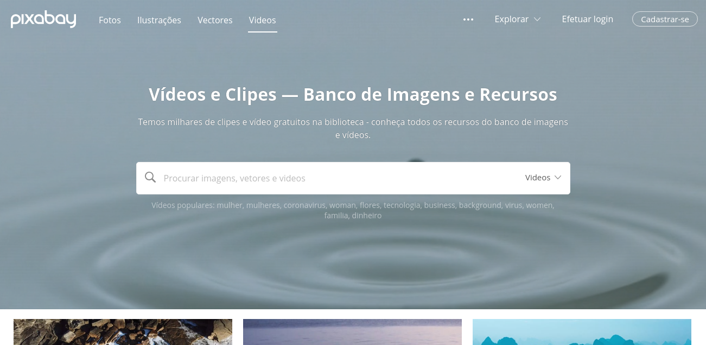
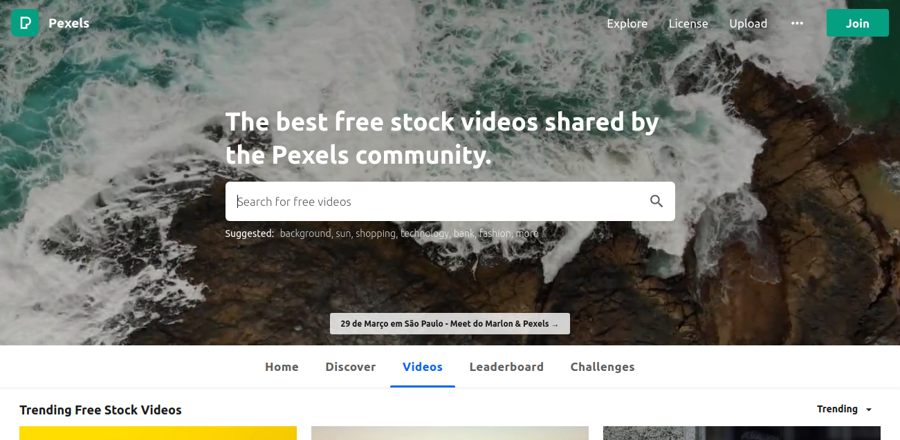
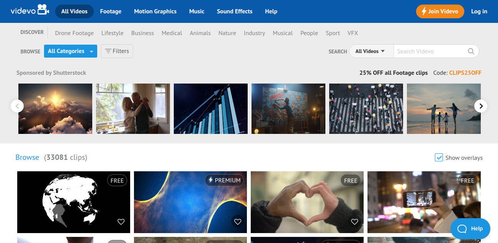
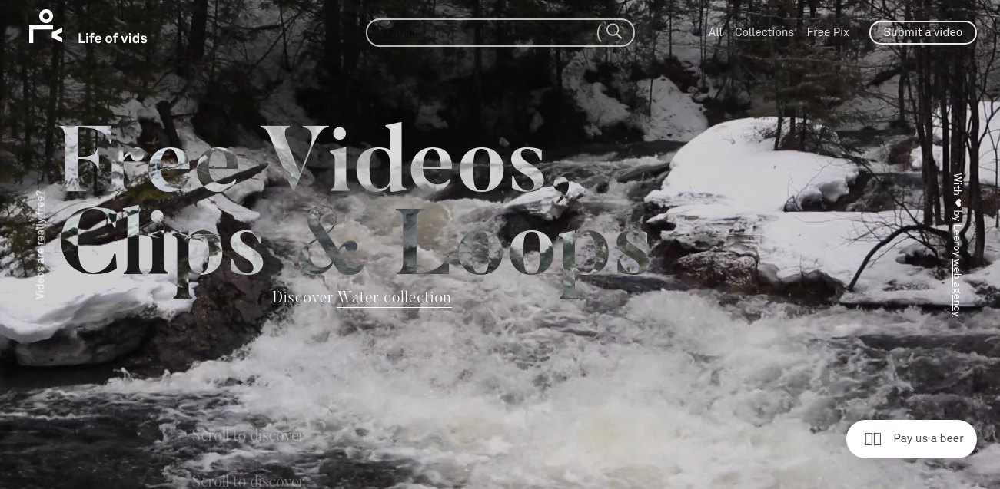
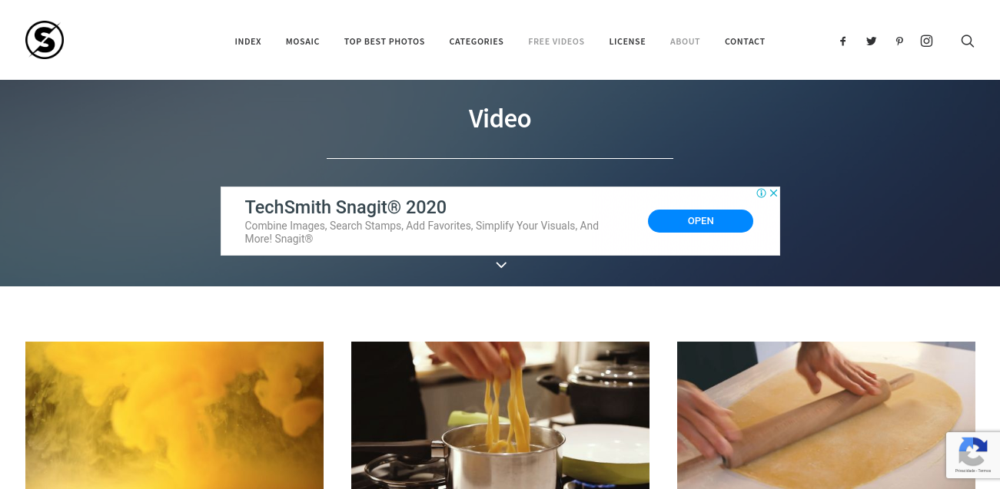

After the success of the article about [free image bank](http://marquesfernandes.com/top-8-sites-gratuitos-com-imagens-em-alta-resolucao-2020/) , I decided to make one about video bank sites! We often need a video for an action on the social network or even to give that special touch to the design of a website, but finding quality free videos that have everything we need is not an easy job... Luckily, we have several websites to help with this mission.  
I've picked out the top 5 sites I use when I need to find that perfect high quality video:

## 1. [pixabay](https://pixabay.com/)

[pixabay](https://pixabay.com/)

Pixabay offers over 1.2 million images and videos, all released under the Creative Commons Zero (CC0) license. This means that you do not need to get permission or give credit to the artist to use or modify the content, even if you are using it for commercial purposes (but it is always legal and a best practice to give credit to the owner).

## two. [pexels](https://videos.pexels.com/)

[pexels](https://videos.pexels.com/)

Pexels started out as a free photo site, but has since added a large library of free HD videos. And true to its name, every video on Pexels has enough pixels to look great on any screen.

Their collection is also under CC0 license, so you can edit and use the videos for personal or commercial purposes without asking permission or linking to the original source. Use the popular search list to find the most requested stock videos.

## 3. [videvo](https://www.videvo.net/)

[videvo](https://www.videvo.net/)

Videvo offers free videos as well as moving graphics created by its user community. The clips you download from Videvo will be licensed in two ways: via the Videvo Standard License or the Creative Commons 3.0 license.

Videos under the Videvo Standard License can be downloaded free of charge for use in any project, the only restriction being that you do not make the clips available for download anywhere else.

Creative Commons 3.0 licensees can be used on any project, but credit must be given to the original creator. You can find licensing information on each clip's download page.

## 4. [Life of Vids](http://www.lifeofvids.com/)

[Life of Vids](http://www.lifeofvids.com/)

Life of Vids is a collection of free videos, clips and loops from [leeroy](https://www.leeroy.ca/en) , an advertising agency from Canada. There are no copyright restrictions, but redistribution on other sites is limited to 10 videos.

## 5. [splitshire](https://www.splitshire.com/category/video-2/)

[splitshire](https://www.splitshire.com/category/video-2/)

Splitshire was created by web designer Daniel Nanescu, he wanted to give away his photos and videos for free for personal and commercial use.

The videos are basically images of drones in beautiful outdoor scenes, and you can download them by clicking on the title below each video. You can use them for free across all of your social media channels, but you cannot sell them or use them in projects with **inappropriate content such as violence, racism or discrimination.**
