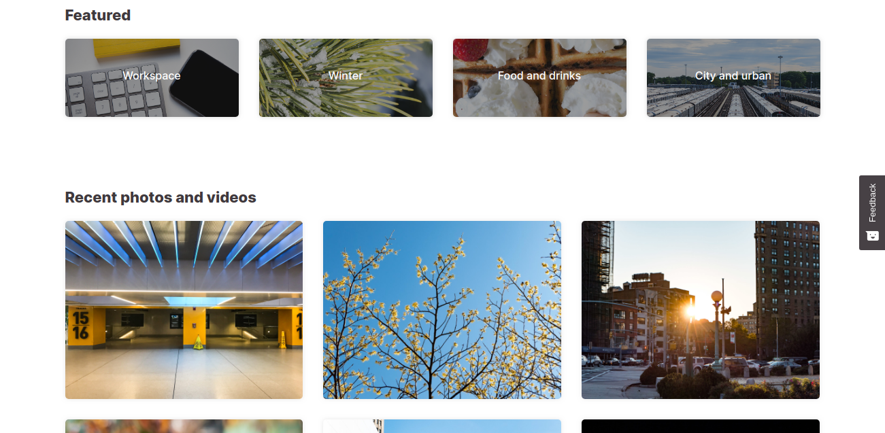
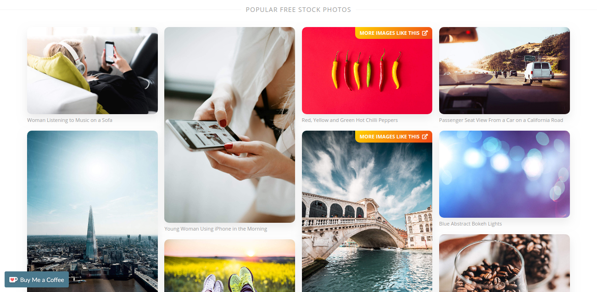
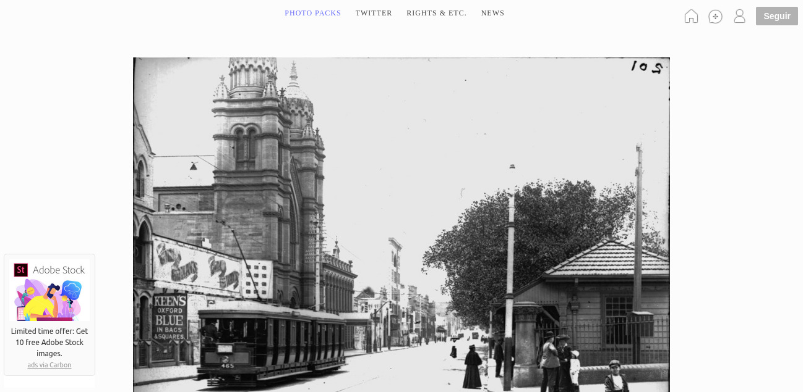

If you ~has~ the habit of picking up images from Google, unconcerned about copyright or any image risk, I have terrible news: I recently went through a situation where a company [specializing in image copyright](https://picrights.com/) contacted me regarding a picture of one of their customers, in addition to the withdrawal notification, to my surprise attached was a bank slip with a "fine" to avoid any lawsuit.

The worst thing is they are more than right, there is a job behind good photos and we shouldn't misuse these images, but as a good internet servant, where everything seems free, I never stopped to think how wrong I was. was being. So, if you have a blog or manage a corporate or personal website, stay tuned! Even with low hits you are in the crosshairs of these companies, the evolution of bots and image recognition techniques have brought into sight all sites, small or large.

So, to prevent you from having the same headache, I've put together a list of the best **free sites** in **high resolution images** that you can use with peace of mind. Even on these sites, it is worth remembering that it is important for you to analyze the image's license model, some may not allow commercial use or alterations for example.

In the past there was a certain prejudice with the use of the famous **[stock photos](https://support.99designs.com/hc/pt/articles/115004164106-O-que-%C3%A9-Stock-Image-ou-Banco-de-Imagens-)** (image bank), with forced images and clearly gringo models, greatly limited the use of images in our daily lives. Fortunately, several new sites are emerging, with high resolution images and a wide range of categories. Check out a list of the top 8 below. **free sites** with images in **high resolution** to get your perfect image:

## [1\. Freepik](https://br.freepik.com/)

[Freepik](https://br.freepik.com/)

Freepik tops the list for its versatility, I use it a lot in everyday life both to look for high quality images, icons (and more icons, they have a huge collection of icons) and also PSD templates for you to create showcases!

## [two. pexels](https://www.pexels.com/)

[pexels](https://www.pexels.com/)

Pexels provides high quality and completely free photos, licensed under the Creative Commons Zero (CC0) license. All photos are well categorized and their search works wonderfully making it very easy to find the perfect picture.

## [3\. unsplash](http://unsplash.com/)

[unsplash](http://unsplash.com/)

Unsplash offers a large collection of free high resolution photos and has become one of the best image sources available today. On your homepage you will find the best uploaded images specially selected by the Unsplash team. All photos are released for free under the Unsplash license.

## [4\. pixabay](https://pixabay.com/)

[pixabay](https://pixabay.com/)

Pixabay offers a large collection of free photos, vectors and art illustrations. All photos are published under Creative Commons CC0.

## [5\. Seal](https://focastock.com/)

[Seal](https://focastock.com/)

Foca is a collection of high resolution photos provided by Jeffrey Betts. Jeffrey specializes in photos of workspaces and nature. All photos are published under Creative Commons CC0.

## [6\. Picjumbo](http://picjumbo.com/)

[Picjumbo](http://picjumbo.com/)

Picjumbo is a collection of totally free photos for your commercial and personal work. New photos are added daily from a wide variety of categories, including abstract, fashion, nature, technology, and more.

## [7\. New Old Stock](http://nos.twnsnd.co/)

[New Old Stock](http://nos.twnsnd.co/)

If you're looking for that old photo for an article or even that work of yours at school about immigrants from the past decades, this site was made for you. A collection of vintage photos from the public archives and free from known copyright restrictions.

## [8\. ISO Republic](https://isorepublic.com/)

[ISO Republic](https://isorepublic.com/)

ISO Republic offers a wide variety of photos; they add new images every day for free under the CCO license.

## Conclusion

It gets easier and easier to find the perfect image, free of charge and without any copyright risk. If you know of any other sites that should be on this list, leave them in the comments!
