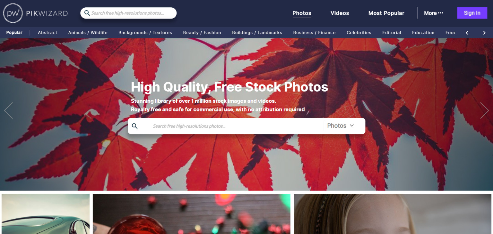

Se você ~tem~ o hábito de pegar imagens do Google, despreocupado com direitos autorais ou qualquer risco de imagem, tenho uma péssima notícia: Recentemente passei por uma situação onde uma empresa [especializada em direitos autorais de imagens](https://picrights.com/) entrou em contato comigo referente a uma imagem de um clientes deles, além da notificação para retirada, para minha surpresa em anexo estava um boleto bancário com uma "multa" para evitar qualquer processo na justiça.

O pior é que eles estão mais do que certos, existe um trabalho por trás de boas fotos e não devemos indevidamente usar essas imagens, mas como um bom criado da internet, onde tudo parece de graça, nunca havia parado para pensar o quanto errado eu estava sendo. Então, se você tem um blog ou administra algum site corporativo ou pessoal, fique ligado! Mesmo com baixos acessos você está na mira dessas empresas, a evolução dos bots e das técnicas de reconhecimento de imagem trouxeram na mira todos os sites, pequenos ou grandes.

Então, para evitar que você tenha a mesma dor de cabeça, separei uma lista com os melhores **sites gratuitos** de **imagens em alta resolução** que você pode usar tranquilamente. Mesmo nesse sites vale lembrar que é importante você analisar o modelo de licença da imagem, algumas podem não permitir o uso comercial ou alterações por exemplo.

Antigamente existia um certo preconceito com o uso das famosas **[stock photos](https://support.99designs.com/hc/pt/articles/115004164106-O-que-%C3%A9-Stock-Image-ou-Banco-de-Imagens-)** (banco de imagens), com imagens forçadas e modelos claramente gringos, limitava e muito o uso das imagens no nosso dia a dia. Felizmente diversos novos sites vem surgindo, com imagens em alta resolução e com uma ampla gama de categorias. Confira abaixo uma lista com os 8 melhores **sites gratuitos** com imagens em **alta resolução** para conseguir a sua imagem perfeita:

## [1\. Freepik](https://br.freepik.com/)

[Freepik](https://br.freepik.com/)

O Freepik entra no topo da lista por sua versatilidade, uso muito no dia a dia tanto para procurar imagens em alta qualidade, ícones (e mais ícones, eles tem uma coletânea gigantesca de ícones) e também modelos em PSD para você criar showcases!

## [2\. Pexels](https://www.pexels.com/)

[Pexels](https://www.pexels.com/)

A Pexels fornece fotos de alta qualidade e completamente gratuitas, licenciadas sob a licença Creative Commons Zero (CC0). Todas as fotos estão bem categorizadas e a sua busca funciona maravilhosamente o que torna muito fácil encontrar a imagem perfeita.

## [3\. Unsplash](http://unsplash.com/)

[Unsplash](http://unsplash.com/)

O Unsplash oferece uma grande coleção de fotos gratuitas de alta resolução e se tornou uma das melhores fontes de imagens disponíveis atualmente. Em sua página inicial você encontrará as melhores imagens enviadas especialmente selecionadas pela equipe do Unsplash. Todas as fotos são liberadas gratuitamente sob a licença Unsplash.

## [4\. Pixabay](https://pixabay.com/)

[Pixabay](https://pixabay.com/)

O Pixabay oferece uma grande coleção de fotos, vetores e ilustrações de arte gratuitas. Todas as fotos são divulgadas sob Creative Commons CC0.

## [5\. Foca](https://focastock.com/)

[Foca](https://focastock.com/)

O Foca é uma coleção de fotos de alta resolução fornecidas por Jeffrey Betts. Jeffrey é especialista em fotos de espaços de trabalho e da natureza. Todas as fotos são divulgadas sob Creative Commons CC0.

## [6\. Picjumbo](http://picjumbo.com/)

[Picjumbo](http://picjumbo.com/)

O Picjumbo é uma coleção de fotos totalmente gratuitas para seus trabalhos comerciais e pessoais. Novas fotos são adicionadas diariamente a partir de uma ampla variedade de categorias, incluindo resumo, moda, natureza, tecnologia e muito mais.

## [7\. New Old Stock](http://nos.twnsnd.co/)

[New Old Stock](http://nos.twnsnd.co/)

Se você está procurando aquela foto antiga pra algum artigo ou até mesmo para aquele seu trabalho da escola sobre imigrantes das décadas passadas, esse site foi feito para você. Uma coleção de fotos vintage dos arquivos públicos e livres de restrições conhecidas de direitos autorais.

## [8\. ISO Republic](https://isorepublic.com/)

[ISO Republic](https://isorepublic.com/)

A ISO Republic oferece uma ampla variedade de fotos; eles adicionam novas imagens todos os dias gratuitamente sob a licença CCO.

## 9\. [PIKWIZARD](https://pikwizard.com/)

[PIKWIZARD](https://pikwizard.com/)

Pikwizard foi uma alternativa interessante, eles entraram em contato por e-mail para apresentar o produto deles. Após uma boa análise, resolvi que eles definitivamente mereciam estar aqui na listagem. Conta com uma excelente seleção de fotos, interface intuitiva e também existe a possibilidade de editar a imagem diretamente no navegador, através do seu editor de imagem.

## Conclusão

Cada vez fica mais fácil conseguir encontrar a imagem perfeita, gratuitamente e sem correr qualquer risco com direitos autorais. Se você conhece algum outro site que deveria estar nessa lista, deixe nos comentários!
