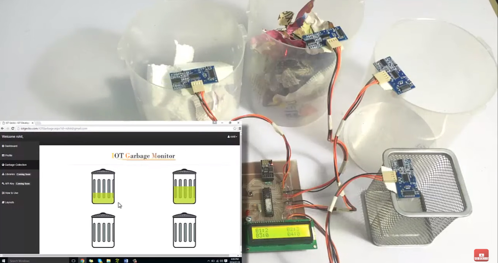
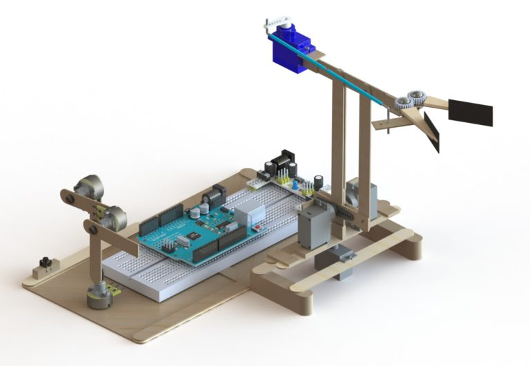

Cada vez mais a criação de projetos amadores de IoT (Internet of Things) vem se tornando viável, placas e peças mais baratas permitindo o amplo acesso e desenvolvimento de projetos comunitários. Separei uma lista com alguns projetos para inspirar seus projetos em 2020! Os tutoriais dos projetos estão em inglês, mas nada que a tradução do Google não de conta...

## 1\. Fechadura de Porta com Reconhecimento Facial - Raspberry PI

Usando um Raspberry Pi, uma camera e uma trava solenoide para criar uma fechadura que destrava quando reconhece seu rosto!

[Confira o projeto](https://maker.pro/raspberry-pi/projects/how-to-create-a-facial-recognition-door-lock-with-raspberry-pi)

## 2\. Monitor de Temperatura e Umidade - Arduíno

Um projeto básico para monitorar a temperatura e umidade de ambientes!

[Confira o projeto](https://www.electronicsforu.com/electronics-projects/humidity-temperature-monitoring-using-arduino-esp8266)

## 3\. Sistema de Irrigação Inteligente para seu Jardim - **Arduíno**

Esse projeto IoT propõe um sistema automatizado de irrigação que pode analisar a umidade do solo e as condições climáticas. Os usuários poderão verificar o nível de umidade e, com o limite predefinido para um nível de umidade do solo, a fonte de alimentação será cortada.

[Confira o projeto](https://www.electronicsforu.com/electronics-projects/humidity-temperature-monitoring-using-arduino-esp8266)

## 4\. Monitoramento de Nível da Lixeira - Arduíno

Esse projeto de IoT usa um sensor ultrassônico para detectar o nível de lixo em cada lixeira e enviar esses dados para o programa principal. Uma página no navegador mostra o nível de lixo em cada lixeira.

[Confira o projeto](https://nevonprojects.com/iot-garbage-monitoring-system/)

## 5\. Rastreador em Tempo Real - Arduíno

Que tal criar um rastreador GPS usando um Arduíno e visualizar os dados em dois painéis de IoT gratuitos?

[Confira o projeto](https://create.arduino.cc/projecthub/botletics/real-time-2g-3g-lte-arduino-gps-tracker-iot-dashboard-01d471?ref=tag&ref_id=tracking&offset=2)

## 6\. Espelho Inteligente - Raspberry PI

[Confira o projeto](https://www.youtube.com/watch?v=51dg2MsYHns&feature=emb_title)

## 7\. Braço Robótico - Arduino

Já pensou em criar um braço robótico com conceitos similares aos utilizados em indústrias, missões especiais e próteses biônicas? O engenheiro Flávio Babos explica detalhadamente em seu [blog](http://flaviobabos.com.br) o passo a passo de como replicar o projeto de seu braço robótico!

[CONFIRA O PROJETO](https://flaviobabos.com.br/braco-robotico-arduino/)

## Mais projetos

Existem diversos sites para procurar projetos IoT e se inspirar:

### Arduíno

-   [https://create.arduino.cc/projecthub](https://create.arduino.cc/projecthub)
-   [https://circuitdigest.com/arduino-projects](https://circuitdigest.com/arduino-projects)

### Raspberry PI

-   [https://projects.raspberrypi.org/en](https://projects.raspberrypi.org/en)
-   [https://www.hackster.io/raspberry-pi/projects](https://www.hackster.io/raspberry-pi/projects)

## Projetos Amadores

Para qualquer diversos tipos de projetos, eu recomendo procurar no site [https://www.instructables.com/](https://www.instructables.com/), nele você consegue inclusive compartilhar seus próprios projetos!
