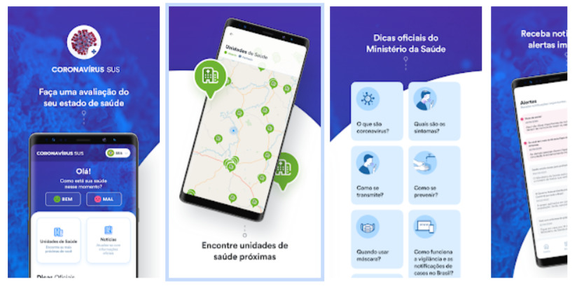
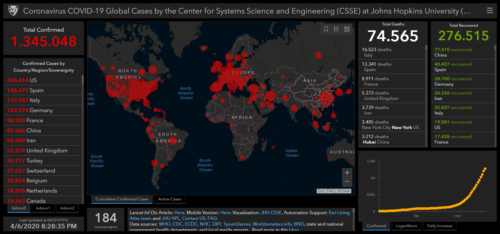
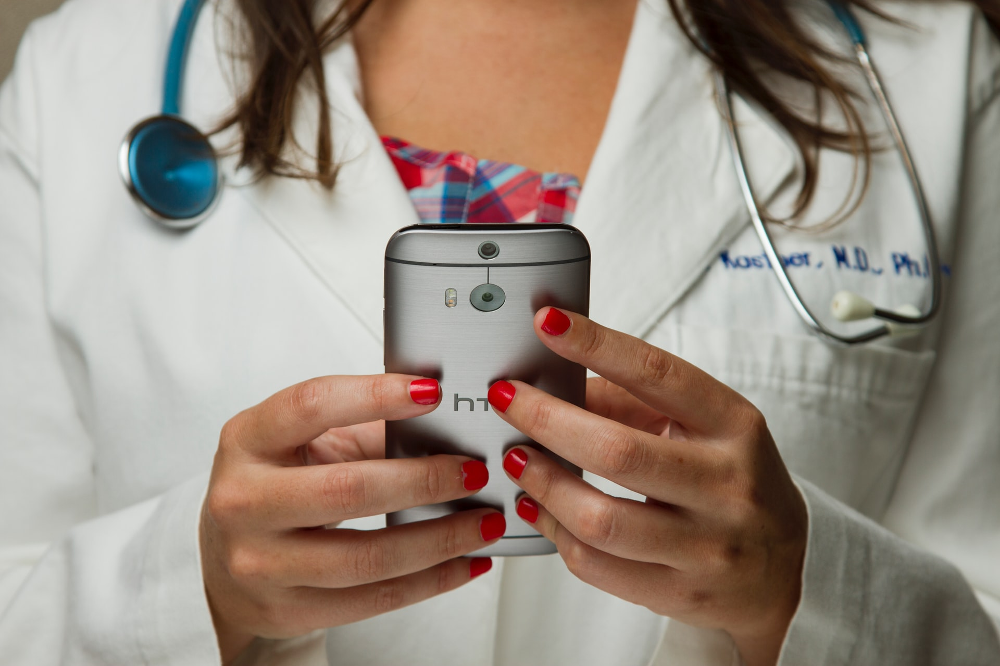

We live in a tense time in our history, the uncertainty of an unknown and lethal virus has brought drastic changes to our lifestyle. I believe that after this crisis we will see an acceleration in the digital transformation, never before have so many companies needed to adopt the "home office" model and search for digital solutions, however forced, this will make many look with new eyes on new work models.

Several, maybe even most, of the innovations came after moments of stress like the one we are experiencing. The need to think outside the box forces people and companies to look for innovative solutions. That's why I believe that we will come out of this stronger and more technological than ever!

We can see how much technology has helped in the fight against Coronavirus, many solutions have been used, so I have separated some interesting examples to share with you.

## 1\. [SUS Cornavirus Application](https://www.gov.br/pt-br/apps/coronavirus-sus)

The Ministry of Health, in a very quick response, launched an app called [Coronavirus - SUS](https://www.gov.br/pt-br/apps/coronavirus-sus) . The app presents from descriptions of symptoms, prevention tips, which are the forms of transmission and a map with the free health facilities closest to your location.

But the main function of the application is in the analysis of the user's health condition, working as a digital triage. If you are feeling unwell and with possible symptoms of the virus, the user can answer a questionnaire in the application that assesses and indicates the risk of infection.

Something commendable and surprising coming from the public sector, which is usually very technologically backward, in less than a month the application had already had more than 3 million downloads. You can find the download links on your mobile [here](https://www.gov.br/pt-br/apps/coronavirus-sus) .

## two. [Johns Hopkins University](https://www.arcgis.com/apps/opsdashboard/index.html#/bda7594740fd40299423467b48e9ecf6)

[Center for Science and Engineering Systems Monitoring Panel](https://www.arcgis.com/apps/opsdashboard/index.html#/bda7594740fd40299423467b48e9ecf6)

THE [Center for Systems for Science and Engineering (CSSE)](https://systems.jhu.edu/) From Johns Hopkins University to become the world's central Coronavirus data, they set up a panel to monitor cases around the world, broken down by country and in some cases by state. Also, they use a repository on the [Github](https://github.com/CSSEGISandData/COVID-19) to share all the data reported and organized by the COVID-19 world, serving as a basis for researchers to analyze and develop projections.

## 3\. Artificial intelligence

### 3.1 Monitoring and preventive detection

the Canadian company [BlueDot](https://bluedot.global/) develops an artificial intelligence algorithm that scans thousands of sources, documents, medical publications and even weather conditions, looking for information about possible diseases and their ability to proliferate. It was this technology that, in December 2019, warned of the emergence of a new respiratory disease in Wuhan, China. Exactly 9 days before the first official communication made by the World Health Organization (WHO).

### 3.2 Drug Analysis

The race for drugs and vaccines against COVID-19 has become the target of a lot of pressure. A viable short-term solution is "drug repositioning," in which they try to find out whether existing drugs approved for human consumption are viable alternatives to combat it. This search started with 2,000 possible drugs, and after analysis by an artificial intelligence algorithm reduced that number to 16.

### 3.3 Coronavirus Diagnosis

The American Artificial Intelligence Company [Infervision](https://www.wired.com/story/chinese-hospitals-deploy-ai-help-diagnose-covid-19/) developed a solution that helps detect and effectively monitor the disease. The solution aims to improve the diagnostic speed of computed tomography (CT) scans. Another company that joined the fight against Coronavirus was the Chinese Alibaba, it developed a [artificial intelligence system](https://thenextweb.com/neural/2020/03/02/alibabas-new-ai-system-can-detect-coronavirus-in-seconds-with-96-accuracy/) they claim to have 96% accuracy in diagnosing COVID-19 in a matter of seconds.

## 4\. telemedicine

The Federal Council of Medicine (CFM) authorized on March 19 the [use of telemedicine](https://pebmed.com.br/tecnologias-que-ampliaram-o-acesso-a-tratamentos-e-diagnosticos-no-brasil-telemedicina/) during the **[COVID-19 pandemic](http://marquesfernandes.com/?p=8003&preview=1&_ppp=97c26d0e74)** .

Telemedicine should be used in the following ways:

-   **Guidance:** Professionals provide remote guidance and referral of patients in isolation.
-   **Monitoring:** Monitoring the patient's progress.
-   **Interconsultation** : Exchange of information and opinions between physicians, for diagnostic or therapeutic assistance.

## 5\. Application to monitor patients with Coronavirus

South Korea has developed a [application](https://www.mois.go.kr/frt/bbs/type002/commonSelectBoardArticle.do;jsessionid=7bA+UtY0JOIXJytznXoyYNHR.node40?bbsId=BBSMSTR_000000000205&nttId=76155) to monitor patients with confirmed and quarantined cases. The app, developed by the Ministry of Interior and Security, allows those patients who need to be in quarantine and not leave the house to be in contact with those responsible for their case and report their progress. He also uses GPS to track their location and ensure they aren't breaking the quarantine.

## 6\. Free services during the pandemic

Due to the sudden demand for services and technologies to facilitate the home office, several companies gave access to their products and services free of charge during this troubled period. A noble action that was very well regarded by the community, here is a list of some companies that joined this movement:

### 6.1 Adobe Creative Cloud

Adobe now offers free access to Adobe Cloud applications on the personal computers of students and teachers, but only through the [request](https://helpx.adobe.com/enterprise/kb/covid-19-education-labs.html) . Access will be available free of charge until May 31, 2020.

### 6.2 Asana

Asana is offering its premium services, Asana Business, to any non-profit organization that is acting directly on the front lines against COVID-19.

### 6.3 Cisco (WebEx)

Cisco, an information security company, has expanded the capabilities of its online meeting product, WebEx, offering it free in all countries they serve.

-   Unlimited use (no time restrictions)
-   Up to 100 participants

### 6.4 Cloudflare

Cloudflare has released its free Cloudflare for Teams service to small businesses for at least six months. The package allows employees to connect from their home to internal company resources using a VPN.

### 6.5 Google

Google is giving its G Suite (Google Apps) and G Suite for Education customers free access to the video conferencing features of Hangouts Meet.

-   Up to 250 participants per call
-   Live stream to up to 100,000 viewers

### 6.6 Microsoft

Microsoft released Microsoft Teams for free over the next six months.

### 6.7 Slack

THE **slack** is making its paid version available to companies that have been working directly to combat coronavirus.

## Conclusion

Technology and health have been allies for a long time, and in situations like this it tends to strengthen itself and bring new solutions for the common good. **If you've noticed technology usage in any other scope not listed here, please share it with us and leave your comment below.**
