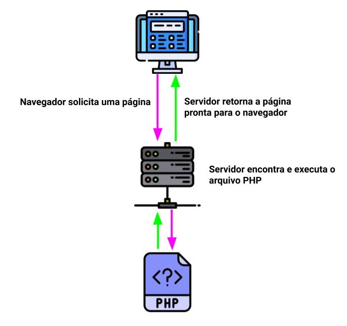

**PHP** (um acrônimo recursivo para *"**P**HP: **H**ypertext **P**reprocessor"*) é uma linguagem interpretada de código aberto, usada principalmente no desenvolvimento do lado do servidor (backend) de aplicações web.

Criado por [Rasmus Lerdorf](https://pt.wikipedia.org/wiki/Rasmus_Lerdorf) em 1995, o PHP tem o desenvolvimento e documentação mantida por [The PHP Group](https://www.php.net/). O PHP é distribuindo em código aberto e licenciado sob a *PHP License*.

Estimasse que entre 60% e 80% da internet é movida por aplicações desenvolvidas em PHP. Graças a popularidade de aplicações de código aberto como o [Wordpress](http://wordpress.com/) e [Magento](https://magento.com/), o PHP se mantém uma linguagem extremamente popular, e assim será por um bom tempo.

## O que é uma linguagem de script?

Antes de entender o que é PHP, precisamos entender o que é uma linguagem de script.

Um script é um conjunto de instruções de programação que são interpretadas em tempo de execução. Os scripts do lado do servidor, como o PHP, são interpretados no servidor, enquanto os scripts do cliente são interpretados pelo aplicativo cliente, navegador, por exemplo, como é o caso do [JavaScript](http://marquesfernandes.com/javascript-o-que-e-como-funciona-e-para-que-serve/). Essas linguagens normalmente dependem de outras aplicações para serem executadas, criando o ambiente de execução.

## Entendendo melhor o PHP

O código PHP pode ser incorporado ao código HTML ou pode ser usado em combinação com vários sistemas de modelos da web, sistema de gerenciamento de conteúdo da web e estruturas da web. Um arquivo PHP contém tags PHP e termina com a extensão ".php".

<?php
  echo "Hello Wolrd";
?>

Um arquivo PHP também pode conter tags como HTML e [JavaScript](http://marquesfernandes.com/javascript-o-que-e-como-funciona-e-para-que-serve/).

<!DOCTYPE html>
<html>
  <head>
    <title>Exemplo de Página</title>
  </head>
  <body>
    <h1>
      <?php echo "Olá, eu sou um título!"; ?>
    </h1>
    
  </body>
</html>

## Fluxo de uma aplicação PHP

O PHP é responsável por fazer toda a lógica para, por exemplo, renderizar uma página web. Ele cuida de consultar os bancos de dados, fazer qualquer cálculo e retornar o HTML pronto para que o navegador possa exibir para o usuário.

Sem entrar em questões muito técnicas, mas para uma aplicação web funcionar você precisa de um servidor web configurado para executar os arquivos PHP. Ele é o responsável por encontrar qual script correto a ser executado quando você acessa uma página como, por exemplo, [http://marquesfernandes.com](http://marquesfernandes.com). Os servidores web mais populares e utilizados são o [Apache](https://www.apache.org/) e [Nginx](https://www.nginx.com/).

## PHP na prática

Veja abaixo o exemplo de um código PHP simples que executa um laço de repetição exibindo tags em HTML:

## Características do PHP

O PHP é uma excelente linguagem para desenvolver aplicações web, podemos citar algumas características importantes:

-   **Velocidade e robustez**: Com mais de 25 anos no mercado, o PHP foi e é amplamente testado e melhorado diariamente. Conta com muitos tutoriais e cursos além de uma comunidade muito ativa.
-   **Orientação a objetos**: O PHP é uma linguagem altamente otimizada para desenvolvimento orientado a objetos.
-   **Portabilidade:** independência de plataforma - escreva uma vez, rode em qualquer lugar (ou em qualquer servidor web que de suporte).
-   **Tipagem dinâmica:** O PHP é uma linguagem fracamente tipada, permitindo um desenvolvimento veloz e prático.
-   **Código Aberto:** Você não precisa pagar nada para desenvolver ou usar o PHP.

## Extensões de um arquivo PHP

Um arquivo PHP é salvo com a extensão "**.php**", existem algumas variações antigas que talvez você talvez possa encontrar em aplicações legadas:

-   .phtml
-   .php3
-   .php4
-   .php5
-   .phps
