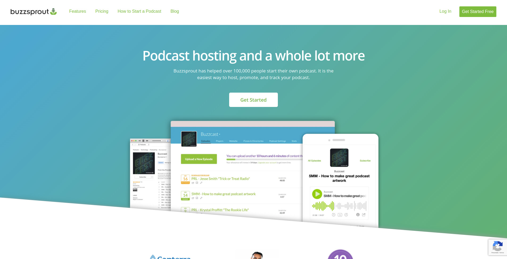
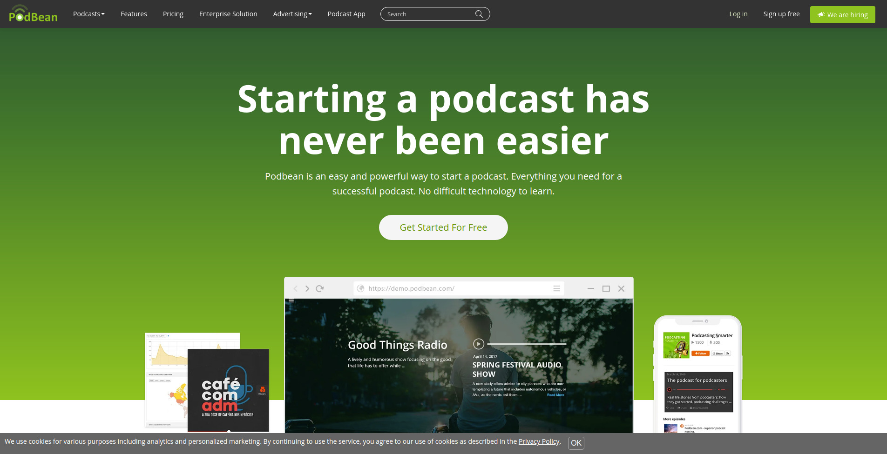
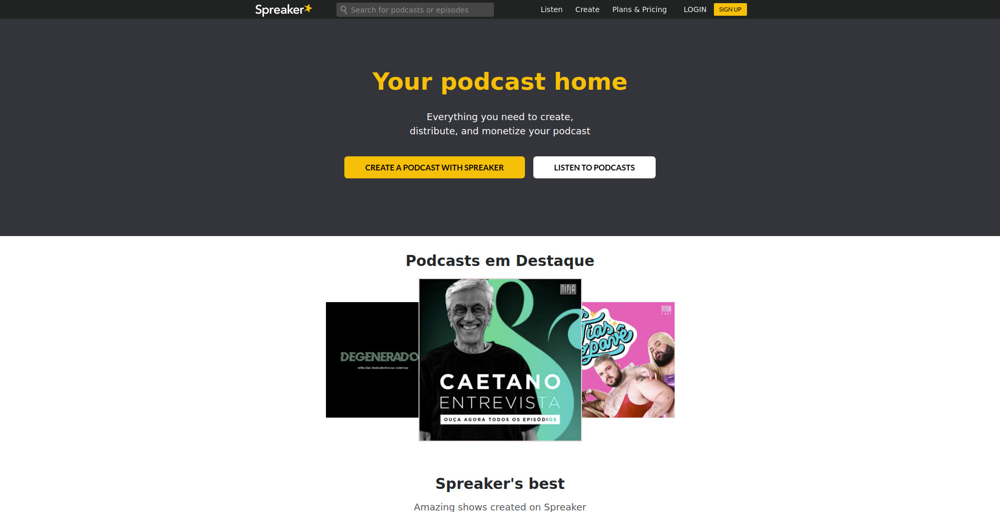

Podcasts invaded the hearts of Brazilians and the world. Every day, new programs are released, prompting many people to start their own channel. I have selected the best platforms for you to host your podcasts, free of charge and without complications.

*See too: [Podcasts on technology and innovation](http://marquesfernandes.com/podcasts-sobre-tecnologia-e-inovacao-para-escutar-em-2020/)*

For those who don't know, platforms, for example Spotify, don't directly host your podcasts, for that you need an RSS feed to integrate with these distribution services. To make this process of creating, updating and distributing your podcasts easier, there are several podcast services that already take care of all this work for you.

The basic features you want for a podcast hosting service are:

-   Simple method to upload your audio files.
-   Generation of an RSS feed with the description of your channel and its episodes.
-   Distribute your RSS feed to the famous platforms: iTunes (Apple Podcasts), Google Podcasts, Spotify, Stitcher,...
-   Provide a channel page for your listeners to search and download episodes directly.

## 1\. [Buzzsprout](https://www.buzzsprout.com/)

[Buzzsprout](https://www.buzzsprout.com/)

**Buzzsprout** is a hosting service that has free and paid plans, you don't need to provide any form of payment to use the platform in its free version. It has integration with major distribution platforms such as Spotify, Apple/iTunes, Google Podcast and Stitcher. 

The platform has served more than 100,000 users since its launch in 2009, and has a 5-star satisfaction rating for its service.

**Free plan:**

-   2 hours of monthly podcasts
-   Retention of uploads for 90 days
-   Statistics of your podcasts

## two. [Podbean](https://www.podbean.com/)

[Podbean](https://www.podbean.com/)

**Podbean** is an easy and powerful platform. The platform offers both free and paid plans, being perhaps the most generous platform in its free plan. It has integration with major distribution platforms such as Spotify, Apple/iTunes, Google Podcast and Stitcher. 

**Free plan:**

-   5 hours of monthly podcasts
-   100GB monthly traffic
-   RSS feed

## 3\. [spreader](https://www.spreaker.com/)

[spreader](https://www.spreaker.com/)

**spreader** is a well-known platform in the market, hosting from new podcasts to well-regarded channels. It has an easy interface that helps from the creation of your podcast to the dissemination to the platforms. Launched in 2010 and hosting thousands of podcasts and millions of active listeners.

**Free plan:  
**

-   Unlimited podcasts
-   Unlimited monthly upload hours
-   RSS feed (Not customizable)
