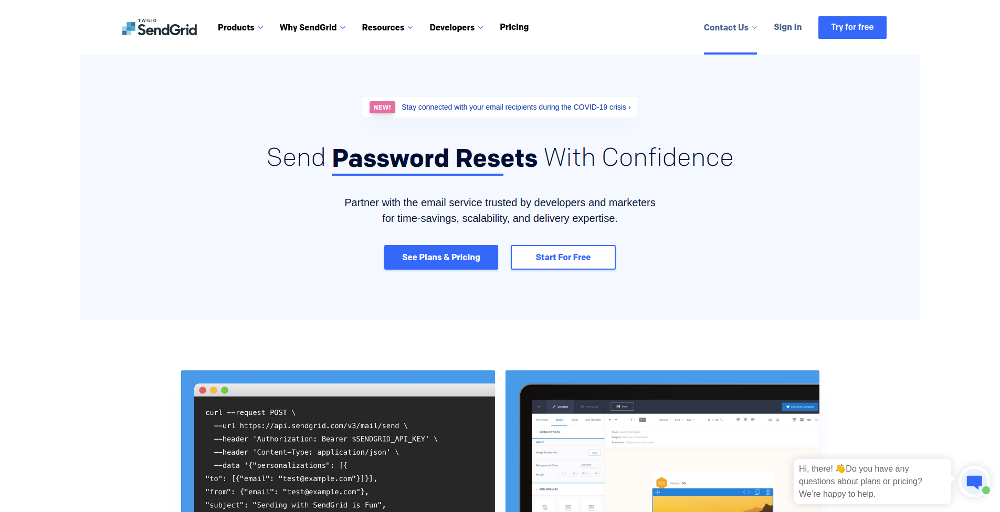
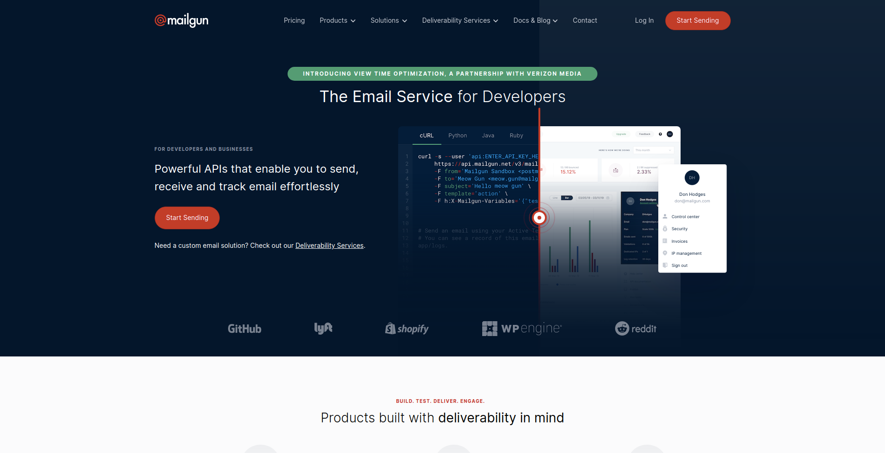
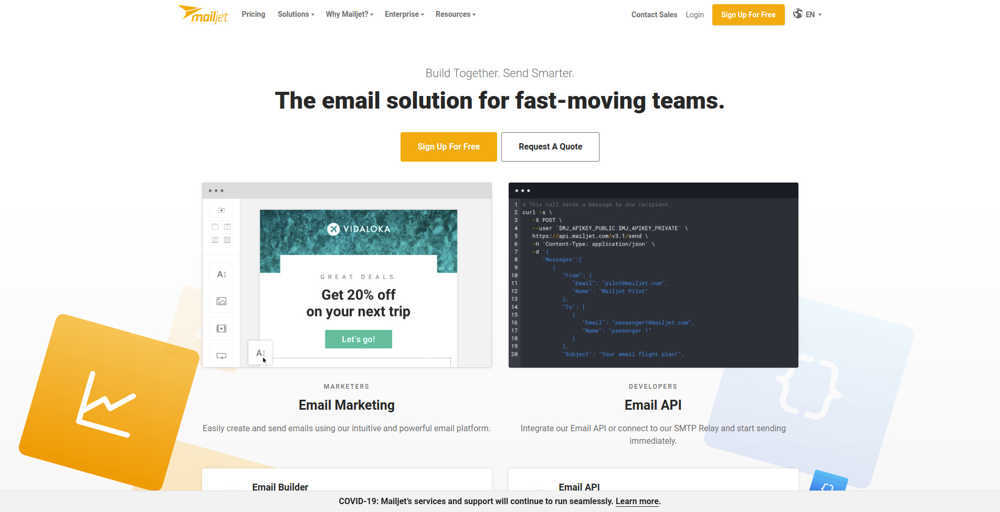

Quando você começa a desenvolver uma aplicação ou serviço web, provavelmente terá a necessidade de se comunicar através de e-mails com seus usuários. Você pode facilmente criar seu projeto piloto usando serviços de e-mail pessoal, enviando pelo protocolo SMTP usando serviços como Gmail, mas como o tempo e o aumento dos envios esses serviços podem trazer limitações como quantidade de envio e problemas com seus emails caindo no spam.

Então se sua aplicação está começando a enviar mais que uma centena de emails, provavelmente está na hora de procurar um serviço especializado nisso. Além de cuidar de todo o processo de envio, muitos dos serviços oferecem ferramentas mais avançadas pra controle de envio, monitoramento de entregas, aberturas e outras estatísticas muito úteis.

## O que é um email transacional?

[Emails transacionais](http://marquesfernandes.com/o-que-e-um-email-transacional/) são um tipo de e-mail automatizado entre o remetente e o recebedor. Diferente dos emails promocionais, um email transacional é disparado mediante eventos, interações com um serviço ou uma plataforma e não com uma empresa em si. São normalmente pré programados e disparados após uma interação, como, por exemplo, a criação de uma conta que requer verificação do email. Você pode entender um pouco melhor o uso desses emails lendo esse [post](http://marquesfernandes.com/o-que-e-um-email-transacional/).

## Melhores serviços de emails transacionais

Escolher um serviço que atenda sua demanda é muito importante, como essa funcionalidade faz parte do core de sua aplicação, é crucial que não haja empecilhos para usar e que alinhem com um custo e funcionalidades disponíveis em seu projeto.

1.  [Amazon SES](#amazon-ses)
2.  [SendGrid](#sendgrid)
3.  [Mailgun](#mailgun)
4.  [Mailjet](#mailjet)
5.  [SendinBlue](#sendiblue)

## 1\. [Amazon SES](https://aws.amazon.com/pt/ses/)

A Amazon Web Services possui diversos serviços cloud, dentre eles o **Amazon SES** para envio de e-mails transacionais. Contando com toda a estrutura e confiabilidade da AWS, possui preços bem acessíveis. É uma solução robusta para quem possui uma certa experiência técnica, o serviço não oferece estatísticas por si, é preciso conectar com o outro serviço, o [AWS SNS](https://aws.amazon.com/pt/sns/), para conseguir acompanhar as métricas de seus envios.

**Plano gratuito:** 62 mil emails por mês.

## 2\. [SendGrid](https://sendgrid.com/)

**SendGrid** é um dos serviços mais populares, possui mais de 80 mil usuários pagantes e enviam mais de 60 bilhões de e-mails por mês. Possui uma interface robusta para acompanhar, monitorar e analisar seus envios, bem como uma API muito bem documentada para integrar com sua aplicação.

**Plano gratuito:**

-   40 mil e-mails no primeiro mês e depois 100 e-mails por dia.
-   APIs, SMTP Relay e Webhooks
-   Editor de template de emails
-   Estatísticas de envio

## 3\. [Mailgun](https://www.mailgun.com/)

**Mailgun** é uma solução completa para todo o escossistema de emails, desde envios até validações. Possui uma interface bem amigável, estatísticas completas e é uma ferramenta consolidada no mercado.

**Plano gratuito:**

Embora não seja uma solução 100% gratuita, oferece um plano de graça pelos primeiros 3 meses e depois um plano flex sob demanda.

-   Email APIs, SMTP Relay e Webhooks
-   Suppression Management
-   Tracking e Estatísticas
-   99,99% Uptime SLA

## 4\. [Mailjet](https://www.mailjet.com/)

**Mailjet** é outro serviço consolidado no mercado, atendendo grandes empresas como a Microsoft e MIT. Sua plataforma é extremamente amigável, com estatísticas avançadas e APIs bem documentas para integrar com a sua aplicação.

**Plano gratuito:**

6 mil emails por mês / 200 emails por dia

-   Contatos ilimitados
-   APIs, SMTP Relay, Webhooks
-   Editor de Template de Email
-   Estatísticas Avançadas

## 5\. [SendinBlue](https://pt.sendinblue.com/)

**SendinBlue** é um serviço focado em marketing, possui uma plataforma extremamente amigável.

**Plano gratuito:**

300 emails por dia e contatos ilimitados
