¿Tiene su sitio una página que demuestre el espíritu de su equipo? ¿O no tiene página que muestre a la gente detrás de su empresa? Si su respuesta fue no para cualquiera de ellos, este artículo es para usted.

Los visitantes que entran en su sitio quieren saber más acerca de su empresa y también conocer a las personas que son responsables de sus servicios o productos. Tener una página de equipo, hermosa y alineada con su espíritu de equipo tiene muchos beneficios: Ayuda a conectar su empresa con su cliente; Aumenta la moral de su equipo, ya que al estar frente al sitio se sentirán aún más parte del negocio; Humaniza tu marca.

Separé una lista con algunos ejemplos de páginas de equipo muy bonitas, algunas más serias y otras más divertidas, grandes ejemplos de cómo esta página debe reflejar la cultura de su empresa.

## Páginas de equipo para la inspiración

1.  [Lado](#lateral)
2.  [Humaan, Año Nuevo](#humaan)
3.  [Khan Academy, Nuevo anuncio](#khan)
4.  [Pulp Electric](#Eletric-Pulp)
5.  [Targetprocess, Año Nuevo](#targetprocess)
6.  [Wistia, Año Nuevo](#Wistia)
7.  [FCINQ, Año Nuevo](#FCINQ)
8.  [Advantix Digital](#Advantix-Digital)
9.  [Brandand & Mortar](#brandandmortar)
10.  [Seda digital](#digital-silk)
11.  [Bleech](#bleech)

### 1\. [Lateral](https://www.lateral-inc.com/about.html)

[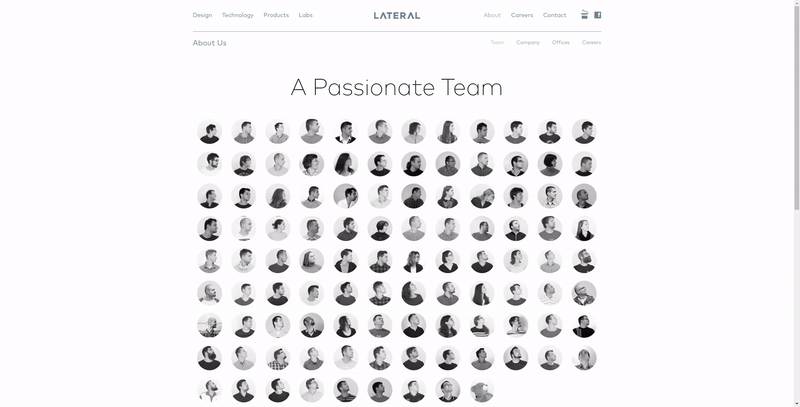](https://www.lateral-inc.com/about.html)

[Lateral](https://www.lateral-inc.com/about.html) es una empresa creativa, enfocada en el estudio de diseño y desarrollo. Su página de equipo estaba muy bien elaborada, encontraron una solución divertida para acomodar a un equipo muy grande, a medida que mueves el ratón la gente va con la dirección de la cabeza y cuando pasas el cursor sobre una persona, se muestra tu posición en la empresa.

### 2\. [Humaan, Año Nuevo](https://humaan.com/about/)

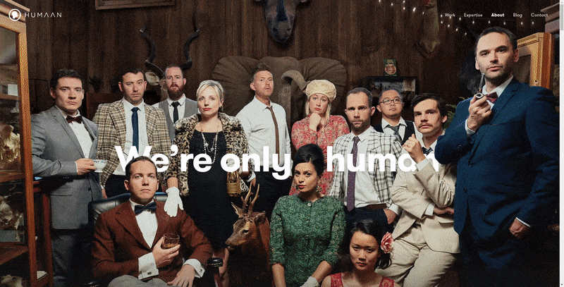

[Humaan](https://humaan.com/about/) es una empresa enfocada en la creación de productos digitales. Su página de equipo es muy divertida, trayendo gifs animados de sus colaboradores y cuando pasa el ratón sobre una breve descripción aparece.

## 3\. [Khan Academy, Nuevo anuncio](https://www.khanacademy.org/about/the-team)

[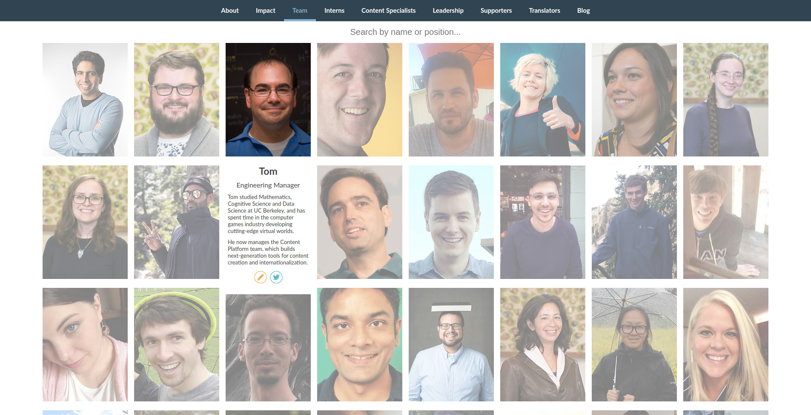](https://www.khanacademy.org/about/the-team)

La [Khan Academy](https://www.khanacademy.org/about/the-team) ofrece ejercicios prácticos, videos instructivos y un panel de aprendizaje personalizado que permite a los estudiantes estudiar a su propio ritmo, tanto dentro como fuera del aula. La página de su equipo tiene un diseño algo simple pero alegre, lo que permite la búsqueda por persona o posición.

## 4\. [Pulp Electric](https://www.electricpulp.com/about/)

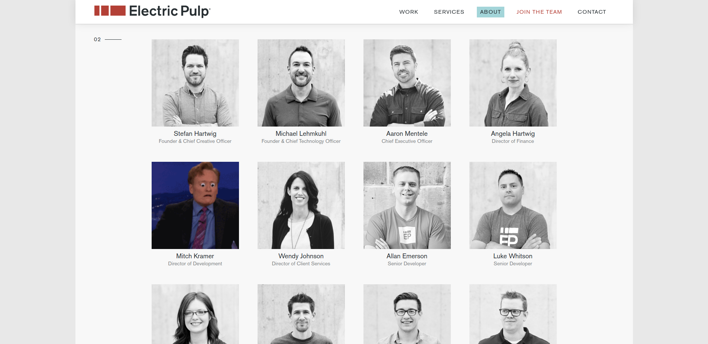

[Eletric Pulp](https://www.electricpulp.com/about/) es una agencia enfocada en productos digitales, diseño y desarrollo. Co una página muy creativa, trae todos sus colaboradores y al pasar el ratón muestra, en lo que supongo, algún gif que la persona más identifica.

## 5\. [targetprocess](https://www.targetprocess.com/team/)

[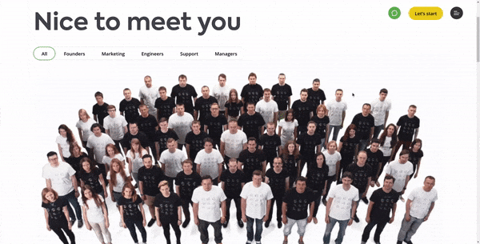](https://www.targetprocess.com/team/)

La [targetprocess](https://www.targetprocess.com/team/) es una empresa enfocada en ayudar a las empresas a implementar y optimizar la metodología Agile. Pasaron mucho tiempo en su página de equipo, trayendo un video animado con sus empleados categorizados por la industria.

## 6\. [Wistia, Año Nuevo](https://wistia.com/about/yearbook)

[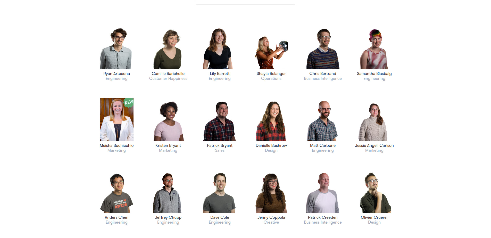](https://wistia.com/about/yearbook)

[Wistia](https://wistia.com/about/yearbook) es una empresa enfocada en el desarrollo de software, vídeos y contenido educativo. Su página de equipo trae dos opciones muy divertidas, la primera presentando a todos sus colaboradores con sus nombres y sus posiciones, y cuando pasa el ratón la foto toma la vida en forma de un gif, el otro, que han desarrollado una especie de juego donde cada empleado es el sonido de un tambor.

## 7\. [FCINQ, Año Nuevo](https://www.fcinq.com/)

[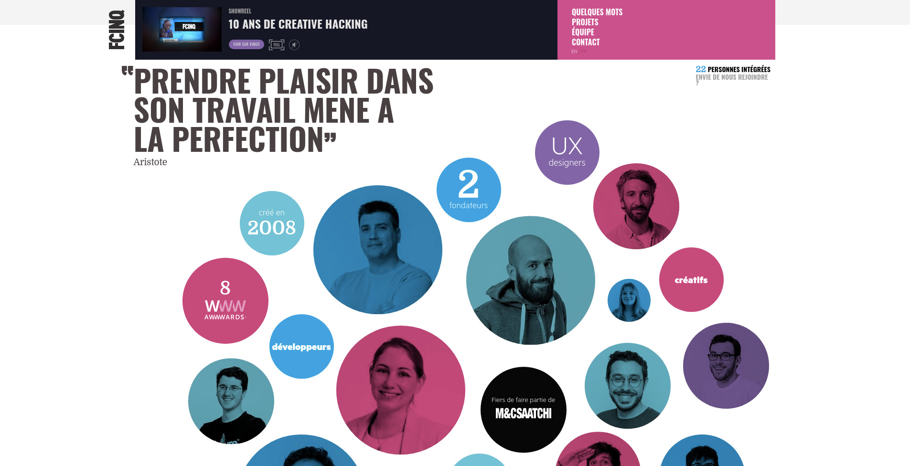](https://www.fcinq.com/)

[FCINQ](https://www.fcinq.com/) es un estudio creativo francés, que trajo la combinación de su identidad visual con la presentación de sus colaboradores.

## 8\. [Advantix Digital](https://advantixdigital.com/about/)

[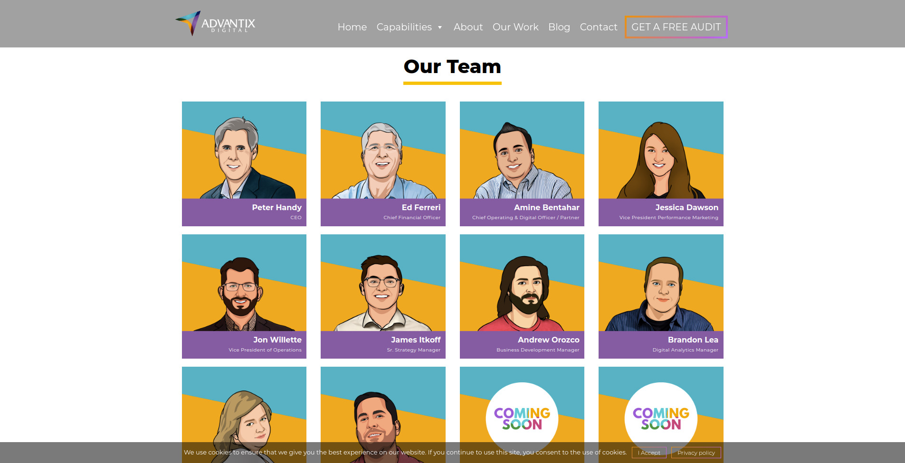](https://advantixdigital.com/about/)

[Advantix Digital](https://advantixdigital.com/about/) es una agencia digital que supo aprovechar sus recursos, poniendo a sus diseñadores a dibujar caricaturas de cada empleado, una buena opción para las empresas que no quieren tomar fotos.

## 9\. [Brandand & Mortar](https://brandandmortar.com/who_we_are/)

[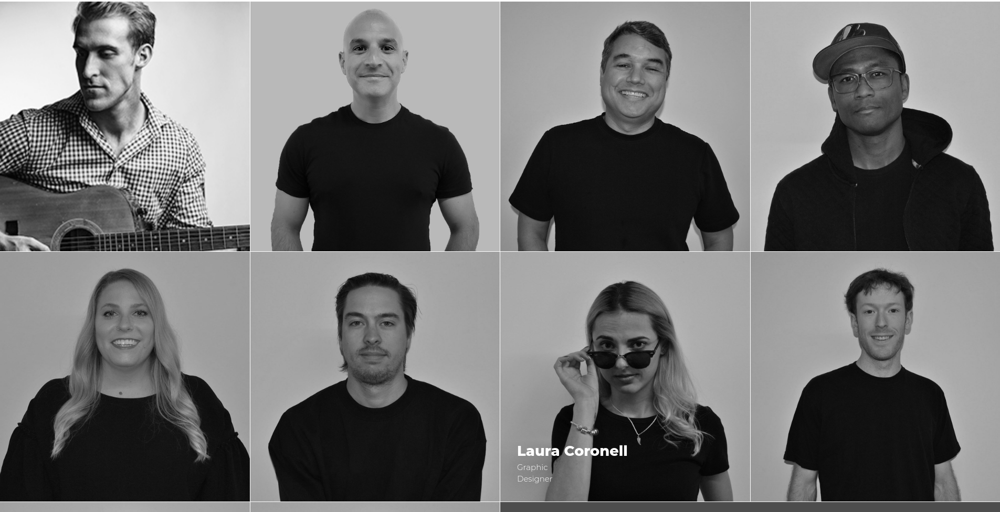](https://brandandmortar.com/who_we_are/)

[Brandand & Mortar](https://brandandmortar.com/who_we_are/) es especialista en marketing. Traje a la página de su equipo una solución semi-profesional, con imágenes en blanco y negro que van con una pose divertida al flotar.

## 10\. [Seda digital](https://www.digitalsilk.com/about)

[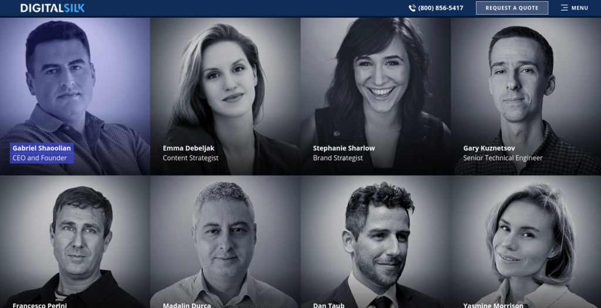](https://www.digitalsilk.com/about)

[Digital Silk](https://www.digitalsilk.com/about) es una consultoría digital, y ha traído toda la sobriedad que una empresa de consultoría suele pasar a la página de su equipo.

## 11\. [Bleech](https://bleech.de/en/)

[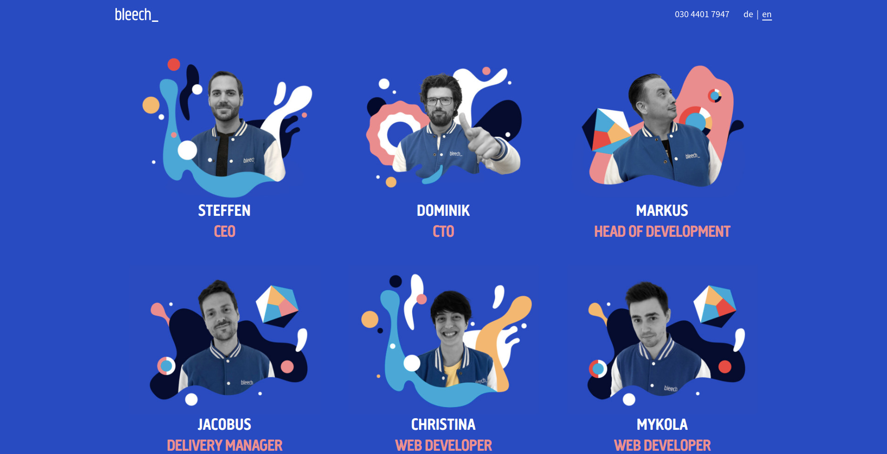](https://bleech.de/en/)

[Bleech](https://bleech.de/en/) es una empresa de desarrollo de Berlín. Fotos y gráficos mezclados en su página de equipo, trayendo un aspecto divertido con una huella moderna.

## Conclusión

Hay varias maneras de crear su página de equipo, vimos algunos ejemplos divertidos y otros más sobrios, simplemente identifique qué sensación desea transmitir a sus usuarios y de la mano!
