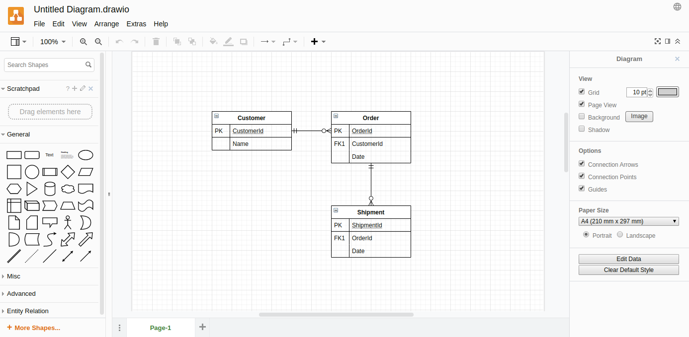
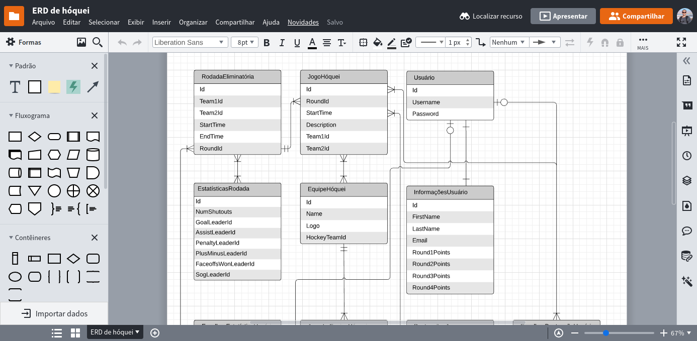
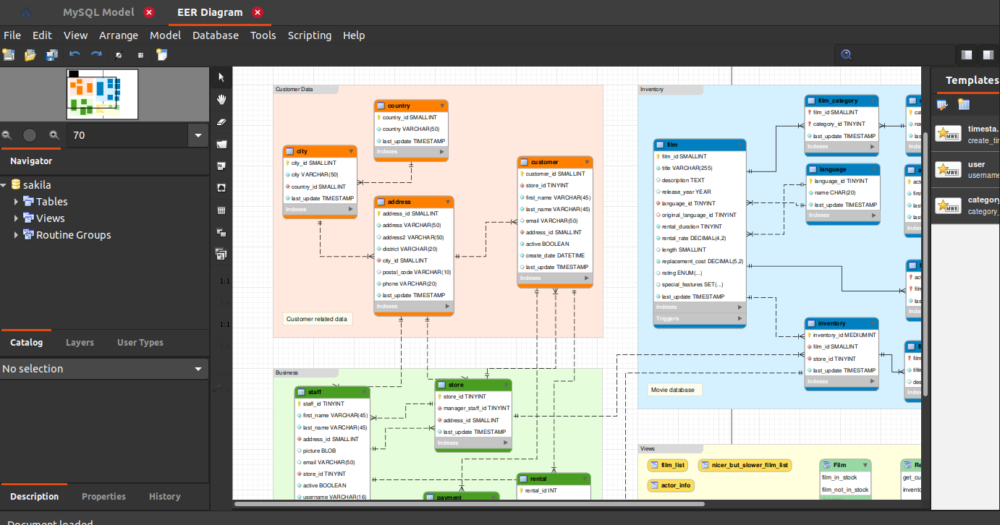

Desenhar o seu banco de dados é um dos passos mais importantes ao começar a desenvolver uma nova aplicação e escolher a ferramenta certa para isso pode facilitar muito sua vida. Diagramar o seu banco ajuda a entender melhor como os seus dados e entidades serão armazenadas e se comunicarão entre si. Muitos projetos sofrem ao longo prazo por terem negligenciado essa etapa tão importante, conforme sua aplicação ganha vida e massa de dados, cada vez mais, qualquer mudança estrutural se torna mais complicada e demorada.

A notícia boa é que existem excelentes ferramentas para ajudar nessa tarefa, separei uma lista para ajudar você a escolher uma ferramenta gratuita de diagramação.

*Confira também: [4 ferramentas gratuitas para gerenciar MongoDB](http://marquesfernandes.com/ferramentas-gratuitas-para-gerenciar-mongodb/)*

## Melhores ferramentas para desenhar/diagramar um banco de dados

-   [dbdiagram.io](#dbdiagram.io)
-   [draw.io](#draw.io)
-   [Lucidchart](#lucidchart)
-   [MySQL Workbench](#mysql)

## 1\. [dbdiagram.io](https://dbdiagram.io/home?utm_source=marquesfernandes&utm_medium=blog_post)

[dbdiagram.io](https://dbdiagram.io/home?utm_source=marquesfernandes&utm_medium=blog_post) é uma ferramenta online que permite facilmente uma rápida prototipagem de entidades e relações. Coloquei em primeiro lugar por ser a minha ferramenta go-to no dia a dia quando preciso estruturar alguma relação. Possui integração com o github, o que permite facilmente versionar seus trabalhos.

## 2\. [diagrams.net (draw.io)](https://www.diagrams.net?utm_source=marquesfernandes&utm_medium=blog_post)

[diagrams.net](https://www.diagrams.net?utm_source=marquesfernandes&utm_medium=blog_post) é uma excelente ferramenta para desenhar seu banco de dados e a relação entre entidades. Possui integração com OneDrive e Google Drive para salvar automaticamente seus projetos. Por se tratar de uma ferramenta mais completa, você pode além de diagramar seu banco, desenhar fluxogramas, organogramas e muito mais.

## 3\. [Lucidchart](https://www.lucidchart.com/pages/landing?utm_source=marquesfernandes&utm_medium=blog_post)

[Lucidchart](https://www.lucidchart.com/pages/landing?utm_source=marquesfernandes&utm_medium=blog_post) segue a mesma linha do diagrams.net, uma ferramenta completa e versátil que permite a diagramação de banco de dados, relacionamento de entitades, etc. Existe uma limitação de 100 modelos básicos no plano gratuito, mas para projetos simples isso não deverá ser um empecilho.

## 4\. [MySQL Workbench](https://www.mysql.com/products/workbench?utm_source=marquesfernandes&utm_medium=blog_post)

[MySQL Workbench](https://www.mysql.com/products/workbench?utm_source=marquesfernandes&utm_medium=blog_post) é uma ferramenta desenvolvida pela Oracle focada na administração e construção de banco de dados no MySQL, no entanto, sua ferramenta de diagramação é muito prática e completa, podendo ser usada para diagramar entidades e principalmente banco de dados SQL, se tornando uma alternativa offline poderosa.
